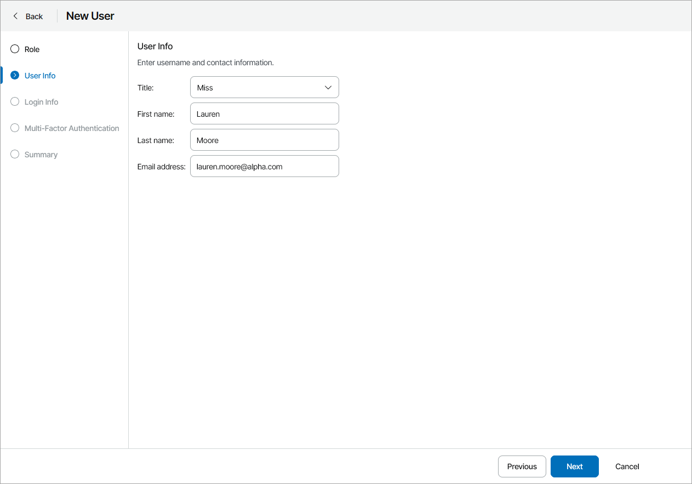
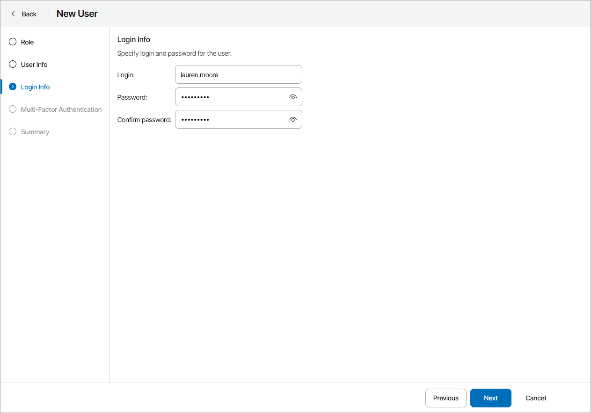
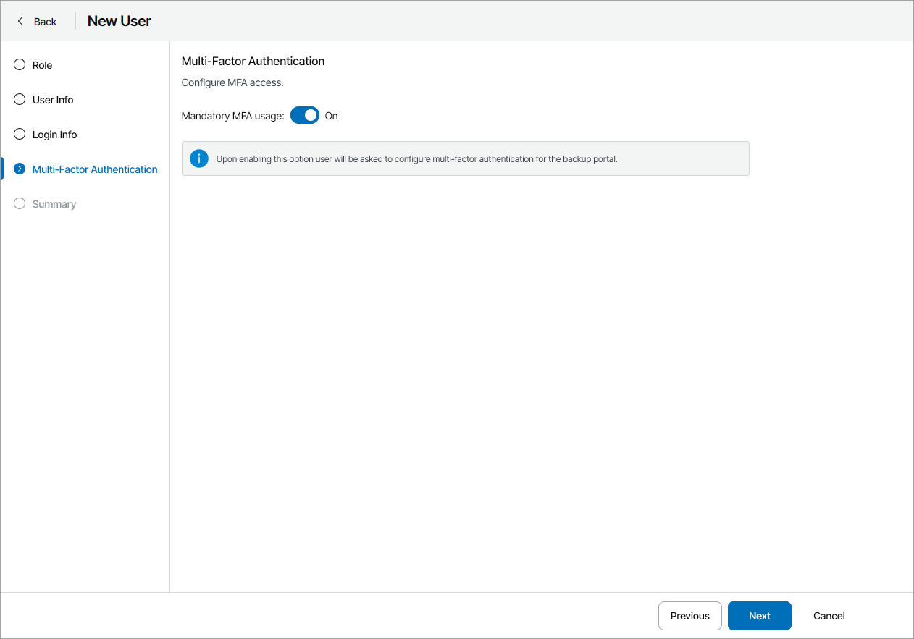
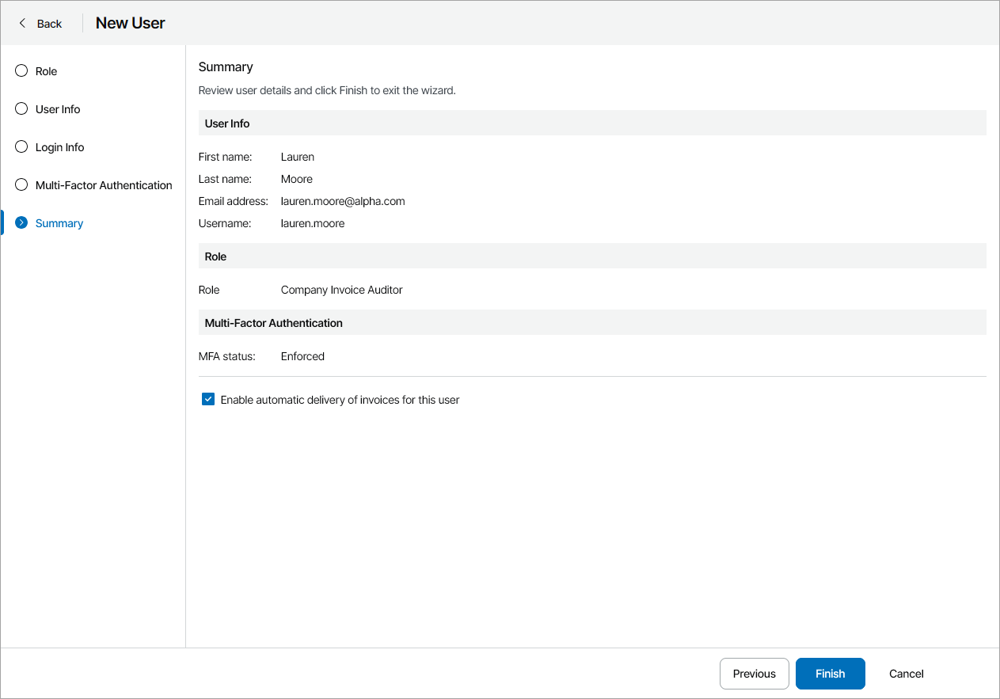

# Creating Company Invoice Auditors

You can create new users with the Company Invoice Auditor role.

Required Privileges

To perform the task, a user must have one of the following roles assigned: Company Owner, Company Administrator.

Creating Company Invoice Auditors

To create a new Invoice Auditor in Veeam Service Provider Console:

1. Log in to Veeam Service Provider Console.

For details, see [Accessing Veeam Service Provider Console](access_vac.md).

1. At the top right corner of the Veeam Service Provider Console window, click Configuration.
2. In the configuration menu on the left, click Roles & Users and navigate to Local Users.
3. At the top of the user list, click New.

Veeam Service Provider Console will launch the New User wizard.

1. At the Role step of the wizard, in the Role field, choose Company Invoice Auditor.
2. At the User Info step of the wizard, specify user's title, first name, last name and email address.

Veeam Service Provider Console can use this address to send email notifications to the user, such as backup report notifications, password reset notifications and so on.

1. At the Login Info step of the wizard, in the Username, Password and Confirm Password fields, type a user name and password.

It is recommended to use a password that contains characters from at least 3 of the following categories: uppercase characters, lowercase characters, base 10 digits (0 through 9), non-alphanumeric characters. The recommended password length is 6 or more characters.

1. At the Multi-Factor Authentication step of the wizard you can assign a second authentication factor to the new user. For details on MFA, see [Configuring Multi-Factor Authentication](mfa.md).

To enable MFA for the new user, set the Mandatory MFA usage toggle to On. On the next authorization session, the user will be prompted to configure MFA by going through the Multi-Factor Authentication step of the Edit User wizard as described in the [Modifying User Profile](modify_user_profile.md#mfa_config) section.

1. At the Summary step of the wizard, review user details.

If you want to send to the user all company invoices, select the Enable automatic delivery of invoices for this user check box. Veeam Service Provider Console will send the invoices automatically after generation.

1. Click Finish.

