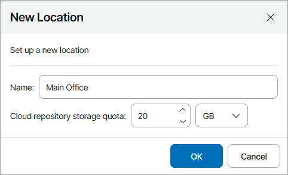

# Creating Locations

You can create new company locations to differentiate backup services and cloud resources consumed by offices or business units in your company.

Required Privileges

To perform the task, a user must have one of the following roles assigned: Company Owner, Company Administrator.

Creating Locations

To create a new company location:

1. Log in to Veeam Service Provider Console.

For details, see [Accessing Veeam Service Provider Console](access_vac.md).

1. At the top right corner of the Veeam Service Provider Console window, click Configuration.
2. In the configuration menu on the left, click Locations.
3. At the top of the location list, click New.
4. In the New Location window, specify location settings:

1. In the Name field, specify a location name.
2. In the Cloud repository storage quota field, specify the maximum amount of cloud repository space that must be available for this location. This amount cannot be greater that the total cloud repository storage quota for your company.

The specified cloud repository storage quota is used as a threshold for the Summary dashboard and for the Company cloud storage quota alarm. It does not limit the actual amount of data that can be uploaded from the location to cloud repositories.

1. Click OK.

When you create a new location, the cloud repository storage quota of the Remote location is decreased by the amount of the cloud repository storage quota set for the new location.

What to Do Next

After you create new locations, you can define what machines and what users will be associated with the new location. For details, see [Setting Locations](set_location_quotas.md).

