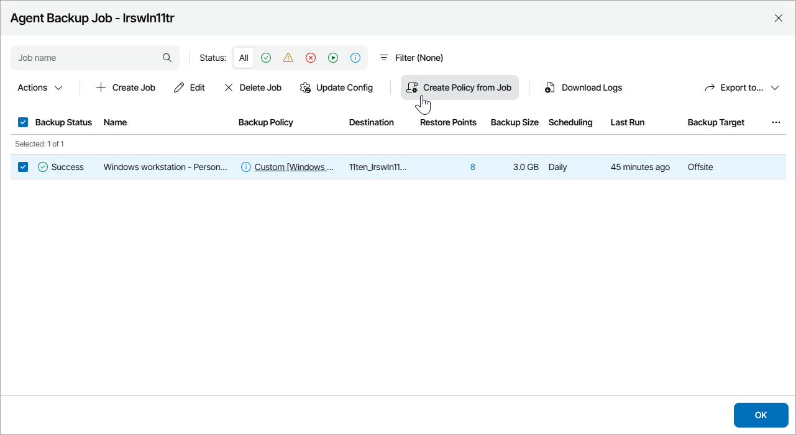

# Creating Backup Policies from Backup Job Configurations

You can create backup policies based on Veeam backup agent jobs, configured for individual computers or configured before Veeam backup agent was activated in Veeam Service Provider Console.

Required Privileges

To perform this task, a user must have one of the following roles assigned: Company Owner, Company Administrator.

Creating Backup Policies from Veeam Backup Agent Job Configuration

To create a backup policy from Veeam backup agent job configuration:

1. Log in to Veeam Service Provider Console.

For details, see [Accessing Veeam Service Provider Console](access_vac.md).

1. In the menu on the left, click Backup Jobs.
2. Open the Computers tab and navigate to Managed by Console.
3. Choose the necessary computer in the list and click a link in the Backup Policies, Successful Jobs or Running Jobs column.
4. In the Agent Backup Job window, click Filter. In the Filter agents backup jobs by assigned policy section, select the Custom check box only. Click Apply.

The list of Veeam backup agent jobs will display backup jobs configured individually or configured before Veeam backup agent was activated.

1. Select the necessary job in the list and click Create Policy from Job.

Alternatively, you can right-click the necessary job in the list and choose Create Policy from Job.

1. Modify backup policy settings as described in [Configuring Backup Policies](configure_backup_policies.md).
2. Save changes.
3. In the Create Policy from Job window, do one of the following:

* If you want to assign the created backup policy to Veeam backup agent, click Yes.

The value in the Backup Policy column will change to the created policy name.

* If you want the backup policy type to remain Custom, click No.

