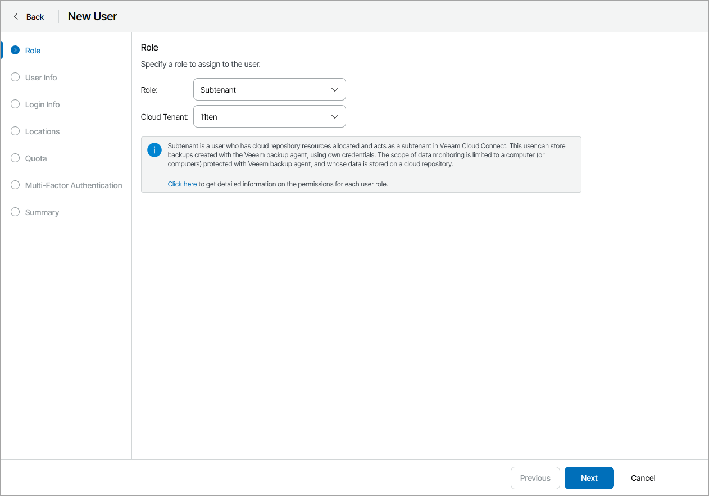
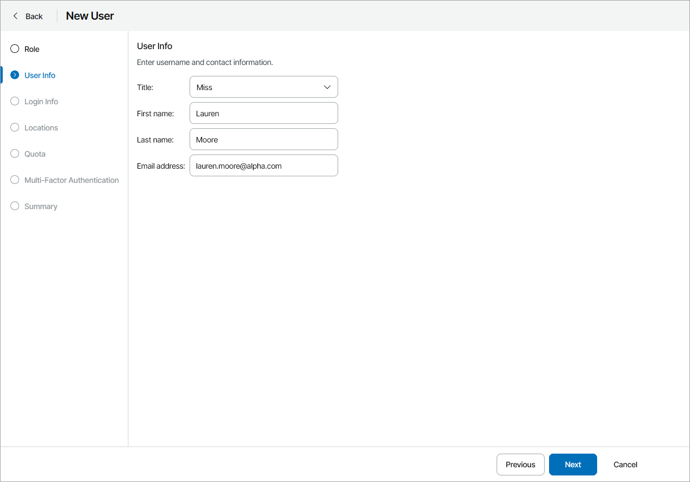
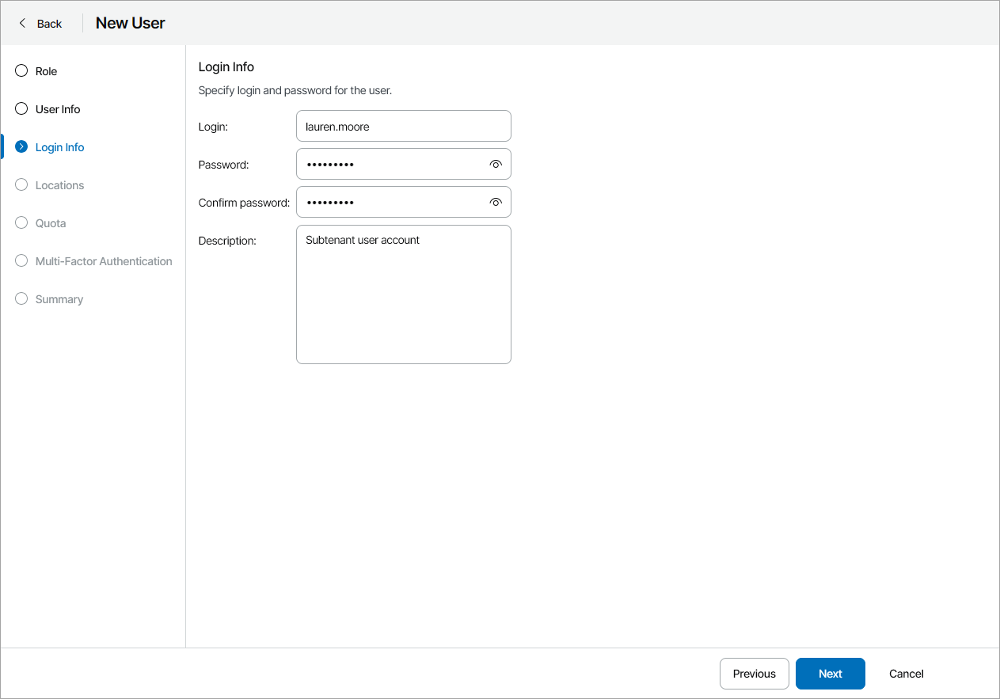
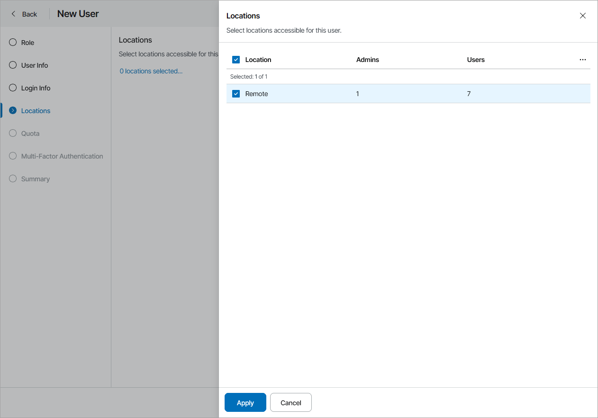
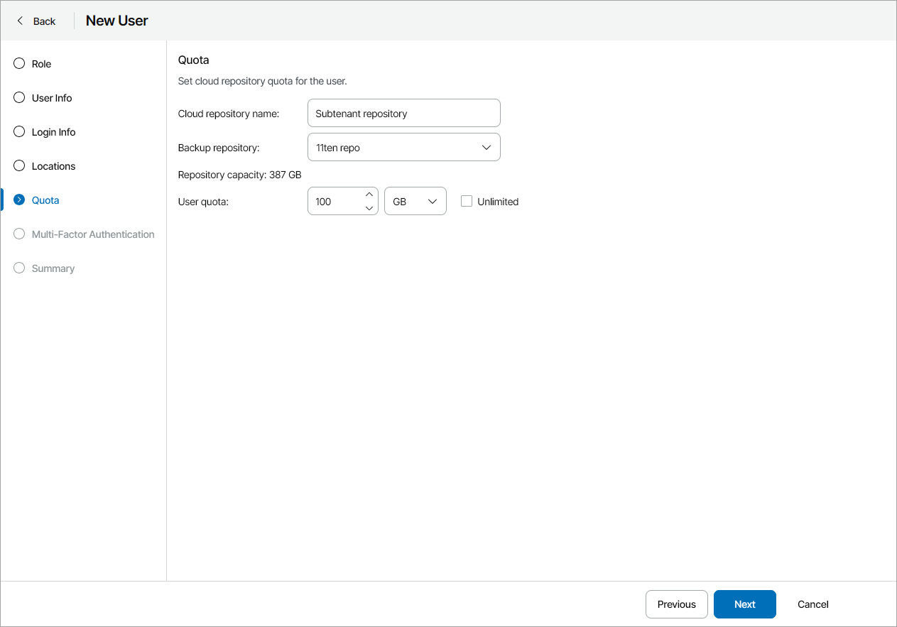
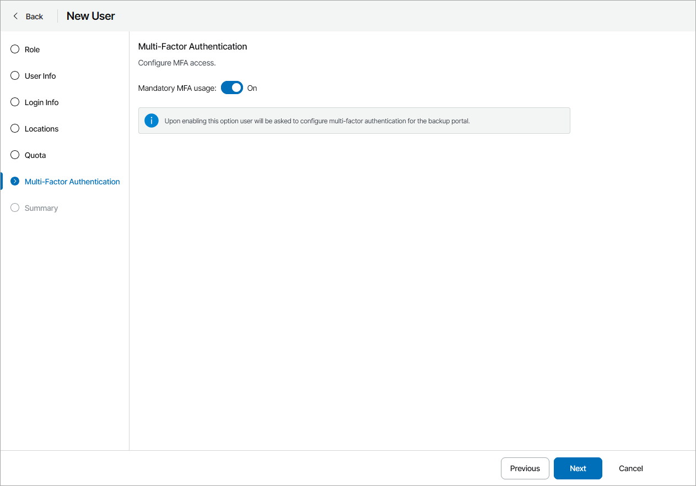
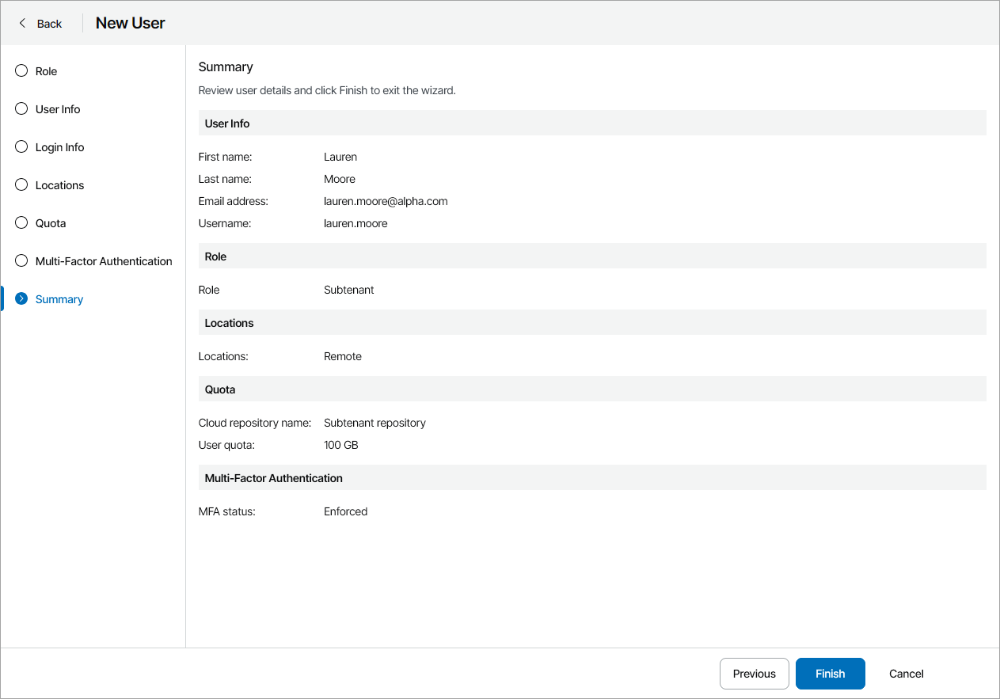

# Creating Subtenants

You can create a new portal user with the Subtenant role and allocate to this user cloud repository space, or user quota. A user quota is an amount of storage space allocated for specific user within the company quota on a cloud repository.

A Subtenant can consume storage resources provided through the user quota for storing Veeam agent backups in the cloud. When pointing a Veeam backup agent job to a cloud repository, you can specify credentials of a Subtenant. Backup files created by the Veeam backup agent job will consume cloud space within the Subtenant quota only.

In addition to storing backups on a cloud repository, a Subtenant can access the Veeam Service Provider Console Client Portal. The scope of monitoring data available to a Subtenant in the Client Portal is limited to a computer (or computers) protected with Veeam backup agents whose data is stored on a cloud repository under the account of the Subtenant. That is, a Subtenant can view details only about those Veeam backup agents that are configured to store backup data to the cloud under credentials of this user.

Required Privileges

To perform the task, a user must have one of the following roles assigned: Company Owner, Company Administrator, Company Tenant, Location Administrator.

Creating Subtenants

To create a new Subtenant in Veeam Service Provider Console:

1. Log in to Veeam Service Provider Console.

For details, see [Accessing Veeam Service Provider Console](access_vac.md).

1. At the top right corner of the Veeam Service Provider Console window, click Configuration.
2. In the configuration menu on the left, click Roles & Users and navigate to Local Users.
3. At the top of the user list, click New.

Veeam Service Provider Console will launch the New User wizard.

1. At the Role step of the wizard, in the Role field, choose Subtenant and select cloud tenant for which the user will be created.

1. At the User Info step of the wizard, specify user's title, first name, last name and email address.

Veeam Service Provider Console can use this address to send email notifications to the user, such as password reset notifications.

1. At the Login Info step of the wizard, in the Username, Password and Confirm Password fields, type a user name and password.

It is recommended to use a password that contains characters from at least 3 of the following categories: uppercase characters, lowercase characters, base 10 digits (0 through 9), non-alphanumeric characters. The recommended password length is 6 or more characters.

1. At the Locations step of the wizard, click the link and select company locations whose data must be available for the user in the Client Portal. Click Apply.

1. At the Quota step of the wizard, allocate cloud repository resources to the user.

You can specify the size of the user quota or create an unlimited user quota. With an unlimited user quota, the Subtenant can consume all storage space within the company quota on a cloud repository.

1. At the Multi-Factor Authentication step of the wizard you can assign a second authentication factor to the new user. For details on MFA, see [Configuring Multi-Factor Authentication](mfa.md).

To enable MFA for the new user, set the Mandatory MFA usage toggle to On. On the next authorization session, the user will be prompted to configure MFA by going through the Multi-Factor Authentication step of the Edit User wizard as described in the [Modifying User Profile](modify_user_profile.md#mfa_config) section.

1. At the Summary step of the wizard, review user details and click Finish.

Automatic Creation of Subtenants

Veeam Service Provider Console can automatically create Subtenants. This normally happens if you use a backup policy that is configured to store backup data on a cloud repository and to create subtenant accounts for each managed Veeam backup agent automatically. When such backup policy is assigned to Veeam backup agents, Veeam Service Provider Console creates a Subtenant account for each Veeam backup agent to which the backup policy is assigned. For details, see [Specify Cloud Repository Quota](specify_cloud_quota.md).

Veeam backup agents use these Subtenant accounts to write data to a cloud repository. The name of each Subtenant account is formed according to the following pattern: <company\_name>\_<computer\_name>.

