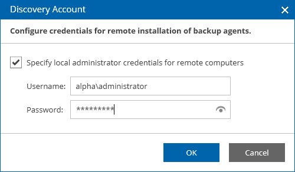

# Deploying Windows Management Agents

To install a management agent on a computer running Microsoft Windows operating system:

1. Copy the agent setup file to a location accessible from the machine where you want to install the management agent.
2. Log on to the machine as an Administrator.
3. Double-click the agent setup file to launch the Veeam Service Provider Console Management Agent wizard.
4. Follow the steps of the wizard.
5. At the last step of the wizard, click Install.
6. When installation completes, click Finish to close the wizard.

The agent will be installed by the following path: %ProgramFiles%\Veeam\Availability Console\CommunicationAgent.

If you have downloaded the management agent setup file from the Veeam Service Provider Console, it will automatically connect to Veeam Service Provider Console with the assigned company configuration. Otherwise, you must configure the agent manually.

|  |
| --- |
| Tip: |
| You can install Veeam Service Provider Console management agent using the command line interface. For details on installation command-line syntax, see section [Veeam Service Provider Console Management Agent for Microsoft Windows](https://helpcenter.veeam.com/docs/vac/deployment/silent_install_agent.html?ver=9.1) of the Deployment Guide. |

Configuring Management Agent

To configure a management agent:

1. In the icon tray, right-click the management agent icon and choose Agent Settings.

If the icon is hidden, display hidden icons, find Veeam.MBP.Agent.Configurator in the list of notification area icons, and choose to show the icon and notifications for it.

1. In the Management Agent Settings window, specify settings that the agent must use to connect to Veeam Service Provider Console.

1. In the Cloud gateway field, type FQDN or IP address of the cloud gateway.
2. In the Port field, specify the port on the cloud gateway that is used to transfer data to Veeam Service Provider Console.
3. [Optional] In the Tag field, specify the tag that must be assigned to the management agent.

1. In the Management Agent Settings window, click Apply.

Management agent will connect to Veeam Service Provider Console server, download the security certificate and perform its verification.

In case of errors during certificate verification you will be prompted the Security Certificate Preview window:

* To view error details, at the top of the window, click the Learn more link.
* To ignore the error and continue agent configuration, click Ignore.

1. In the Management Agent window, click Restart to restart the management agent and apply connection settings.
2. Wait for the agent to connect to Veeam Service Provider Console.

When the agent connects to Veeam Service Provider Console, the status in the Management Agent Settings window will be displayed as Connected. The agent icon in the icon tray will turn blue.

1. [Optional] Specify an account that will be used for computer discovery, and the installation and upgrade of Veeam products on local computers.

If you do not specify an account at this stage, you can specify it when configuring discovery rules, or installing or upgrading VBR servers.

1. In the Management Agent Settings window, click the Remote computer discovery user account link.
2. In the Discovery Account window, select the Specify local administrator credentials for remote installation of backup agents check box.
3. In the Username and Password fields, specify credentials of an account that will be used to discover client computers and install Veeam backup agents.

The account must have local Administrator permissions on all computers that you want to discover in the client infrastructure.

1. Click OK.

1. In the Management Agent Settings window, click Close.

What You Can Do Next

If a company has more than one location, you must set a location for the management agent.

By default, all new management agents you install belong to the default company location. If the management agent belongs to a non-default location, you must explicitly set this location for the agent.

For details on setting locations, see [Setting Locations](set_location_quotas.md#backup_agent).

