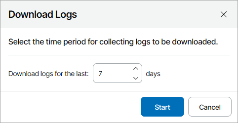

# Downloading Logs from Veeam Backup & Replication Servers

You can download Veeam Backup & Replication log files from Veeam Backup & Replication servers without having to access the Veeam Backup & Replication console.

Log files are downloaded as a single ZIP archive. If you choose to download logs for more than one backup server, the archive will include a separate archive with log files for each chosen client backup server.

Required Privileges

To perform this task, a user must have one of the following roles assigned: Company Owner, Company Administrator, Company Tenant, Location Administrator.

Downloading Logs from Veeam Backup & Replication Servers

To download logs from one or more client backup servers:

1. Log in to Veeam Service Provider Console.

For details, see [Accessing Veeam Service Provider Console](access_vac.md).

1. In the menu on the left, click Managed Computers.
2. Open the Backup Servers tab.
3. Select the necessary backup servers in the list.
4. Click Server Actions and select Download Logs.
5. In the Download Logs window, specify a number of days for which you want to gather logs from client backup servers.

1. Click Start.

Veeam Service Provider Console will display a window with message notifying that the download process started. Click OK to close the window.

1. Wait until Veeam Service Provider Console collects log data.

The file with exported data will be saved to the default download location on your computer.

