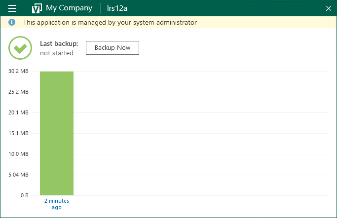

# Enabling Read-Only Access Mode

To prevent end users from changing Veeam backup agent job settings, you can enable read-only access mode.

|  |
| --- |
| Important! |
| Read-only access mode affects only Veeam backup agent end user interface and does not provide extra security measures for backup files.  To ensure security of your backups:   1. Follow the 3-2-1 backup strategy. For details, see the Veeam Blog article [How to follow the 3-2-1 backup rule with Veeam Backup & Replication](https://www.veeam.com/blog/321-backup-rule.html). 2. Use buckets to store cloud backups. 3. Use immutability for scale-out backup repositories. For details, see section [Immutability for Scale-Out Backup Repositories](https://helpcenter.veeam.com/docs/vbr/userguide/immutability_sobr.html?ver=13) of the Veeam Backup & Replication User Guide. |

In the read-only access mode, Veeam backup agents can be managed only in Veeam Service Provider Console. The Veeam backup agent Control Panel section displays a notification saying that the product is managed by a system administrator.

End users working directly with Veeam backup agent in the read-only access mode can perform a limited set of operations, including:

* Running the backup job manually
* Viewing backup session statistics
* Creating Veeam Recovery Media
* Restoring individual files

Other operations are not available for end users.

|  |
| --- |
| Note: |
| When you install Veeam backup agents using discovery rules, or initiate Veeam backup agent installation in Veeam Service Provider Console, the read-only access mode is enabled by default. You may need to manually enable the read-only access mode only if Veeam backup agents were installed outside Veeam Service Provider Console (for example, using GPO), or if for some reason you chose not to keep the default access mode settings when installing Veeam backup agents. |

Required Privileges

To perform this task, a user must have one of the following roles assigned: Company Owner, Company Administrator, Company Tenant, Location Administrator.

Enabling Read-Only Access Mode

To enable read-only access mode for Veeam backup agents:

1. Log in to Veeam Service Provider Console.

For details, see [Accessing Veeam Service Provider Console](access_vac.md).

1. In the menu on the left, click Backup Jobs.
2. Open the Computers > Managed by Console tab.
3. Select one or more Veeam backup agents in the list.

To display all Veeam backup agents running in the full access mode, click Filter, in the Filter backup agents by UI mode section select Full and click Apply.

1. At the top of the list, click Backup Agent UI and choose Switch to Read-only UI.

Alternatively, you can right-click the necessary Veeam backup agent, choose Backup Agent UI and select Switch to Read-only UI.

Disabling Read-Only Access Mode

To disable read-only access for Veeam backup agents:

1. Log in to Veeam Service Provider Console.

For details, see [Accessing Veeam Service Provider Console](access_vac.md).

1. In the menu on the left, click Backup Jobs.
2. Open the Computers > Managed by Console tab.
3. Select one or more Veeam backup agents in the list.

To display all Veeam backup agents running in the read-only access mode, click Filter, in the Filter backup agents by UI mode section select Read-Only and click Apply.

1. At the top of the list, click Backup Agent UI and choose Switch to Full Admin Access.

Alternatively, you can right-click the necessary Veeam backup agent, choose Backup Agent UI and select Switch to Full Admin Access.

