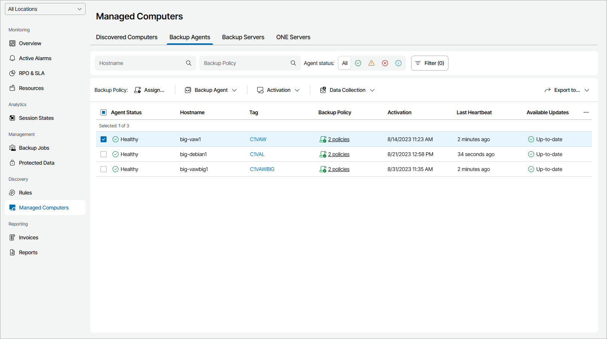

# Viewing and Exporting Veeam Backup Agent Details

You can view details on managed Veeam backup agents and export them to a CSV or XML file.

Required Privileges

To perform this task, a user must have one of the following roles assigned: Company Owner, Company Administrator, Company Administrator, Company Tenant, Location Administrator, Location User.

Viewing and Exporting Veeam Backup Agents Details

To view and export Veeam backup agents details:

1. Log in to Veeam Service Provider Console.

For details, see [Accessing Veeam Service Provider Console](access_vac.md).

1. In the menu on the left, click Managed Computers.
2. Open the Backup Agents tab.
3. To narrow down the list of managed Veeam backup agents, you can apply the following filters:

* Hostname — limit the list of Veeam backup agents by the name of protected computer.
* Backup Policy — limit the list of Veeam backup agents by the name of a backup policy.
* Agent status — limit the list of Veeam backup agents by the Veeam Service Provider Console management agent status (Healthy, Warning, Error, Info).
* Assigned policy — limit the list of Veeam backup agents by the backup policy assignment status (Assigned, Not assigned, Custom, Outdated).

* Platform — limit the list of Veeam backup agents by platform type (Physical, Virtual, Cloud).

* Available updates — limit the list of Veeam backup agents by update status (Up-to-date, Update available, Attention required).
* Activation — limit the list of Veeam backup agents by mode (Activated, Not activated).
* Operation mode — limit the list of Veeam backup agents by operation mode (Server, Workstation).
* Guest OS — limit the list of Veeam backup agents by guest OS (Windows, Linux, macOS).
* Location — limit the list of jobs by location to which jobs belong. To limit the list of jobs by location, use filter at the top left corner of the Veeam Service Provider Console window.

1. To export Veeam backup agent details, click Export to and choose a format of the exported data:

* CSV — choose this option to structure exported data as a CSV file.
* XML — choose this option to structure exported data as an XML file.

The file with exported data will be saved to the default download location on your computer.

Each Veeam backup agent in the list is described with a set of properties. By default, some properties in the list are hidden. To display additional properties, click the ellipsis on the right of the list header and choose properties that must be displayed.

* Agent Status — Veeam Service Provider Console management agent status (Healthy, Warning, Error, Unknown).

You can click the Error link, to view error details.

* Company — name of a company to which Veeam backup agent belongs.
* Site — name of a Veeam Cloud Connect site on which the company is registered.
* Location — name of a location to which Veeam backup agent belongs.
* Platform — computer platform on which Veeam backup agent is deployed (Physical, Virtual, Cloud).
* Hostname — name of a managed computer on which Veeam backup agent is deployed.

* Tag — tag assigned to a Veeam backup agent.

* Operation Mode — backup job operation mode (Workstation, Server).
* Backup Policy — backup policies assigned to Veeam backup agent.

You can click this property to view details of all backup policies assigned to Veeam backup agent.

* Activation — date and time when Veeam backup agent was activated.
* Last Heartbeat — time period since a Veeam Service Provider Console management agent sent the latest heartbeat to Veeam Service Provider Console.
* Guest OS — guest OS on a managed computer.
* Backup Agent Version — version of Veeam backup agent deployed on a managed computer.
* Available Updates — update status of Veeam backup agent deployed on a managed computer (Up-to-date, Upgrade available, Patch available, Manual upgrade required).
* Backup Agent License — license mode (Activated, Free, Paid (Standalone)).
* Reboot Required — indicates whether computer reboot is required (normally, computer reboot is required after installation procedures).
* CBT Driver — indicates whether CBT driver is installed.
* Patch Level — level of Veeam backup agent patch.

