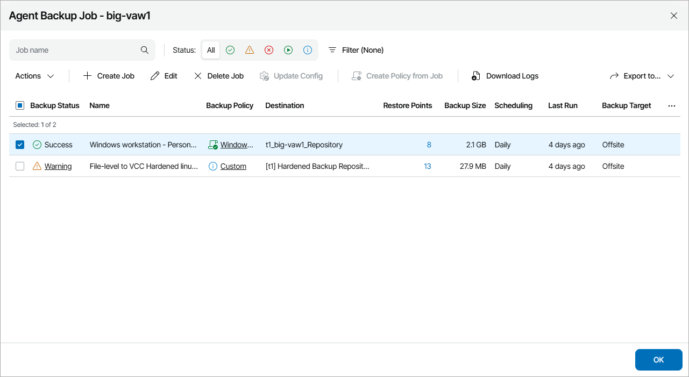

# Viewing and Exporting Managed Veeam Backup Agent Job Details

You can view Veeam backup agent job details and export them to a CSV or XML file.

Required Privileges

To perform this task, a user must have one of the following roles assigned: Company Owner, Company Administrator, Company Tenant, Location Administrator, Location User, Subtenant.

Subtenant can only view job details but cannot perform export.

Viewing and Exporting Managed Veeam Backup Agent Job Details

To view and export Veeam backup agent job details:

1. Log in to Veeam Service Provider Console.

For details, see [Accessing Veeam Service Provider Console](access_vac.md).

1. In the menu on the left, click Backup Jobs.
2. Open the Computers tab and navigate to Managed by Console.

Veeam Service Provider Console will display a list of managed Veeam backup agents.

1. To narrow down the list of Veeam backup agents, you can apply the following filters:

* Computer — limit the list of Veeam backup agents by the name of a protected computer.

* Status — limit the list of jobs by status of the latest job session (Success, Warning, Failed, Running, Info).

* Platform — limit the list of Veeam backup agents by platform type (Physical, Virtual, Cloud).
* Operation mode — limit the list of Veeam backup agents by operation mode (Server, Workstation).
* UI mode — limit the list of Veeam backup agents by mode (Read-only, Full).
* Backup mode — limit the list of Veeam backup agents by backup operation mode (Entire computer, Volume-level, File-level).
* Guest OS — limit the list of Veeam backup agents by guest OS (Windows, Linux, macOS).

* Location — limit the list of jobs by location to which jobs belong. To limit the list of jobs by location, use filter at the top left corner of the Veeam Service Provider Console window.

1. To export summary details of all jobs on selected Veeam backup agents, click Export to and choose a format of the exported data:

* CSV — choose this option to structure exported data as a CSV file.
* XML — choose this option to structure exported data as an XML file.

The file with exported data will be saved to the default download location on your computer.

1. To export details of one or more jobs on a particular Veeam backup agent:

1. Select the necessary Veeam backup agent in the list and click a link in the Backup Policy, Successful Jobs or Running Jobs column.
2. In the Agent Backup Job window, select the necessary Veeam backup agent jobs.

To narrow down the list of jobs, you can apply the following filters:

* Job Name — limit the list of jobs by name.
* Job Status — limit the list of jobs by status of the latest job session (Success, Warning, Failed, Running, Info).
* Operation mode — limit the list of jobs by operation mode (Server, Workstation).
* Assigned policy — limit the list of jobs by the status of a backup policy assigned to Veeam backup agent (Assigned, Not assigned, Custom, Out-of-date).
* Backup target — limit the list of jobs by the location where backup files for a managed computer reside (Local, Offsite).

1. Click Export to and choose a format of the exported data:

* CSV — choose this option to structure exported data as a CSV file.
* XML — choose this option to structure exported data as an XML file.

The file with exported data will be saved to the default download location on your computer.

Each Veeam backup agent job in the list is described with a set of properties. By default, some properties in the list are hidden. To display additional properties, click the ellipsis on the right of the list header and choose properties that must be displayed.

* Backup Status — status of the latest job session (Success, Warning, Failed, Running).
* Name — name of the backup job.
* Backup Policy — backup policy assigned to Veeam backup agent.
* Operation Mode — backup job operation mode (Workstation, Server).
* Destination — location where backup files for a managed computer reside.
* Restore Points — number of restore points available in the backup chain for a managed computer.
* Backup Size — total size of all restore points for a managed computer.

Note that for jobs targeted to scale-out backup repositories the value in this column may represent the total size of restore points stored on performance tier only.

* Scheduling — job scheduling settings.
* Last Run — date and time when the latest backup job session started.
* Last Modified — date and time when settings of the backup job were last modified.
* Modified by — user who last modified job settings.
* Next Run — date and time of the next backup job session according to the backup schedule.
* Repository Free Space — amount of free space available on the target repository (repository where backup files for a managed computer reside).
* Avg. Duration — average time it took to complete the job session (total job duration time for the previous month divided by the number of times the job ran).
* Duration — duration of the latest job session.
* Backup Mode — backup operation mode (Entire computer, File level, Volume level).
* Backup Target — target location for the backup files (Local, Offsite).

