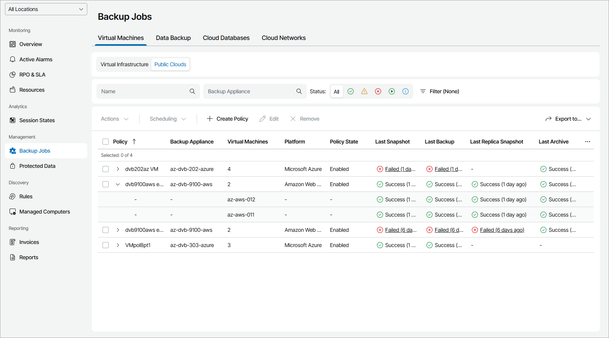

# Virtual Machines

To view and export policy details for VMs in the public clouds:

1. Log in to Veeam Service Provider Console.

For details, see [Accessing Veeam Service Provider Console](access_vac.md).

1. In the menu on the left, click Backup Jobs.
2. Open the Virtual Machines tab and navigate to Public Clouds.

Veeam Service Provider Console will display a list of all policies configured to store backups on external repositories integrated with managed backup servers.

To narrow down the list of policies, you can apply the following filters:

* Name — search policies by name.

* Backup Appliance — search policies by appliance name.

* Status — limit the list of policies by the result of the latest session (Success, Warning, Failed, Running, Information).
* Type — limit the list of policies by type (Backup, Snapshot, Replica snapshot, Archive).
* Platform — limit the list of policies by cloud platform on which protected VMs reside (Amazon Web Services, Microsoft Azure, Google Cloud).
* Location — limit the list of policies by location to which policies belong. To limit the list of policies by location, use filter at the top left corner of the Veeam Service Provider Console window.

1. To export policy details, click Export to and choose a format of the exported data:

* CSV — choose this option to structure exported data as a CSV file.
* XML — choose this option to structure exported data as an XML file.

The file with exported data will be saved to the default download location on your computer.

Each policy in the list is described with a set of properties. By default, some properties in the list are hidden. To display additional properties, click the ellipsis on the right of the list header and choose job properties that must be displayed.

* Policy — policy name.

You can expand a policy to view detailed information on names and resource IDs of protected VMs.

* Virtual Machines — number of protected VMs.

To view names of protected VMs, expand the policy name.

* Backup Appliance — name of an appliance to which a policy belongs.
* Location — name of a location to which a policy belongs.

* Resource ID — id of Microsoft Azure VM, AWS EC2 instance or Google Cloud VM instance.

To view ids of protected instances, expand the policy name.

* Platform — name of a cloud platform on which a protected VM resides.
* Policy State — state of a policy schedule (Enabled, Disabled).
* Last Snapshot — status of the latest snapshot session and amount of time since the session completed.
* Last Backup — status of the latest backup session and amount of time since the session completed.
* Last Replica Snapshot — status of the latest replica snapshot session and amount of time since the session completed.
* Last Archive — status of the latest archive session and amount of time since the session completed.
* Next Run — date and time of the next scheduled policy run.
* Server Name — name of a backup server with which an external repository hosting backup files is integrated.

