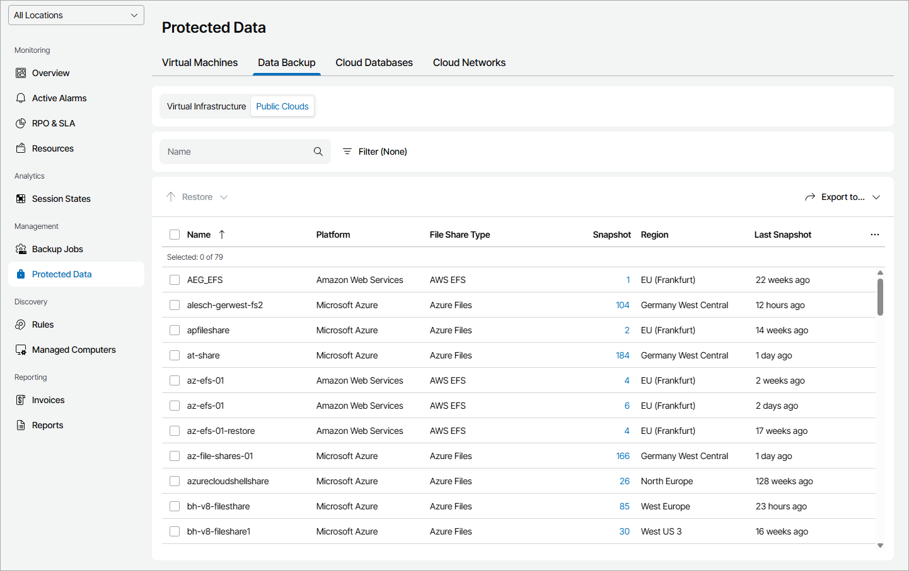

# File Shares

To view and export protected cloud file shares details:

1. Log in to Veeam Service Provider Console.

For details, see [Accessing Veeam Service Provider Console](access_vac.md).

1. In the menu on the left, click Protected Data.
2. Open the Data Backup tab and navigate to Public Clouds.

Veeam Service Provider Console will display a list of all file shares protected by Veeam Backup for Public Clouds.

To narrow down the list of file shares, you can apply the following filters:

* Name — search file shares by name.
* Type — limit the list of file shares by policy type (Snapshot, Replica snapshot).

* Platform — limit the list of file shares by cloud platform on which file shares reside (Amazon Web Services, Microsoft Azure).

* File share type — limit the list of policies by type of protected file share (AWS FSx, AWS EFS, Azure Files).

* Location — limit the list of file shares by location to which file shares belong. To limit the list of file shares by location, use filter at the top left corner of the Veeam Service Provider Console window.

1. To export protected file share details, click Export to and choose a format of the exported data:

* CSV — choose this option to structure exported data as a CSV file.
* XML — choose this option to structure exported data as an XML file.

The file with exported data will be saved to the default download location on your computer.

Each file share in the list is described with a set of properties. By default, some properties in the list are hidden. To display additional properties, click the ellipsis on the right of the list header and choose file share properties that must be displayed.

* Name — file share name.

* Location — name of a location to which a file share server belongs.

* File-Level Restore Portal — link to the Veeam Backup for Public Clouds restore portal.

* Policy — name of a file protection policy.
* Platform — platform on which a file share resides.

* File Share Type — type of a protected file share.

* Snapshot — number of snapshots available in the backup chain for a cloud file share.

You can click this property to view and export details on date and size of each snapshot.

* Replica Snapshot — number of replica snapshots available in the backup chain for a cloud file share.

You can click this property to view and export details on date and size of each snapshot.

* Region — name of region in which file share is located.
* Last Snapshot — amount of time since the last snapshot session run.
* Last Replica Snapshot — amount of time since the last replica snapshot session run.

* Resource ID — ID of a cloud object.

Restore Point Details

You can view the following details on backed up data:

* Date — date of restore point creation.
* Size — size of the source data backed up.

You can export restore points details. To do this, click Export to and choose a format of the exported data:

* CSV — choose this option to structure exported data as a CSV file.
* XML — choose this option to structure exported data as an XML file.

The file with exported data will be saved to the default download location on your computer.

