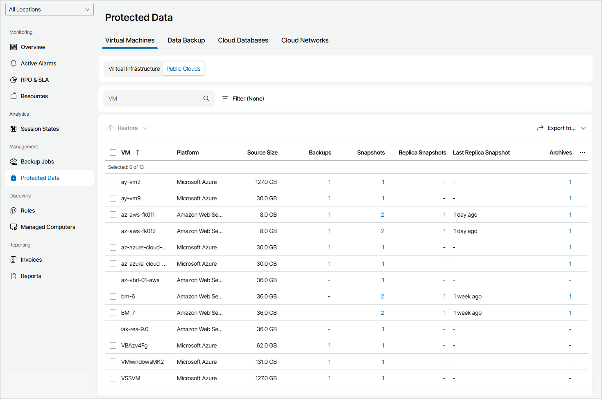

# Virtual Machines

To view and export protected cloud VMs details:

1. Log in to Veeam Service Provider Console.

For details, see [Accessing Veeam Service Provider Console](access_vac.md).

1. In the menu on the left, click Protected Data.
2. Open the Virtual Machines tab and navigate to Public Clouds.

Veeam Service Provider Console will display a list of all VMs protected by Veeam Backup for Public Clouds.

To narrow down the list of VMs, you can apply the following filters:

* VM — search VMs by name.
* Type — limit the list of VMs by protection policy type (Backup, Snapshot, Replica snapshot, Archive).
* Platform — limit the list of VMs by type of platform on which VMs reside (Amazon Web Services, Microsoft Azure, Google Cloud).

* Location — limit the list of VMs by location to which jobs belong. To limit the list of jobs by location, use filter at the top left corner of the Veeam Service Provider Console window.

1. To export job details, click Export to and choose a format of the exported data:

* CSV — choose this option to structure exported data as a CSV file.
* XML — choose this option to structure exported data as an XML file.

The file with exported data will be saved to the default download location on your computer.

Each VM in the list is described with a set of properties:

* VM — name of a protected VM.

* Platform — platform on which protected VM resides.
* File-Level Restore Portal — link to the Veeam Backup for Public Clouds restore portal.
* Backup Server — name of a backup server on which a VM protection job is configured.
* Location — name of a location to which a job belongs.
* Source Size — total size of the source data backed up.
* Backups — number of backup jobs configured for a VM.

You can click this property to view and export job details. For details, see [VM Job Details](#backup).

* Last Backup — amount of time since the latest backup session completed.
* Backup Size — total size of all backup restore points for a VM.
* Backup Target — name of a target backup location.
* Snapshots — number of backup policies configured for a VM.

You can click this property to view and export policy details. For details, see [VM Policy Details](#snapshot).

* Last Snapshot — amount of time since the latest backup policy session completed.
* VM Region — name of region in which cloud storage with backups is located.
* Replica Snapshots — number of backup policies with snapshot replication configured for a VM.

You can click this property to view and export policy details. For details, see [VM Policy Details](#snapshot).

* Last Replica Snapshot — amount of time since the latest replica snapshot was created.
* Replica Snapshot Region — name of region in which cloud storage with snapshot replicas is located.
* Archives — number of archive jobs configured for a VM.

You can click this property to view and export job details. For details, see [VM Job Details](#backup).

* Last Archive — amount of time since the latest archive session completed.
* Archive Size — total size of all archive restore points for a VM.
* Archive Target — name of a target archive location.
* Backup Copies — number of backup copy jobs configured for a VM.

You can click this property to view and export job details. For details, see [VM Job Details](#backup).

* Last Backup Copy — amount of time since the latest backup copy session completed.
* Backup Copy Size — total size of all backup copy restore points for a VM.
* Backup Copy Target — name of a target backup copy location.
* Backups on Tape — number of backup to tape jobs configured for a VM.

You can click this property, to view and export job details. For details, see [VM Job Details](#backup).

* Last Backup on Tape — amount of time since the latest backup to tape session completed.
* Backups on Tape Size — total size of all backup to tape restore points for a VM.
* Tape Media Pool — name of a media pool which contains tapes with backup files.
* Resource ID — ID of a cloud object.
* Last Health Check — status of the latest backup health check session and amount of time since the latest health check session.

VM Job Details

You can view and export the following details on VM jobs:

* Job/Policy Name — name of a data protection job or policy.
* Last Job Run — amount of time since the latest data protection session completed.
* Source Size — size of the source data backed up.
* Restore Points — number of restore points available in the backup chain for a VM.

You can click this property to view details of each restore point. For details, see [Restore Point Details](#restore_point).

Backed up data for individual VMs is available only for jobs pointed to repositories with the Use per-machine backup files option enabled. For details, see section [Backup Chain Formats](https://helpcenter.veeam.com/docs/vbr/userguide/per_vm_backup_files.html?ver=13) of the Veeam Backup & Replication User Guide.

* Backup Size — total size of all restore points created by a job.
* (For backup jobs) Repository — name of a target backup repository.
* (For replication jobs) Target Host — name of a target host for VM replica.
* (For tapes) Media Pool — name of a media pool which contains tapes with backup files.
* (For archives) Archive — name of an archive repository.
* Backup Server — name of a backup server on which a VM protection job is configured.

VM Policy Details

You can view and export the following details on cloud VM policies:

* Policy Name — name of a cloud protection policy.
* Last Job Run — amount of time since the latest cloud policy session completed.
* VM Size — size of the source data backed up.
* Snapshots — number of snapshots available in the backup chain for a cloud VM.

You can click this property to view and export details on date and size of each snapshot.

* VM Region — name of region in which cloud storage with backups or snapshot replicas is located.
* Backup Server — name of a backup server with which an external repository hosting backup files is integrated.

Restore Point Details

You can view the following details on backed up data:

* Date — date of restore point creation.
* Source Size — size of the source data backed up.

You can export restore points details. To do this, click Export to and choose a format of the exported data:

* CSV — choose this option to structure exported data as a CSV file.
* XML — choose this option to structure exported data as an XML file.

The file with exported data will be saved to the default download location on your computer.

