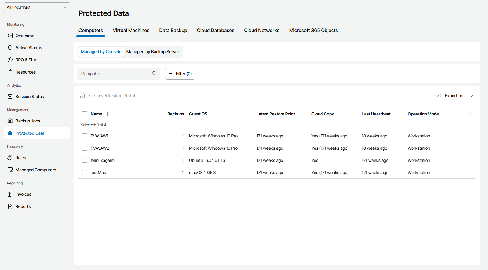

# Viewing and Exporting Protected Computer Details

You can view details of computers protected with Veeam backup agents and export them to a CSV or XML file.

To access protected data details, you must have at least one Veeam backup agent in your infrastructure.

Required Privileges

To perform this task, a user must have one of the following roles assigned: Company Owner, Company Administrator, Company Tenant, Location Administrator, Location User, Subtenant.

Viewing and Exporting Protected Computer Details

To view and export details of computers protected with Veeam backup agents:

1. Log in to Veeam Service Provider Console.

For details, see [Accessing Veeam Service Provider Console](access_vac.md).

1. In the menu on the left, click Protected Data.
2. Open the Computers tab and navigate to Managed by Console.

Veeam Service Provider Console will display a list of all managed computers that have at least one finished Veeam backup agent job.

1. To narrow down the list of computers, you can apply the following filters:

* Computer — search the list of computers by the name.
* Operation mode — limit the list of computers by Veeam backup agent operation mode (Server, Workstation).
* Cloud copy — limit the list of computers by cloud copy existence (Yes, No).
* Restore status — limit the list of computers by last file-level restore session status (Restoring, Failed, Success, Warning).
* Backup type — limit the list of computers by backup operation type (Entire computer, Volume-level, File-level).
* Guest OS — limit the list of protected computers by guest OS (Windows, Linux, macOS).

* Location — limit the list of jobs by location to which jobs belong. To limit the list of jobs by location, use filter at the top left corner of the Veeam Service Provider Console window.

1. To export protected computer details, click Export to and choose a format of the exported data:

* CSV — choose this option to structure exported data as a CSV file.
* XML — choose this option to structure exported data as an XML file.

The file with exported data will be saved to the default download location on your computer.

Each protected computer in the list is described with a set of properties. By default, some properties in the list are hidden. To display additional properties, click the ellipsis on the right of the list header and choose properties that must be displayed.

* Name — name of a protected computer.
* Tag — custom tag assigned to a computer.

* Backups — number of backup jobs configured for a computer.

You can click this property, to view and export backup job details. For details, see [Veeam Backup Agent Job Details](#backup).

* Backup Copies — number of backup copy jobs configured for a computer.

You can click this property, to view and export backup copy job details. For details, see [Veeam Backup Agent Job Details](#backup).

* Guest OS — type and version of computer operating system.

* Latest Restore Point — amount of time since the latest restore point was created for a protected computer.

* Cloud Copy — indicates if the cloud copy exists for a protected computer (Yes, No).

* Location — name of a location to which a monitored computer belongs.
* Last Heartbeat — time period since a Veeam Service Provider Console management agent sent the latest heartbeat to Veeam Service Provider Console.
* Last Restore — date and time when the latest file-level restore task started.
* Restore Status — status of the latest file-level restore task (Restoring, Failed, Success, Warning).

You can click the Failed link to open the file-level restore portal for task audit.

* Operation Mode — Veeam backup agent operation mode (Workstation, Server).

Veeam Backup Agent Job Details

To narrow down the list of jobs, you can apply the following filters:

* Job Name — limit the list of jobs by name.
* Operation mode — limit the list of jobs by operation mode (Server, Workstation).
* Backup target — limit the list of jobs by the location where backup files for a managed computer reside (Local, Offsite).
* Backup type — limit the list of jobs by backup operation type (Entire computer, Volume-level, File-level).

You can view and export the following details on Veeam backup agent jobs:

* Job Name — name of a data protection job.
* (For backup jobs) Operation Mode — Veeam backup agent job operation mode (Server, Workstation).
* (For backup jobs) Backup Type — backup operation type (Entire computer, Volume-level, File-level).
* Restore Points — number of restore points available in the backup chain for a computer.

You can click this property to view details of each restore point. For details, see [Restore Point Details](#restore_point).

* Latest Restore Point — amount of time since the latest restore point was created for a protected computer.
* Backup Size — total size of all restore points created by a job.
* Destination — target backup location.
* Next Run — date and time when the next job session will start.

You can export Veeam backup agent jobs details. To do this, click Export to and choose a format of the exported data:

* CSV — choose this option to structure exported data as a CSV file.
* XML — choose this option to structure exported data as an XML file.

The file with exported data will be saved to the default download location on your computer.

Restore Point Details

You can view the following details on backed up data:

* Date — date of restore point creation.
* Source Size — size of the source data backed up.

The value in this column will be empty (—) for file-level backup jobs.

* Backed Up Data — size of the data included in the backup increment.

The value in this column will be empty (—) if no new data was backed up.

* Restore Point Size — size of the restore point.

You can export restore points details. To do this, click Export to and choose a format of the exported data:

* CSV — choose this option to structure exported data as a CSV file.
* XML — choose this option to structure exported data as an XML file.

The file with exported data will be saved to the default download location on your computer.

