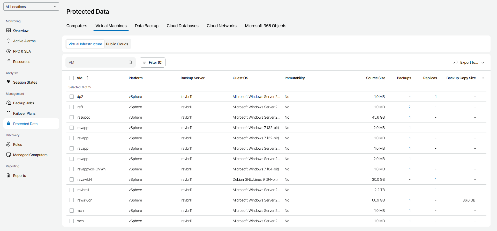

# Virtual Machines

To view and export details for protected VMs in virtual infrastructure:

1. Log in to Veeam Service Provider Console.

For details, see [Accessing Veeam Service Provider Console](access_vac.md).

1. In the menu on the left, click Protected Data.
2. Open the Virtual Machines tab and navigate to Virtual Infrastructure.

Veeam Service Provider Console will display a list of all VMs protected by managed backup servers.

To narrow down the list of VMs, you can apply the following filters:

* VM — search VMs by name.
* Type — limit the list of VMs by protection job type (Backup, Replication, CDP replication, Backup copy, Backup to tape).
* Malware state — limit the list of VMs by restore point infection status (Clean, Infected, Suspicious, Unknown).
* N. of job types — limit the list of VMs by the number of data protection job types (Single, Multiple).
* Cloud copy — limit the list of VMs by cloud copy existence (Yes, No).
* Platform — limit the list of VMs by type of platform on which VMs reside (vSphere, Hyper-V, AHV, oVirt KVM, Proxmox VE, SC HyperCore, HPE Morpheus VM Essentials).
* Immutability — limit the list of VMs by immutability status (Yes, No).

* Location — limit the list of jobs by location to which jobs belong. To limit the list of jobs by location, use filter at the top left corner of the Veeam Service Provider Console window.

1. To export job details, click Export to and choose a format of the exported data:

* CSV — choose this option to structure exported data as a CSV file.
* XML — choose this option to structure exported data as an XML file.

The file with exported data will be saved to the default download location on your computer.

Each VM in the list is described with a set of properties. By default, some properties in the list are hidden. To display additional properties, click the ellipsis on the right of the list header and choose job properties that must be displayed.

If a job is assigned to your company by the service provider, some properties may be unavailable.

* VM — name of a protected VM.
* Platform — platform on which protected VM resides.
* Backup Server — name of a backup server on which a VM protection job is configured.
* * Location — name of a location to which a job belongs.
  * Guest OS — guest operation system installed on a VM.
  * Malware State — antivirus scan result of the created VM restore points.

Note that to view the antivirus scan result, you must connect to Veeam Service Provider Console the Veeam ONE server that monitors the backup server.

* Immutability — immutability status of the created VM restore points.
* Source Size — total size of the source data backed up.
* Backups — number of backup jobs configured for a VM.

You can click this property to view and export job details. For details, see [VM Job Details](#backup).

* Last Backup — amount of time since the latest backup session completed.
* Backup Size — total size of all backup restore points for a VM.
* Backup Target — name of a target backup location.
* Replicas — number of replication jobs configured for a VM.

You can click this property to view and export job details. For details, see [VM Job Details](#backup).

* Last Replication — amount of time since the latest replication session completed.
* Replication Target — name of a target host.
* CDP Replicas — number of CDP replication jobs configured for a VM.

You can click this property to view and export job details. For details, see [VM Job Details](#backup).

* Last CDP Replication — amount of time since the latest CDP replication session completed.
* CDP Replication Target — name of a CDP target host.
* Backup Copies — number of backup copy jobs configured for a VM.

You can click this property to view and export job details. For details, see [VM Job Details](#backup).

* Last Backup Copy — amount of time since the latest backup copy session completed.
* Backup Copy Size — total size of all backup copy restore points for a VM.
* Backup Copy Target — name of a target backup copy location.
* Backups on Tape — number of backup to tape jobs configured for a VM.

You can click this property to view and export job details. For details, see [VM Job Details](#backup).

* Last Backup on Tape — amount of time since the latest backup to tape session completed.
* Backups on Tape Size — total size of all backup to tape restore points for a VM.
* Tape Media Pool — name of a media pool which contains tapes with backup files.
* Resource ID — ID of a virtual object.

VM Job Details

You can view and export the following details on VM jobs:

* Job/Policy Name — name of a data protection job or policy.
* Last Run — amount of time since the latest data protection session completed.
* Source Size — size of the source data backed up.

* Malware State — antivirus scan result of the created VM restore points.

Note that to view the antivirus scan result, you must connect to Veeam Service Provider Console the Veeam ONE server that monitors the backup server.

* Restore Points — number of restore points available in the backup chain for a VM.

You can click this property to view details of each restore point. For details, see [Restore Point Details](#restore_point).

Backed up data for individual VMs is available only for jobs pointed to repositories with the Use per-machine backup files option enabled. For details, see section [Backup Chain Formats](https://helpcenter.veeam.com/docs/vbr/userguide/per_vm_backup_files.html?ver=13) of the Veeam Backup & Replication User Guide.

* Backup Size — total size of all restore points created by a job.
* (For backup jobs) Repository — name of a target backup repository.
* (For replication jobs) Target Host — name of a target host for VM replica.
* (For tapes) Media Pool — name of a media pool which contains tapes with backup files.
* (For archives) Archive — name of an archive repository.
* (For CDP policies) Target — name of a target repository.
* Backup Server — name of a backup server on which a VM protection job is configured.

Restore Point Details

You can view the following details on backed up data:

* Date — date of restore point creation.
* Source Size — size of the source data backed up.

* Malware State — antivirus scan result of the restore point.

Note that to view the antivirus scan result, you must connect to Veeam Service Provider Console the Veeam ONE server that monitors the backup server.

* Backed Up Data — size of the data included in the backup increment.
* Restore Point Size — size of the restore point.

You can export restore points details. To do this, click Export to and choose a format of the exported data:

* CSV — choose this option to structure exported data as a CSV file.
* XML — choose this option to structure exported data as an XML file.

The file with exported data will be saved to the default download location on your computer.

