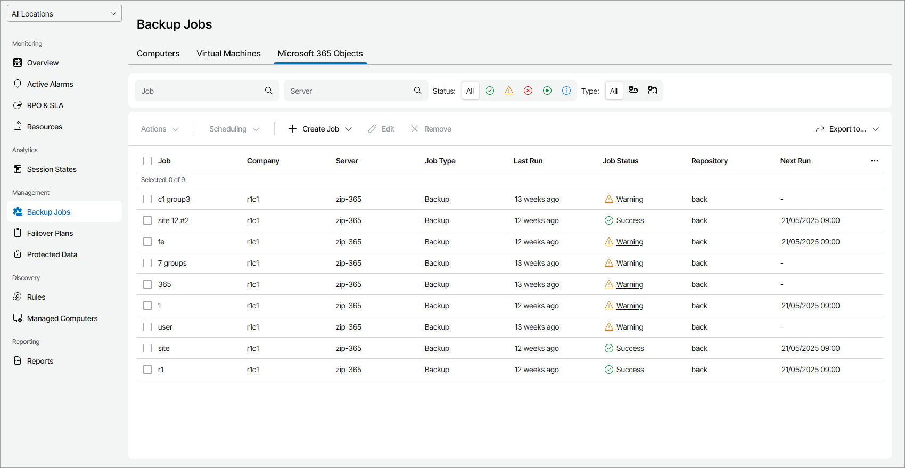

# Viewing and Exporting Job Details

To view and export Veeam Backup for Microsoft 365 job details:

1. Log in to Veeam Service Provider Console.

For details, see [Accessing Veeam Service Provider Console](access_vac.md).

1. In the menu on the left, click Backup Jobs.
2. Open the Microsoft 365 Objects tab.

Veeam Service Provider Console will display a list of all file jobs configured on managed Veeam Backup for Microsoft 365 servers.

To narrow down the list of jobs, you can apply the following filters:

* Job — search jobs by job name.
* Server — search jobs by name of a Veeam Backup for Microsoft 365 server.
* Status — limit the list of jobs by the result of the latest job session (Success, Warning, Failed, Running, Information).
* Type — limit the list of jobs by type (Backup, Backup Copy).

* Location — limit the list of jobs by location to which jobs belong. To limit the list of jobs by location, use filter at the top left corner of the Veeam Service Provider Console window.

1. To export job details, click Export to and choose a format of the exported data:

* CSV — choose this option to structure exported data as a CSV file.
* XML — choose this option to structure exported data as an XML file.

The file with exported data will be saved to the default download location on your computer.

Each job in the list is described with a set of properties. By default, some properties in the list are hidden. To display additional properties, click the ellipsis on the right of the list header and choose job properties that must be displayed.

* Job Status — status of the latest job session (Success, Warning, Failed, Running, Stopped, Disconnected, No Info).
* Job — name of a data protection job.
* Company — name of a company to which a job belongs.

* Site — name of the Veeam Cloud Connect site on which the company is registered.

* Location — name of a location to which a job belongs.
* Server — name of a Veeam Backup for Microsoft 365 server.
* Job Type — type of a file protection job (Backup, Backup Copy).
* Repository — name of a target backup repository.
* Last Run — amount of time since the latest job session started.
* Next Run — date and time of the next scheduled job run.

