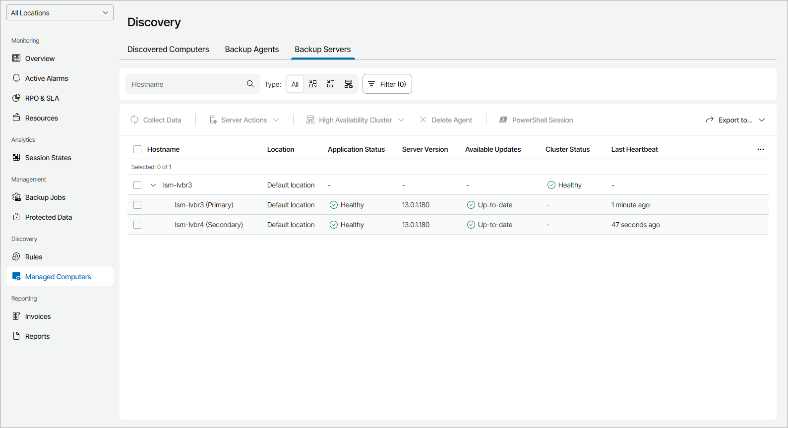

# Viewing and Exporting Veeam Backup & Replication Server Details

You can view details on managed Veeam Backup & Replication servers and export them to a CSV or XML file.

Required Privileges

To manage Veeam Backup & Replication servers, a user must have one of the following roles assigned: Company Owner, Company Administrator, Company Tenant, Company Administrator, Location Administrator, Location User.

Viewing and Exporting Veeam Backup & Replication Server Details

To view and export Veeam Backup & Replication server details:

1. Log in to Veeam Service Provider Console.

For details, see [Accessing Veeam Service Provider Console](access_vac.md).

1. In the menu on the left, click Managed Computers.
2. Open the Backup Servers tab.

Veeam Service Provider Console will display a list of all managed Veeam Backup & Replication servers.

To narrow down the list of servers, you can apply the following filters:

* Hostname — search the list of servers by server name.
* Type — limit the list of servers by type (Veeam Backup & Replication, Veeam Backup Enterprise Manager, Backup High Availability Cluster).

* Application status — limit the list of servers by application status (Healthy, Unaccessible).
* Management agent status — limit the list of servers by management agent status (Healthy, Warning, Error).
* Management agent version — limit the list of servers by management agent version (Up-to-date, Out-of-date, Patch available, N/A).

* Available updates — limit the list of servers by update status (Up-to-date, Update available, Attention required).
* Cluster status — limit the list of servers by High Availability cluster status (Healthy, Missing secondary node, Node offline, Cluster offline).

1. To export server details, click Export to and choose a format of the exported data:

* CSV — choose this option to structure exported data as a CSV file.
* XML — choose this option to structure exported data as an XML file.

The file with exported data will be saved to the default download location on your computer.

Each Veeam Backup & Replication server in the list is described with a set of properties. By default, some properties in the list are hidden. To display additional properties, click the ellipsis on the right of the list header and choose properties that must be displayed.

* Company — name of a company to which a Veeam Backup & Replication server belongs.

* Site — name of the Veeam Cloud Connect site on which the company is registered.

* Location — name of a location to which a Veeam Backup & Replication server belongs.

* Application Status — status of the application running on a computer.

In some cases, after enabling multi-factor authentication for the Veeam Backup & Replication server, the value in this column may become Inaccessible. For details on how to resolve the issue, refer to [this Veeam KB article.](https://www.veeam.com/kb4431)

* Hostname — name of a computer on which Veeam Backup & Replication server is deployed.
* Server Version — version of a Veeam Backup & Replication server and installed or available patch.

* Available Updates — update status of Veeam Backup & Replication server (Up-to-date, Upgrade available, Patch available, Manual upgrade required).

* Tag — tag assigned to a Veeam Backup & Replication server.
* Type — type of a backup server (Veeam Backup & Replication, Veeam Backup Enterprise Manager).
* Cluster Status — status of the High Availability cluster to which a Veeam Backup & Replication server belongs.
* Last Heartbeat — time period since a Veeam Service Provider Console management agent sent the latest heartbeat to Veeam Service Provider Console.
* Update Status — status of the Veeam Backup & Replication patching or upgrading task.

You can click a link in the Update Status column to view patching or upgrading progress, download task session logs or cancel patching or upgrading.

[For all roles except for Location User] If patching or upgrading was canceled and the Update Status is Error, click Clear Logs to update the status.

* Scheduled Updates — date and time of the scheduled Veeam Backup & Replication patching or upgrading task.

You can click a link in the Scheduled Updates column to reschedule the task, start the task immediately or cancel the scheduled task.

* Guest OS — operation system of a computer on which Veeam Backup & Replication server is deployed.
* Management Agent Status — Veeam Service Provider Console management agent status (Healthy, Warning, Error).

You can click the Error link to view error details.

* Management Agent Version — Veeam Service Provider Console management agent version.
* Upgrade File Download Status — status of the Veeam Backup & Replication upgrade file download.

You can click a link in the Upgrade File Download Status column to view the download progress or cancel the download.

* IP Address — IP address of a computer on which Veeam Backup & Replication server is deployed.

