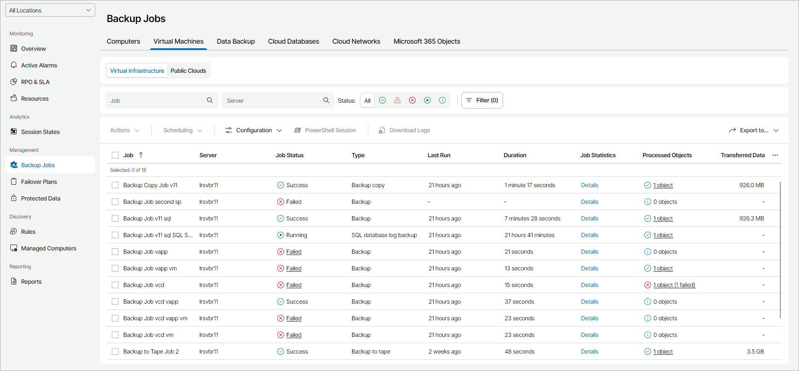

# Virtual Machines

To view and export job details for VMs in the virtual infrastructure:

1. Log in to Veeam Service Provider Console.

For details, see [Accessing Veeam Service Provider Console](access_vac.md).

1. In the menu on the left, click Backup Jobs.
2. Open the Virtual Machines tab and navigate to Virtual Infrastructure.

Veeam Service Provider Console will display a list of all VM jobs configured on managed backup servers.

To narrow down the list of jobs, you can apply the following filters:

* Job — search jobs by name.
* Server — search jobs by name of a backup server on which a job is configured.
* Status — limit the list of jobs by the result of the latest job session (Success, Warning, Failed, Running, Information).
* Type — limit the list of jobs by type (Backup, Replication, SureBackup, Backup copy, Backup to tape, VM copy, SQL database log backup job, Oracle database log backup job, PostgreSQL database log backup job, Storage snapshot, CDP policy).
* Platform type — limit the list of jobs by the type of platform on which protected VMs run (vSphere, Cloud Director, Hyper-V, AHV, oVirt KVM, Proxmox VE, SC HyperCore, HPE Morpheus VM Essentials, Other).
* Backup target — limit the list of jobs by target backup location (Local, Offsite).

* Location — limit the list of jobs by location to which jobs belong. To limit the list of jobs by location, use filter at the top left corner of the Veeam Service Provider Console window.

1. To export job details, click Export to and choose a format of the exported data:

* CSV — choose this option to structure exported data as a CSV file.
* XML — choose this option to structure exported data as an XML file.

The file with exported data will be saved to the default download location on your computer.

Each job in the list is described with a set of properties. By default, some properties in the list are hidden. To display additional properties, click the ellipsis on the right of the list header and choose job properties that must be displayed.

If a job is assigned to your company by the service provider, some properties may be unavailable.

* Job — name of a data protection job.

* Location — name of a location to which a job belongs.
* Server — name of a backup server on which a job is configured.
* Job Status — status of the latest job session (Success, Warning, Failed, Running, No Info).
* Type — job type (Backup, Replication, SureBackup, Backup copy, Backup to tape, VM Copy, SQL database log backup, Oracle database log backup, PostgreSQL database log backup, Storage snapshot, CDP policy).
* Platform — platform on which protected VMs run (vSphere, Cloud Director, Hyper-V, AHV, oVirt KVM, Proxmox VE, SC HyperCore, HPE Morpheus VM Essentials, Other).
* Last Run — amount of time since the latest job session started.
* End Time — date and time when the latest job session ended.
* Duration — time taken to complete the latest job session.
* Avg. Duration — average time a job session takes to complete (total duration of job sessions for the previous month divided by the number of job sessions for the previous month).
* Target — name of a target backup location.
* CDP Session Errors — number of errors occurred during the last CDP policy session.

You can click this property to view detailed information on occurred errors.

* Job Statistics — summary information on the job.

Click the Details link in the column to view information on job duration, processing rate, bottleneck and the amount of processed, read and transferred data. For CDP policies, job statistics include information on RPO, syncronization sessions, job duration and processed data for the last period and last 24 hours.

* Processed Objects — number of processed by a job objects that have backup or replica restore points. For CDP policies, value in this column shows the number of VMs included in a CDP policy. For backup to tape jobs, value in this column shows the number of restore points.

You can click this property to view and export object details. For details, see [Processed Object Details](#vm).

* Processing Rate — rate at which VM data was processed during the latest job session.
* Transferred Data — total amount of data that was transferred to target during the latest job session.
* Bottleneck — bottleneck in the process of transferring the data from source to target (Source, Proxy, Network, Target, Source WAN accelerator, Target WAN accelerator).
* Schedule — type of schedule configured for the job (Daily, Monthly, Periodically, Continuously, Chained, Not scheduled, Disabled).

Processed Object Details

You can view and export the following details on objects processed during the last job session or last 12 hours:

* Object — name of a processed object.
* Status — status of the latest backup job session.
* Transferred Data — total amount of data transferred during the latest backup job session or last 12 hours.
* Guest OS — guest OS installed on a VM.

* Restore Points — number of restore points available in the backup chain for a VM.

You can click this property to view details of each restore point. For details, see [Restore Point Details](#restore_point).

Backed up data for individual VMs is available only for jobs pointed to repositories with the Use per-machine backup files option enabled. For details, see section [Backup Chain Formats](https://helpcenter.veeam.com/docs/vbr/userguide/per_vm_backup_files.html?ver=13) of the Veeam Backup & Replication User Guide.

* Last Run — date and time of the latest successful backup job session.
* Last Duration — time taken to complete the latest job session.

The following details are available on objects processed by CDP policies for the last 12 hours:

* Object — name of a processed object.
* Status — status of the latest CDP policy session.
* SLA — percentage of sessions completed within RPO.
* Bottleneck — bottleneck in the process of transferring the data.
* Max Delay — difference between the configured RPO and time required to transfer and save data.
* Avg. Duration — average duration of a synchronization session.
* Max Duration — maximum duration of a synchronization session.
* Sync Interval — duration of a synchronization session configured in the policy.
* Successful Sessions — number of successful policy sessions.
* Failed Sessions — number of failed policy sessions.
* Warnings — number of policy sessions finished with warnings.
* Avg. Data — average amount of data processed within one synchronization session.
* Max Data — maximum amount of data processed within one synchronization session.
* Total Data — total size of data sent during the policy session.

Restore Point Details

You can view the following details on backed up data:

* Date — date of restore point creation.
* Source Size — size of the source data backed up.
* Backed Up Data — size of the data included in the backup increment.
* Restore Point Size — size of the restore point.

You can export restore points details. To do this, click Export to and choose a format of the exported data:

* CSV — choose this option to structure exported data as a CSV file.
* XML — choose this option to structure exported data as an XML file.

The file with exported data will be saved to the default download location on your computer.

