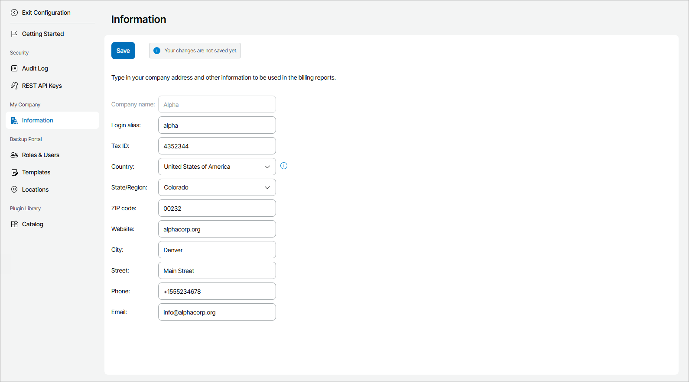

# Filling Company Profile

Before you start working with Veeam Service Provider Console, you must fill out the company profile. The profile contains information about your company, such as the company name, address, contact person details and so on. Information specified in the company profile is included in invoices.

Some information in the company profile is populated by the Veeam Service Provider Console Portal Administrator, when a company account is registered. You must check provided details and fill the remaining information in the company profile.

Required Privileges

To perform this task, a user must have one of the following roles assigned: Company Owner, Company Administrator.

Filling Company Profile

To fill the company profile:

1. Log in to Veeam Service Provider Console.

For details, see [Accessing Veeam Service Provider Console](access_vac.md).

1. At the top right corner of the Veeam Service Provider Console window, click Configuration.
2. In the configuration menu on the left, click Information.
3. In the Login alias field, specify a short name for login to the backup portal.
4. In the Tax ID field, specify the company tax identification number.
5. In the Country, State/Region, ZIP code, Website, City, Street, Phone, and Email fields, specify your company address and contact information.
6. Click Save.

The specified company name, tax ID, phone number, ZIP code, country and region will be displayed in invoices.

