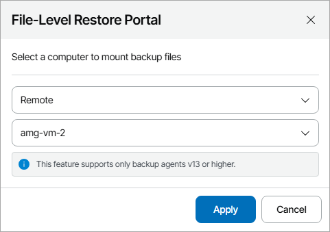

# Step 1. Open File-Level Restore Portal

To open the file-level restore portal:

1. Log in to Veeam Service Provider Console.

For details, see [Accessing Veeam Service Provider Console](access_vac.md).

1. In the menu on the left, click Protected Data.
2. Open the Computers tab and navigate to Managed by Console.

Veeam Service Provider Console will display a list of all managed Veeam backup agents.

1. Select the necessary Veeam backup agent in the list.

To display all Windows agents, click Filter, in the Guest OS section select Windows and click Apply.

1. Do one of the following:

* To perform restore on the selected computer, at the top of the list, click File-Level Restore.

Alternatively, you can right-click the necessary computer and choose File-Level Restore.

The file-level restore portal will open in a new tab.

* To restore files to a different computer or restore files from an orphaned backup:

1. Click a link in the Backups column.
2. In the Backups window, select the necessary backup job.
3. At the top of the list, click File-Level Restore.

Alternatively, you can right-click the necessary backup job and choose File-Level Restore.

1. In the File-Level Restore window, select a location and a remote computer on which you want to perform restore.
2. Click Apply.

The file-level restore portal will open in a new tab.

|  |
| --- |
| Note: |
| Restore to a different computer is available only for Veeam Agent for Microsoft Windows version 13 or later. |

