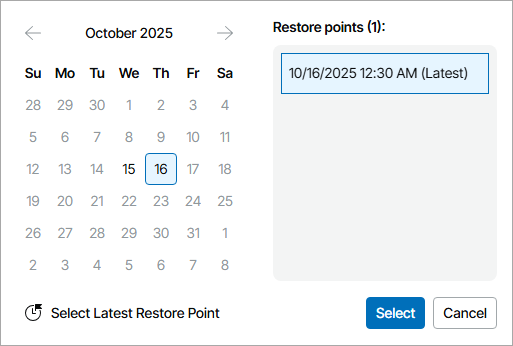
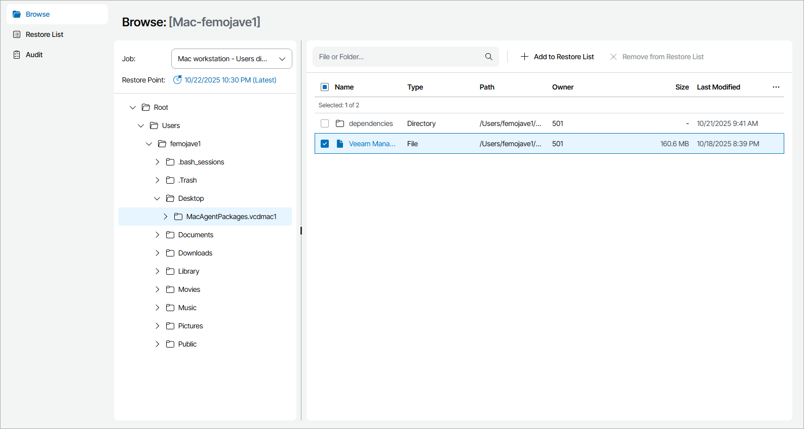

# Step 2. Select Restore Point and Files to Restore

Specify the necessary restore point and select files and folders you want to restore:

1. In the file-level restore portal, open the Browse tab.
2. In the Job list, select the necessary job and click a link in the Restore Point field.

The job list includes all Veeam backup agent jobs for the selected computer that have available restore points.

1. In the Select Restore Point window, select the restore point from which you want to restore files and click Select.

To select the most recent restore point, you can click Select Latest Restore Point.

1. In the hierarchy on the left, select the necessary folder.
2. In the displayed list of folder content, select files and folders you want to restore.

Note that symbolic links will be skipped during the restore.

1. At the top of the list, click Add to Restore List.

Note that you cannot add volumes to the restore list.

1. Repeat steps 2–6 for all files and folders you want to restore.

