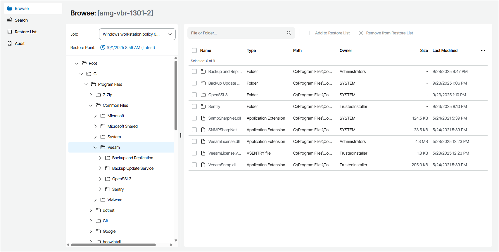
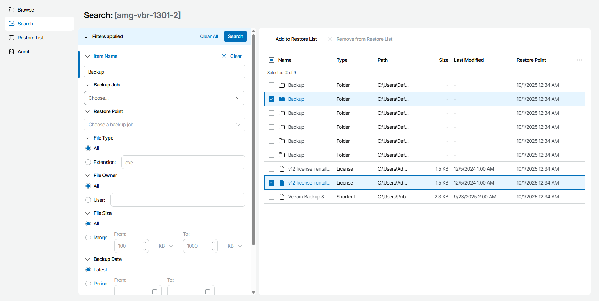

# Step 2. Select Restore Point and Files to Restore

Specify the necessary restore point and select files and folders you want to restore:

1. In the file-level restore portal, open the Browse tab.
2. In the Job list, select the necessary job and click a link in the Restore Point field.

The job list includes all Veeam backup agent jobs for the selected computer that have available restore points.

1. In the Select Restore Point window, select the restore point from which you want to restore files and click Select.

To select the most recent restore point, you can click Select Latest Restore Point.

1. In the hierarchy on the left, select the necessary folder.
2. In the displayed list of folder content, select files and folders you want to restore.

Note that symbolic links will be skipped during the restore.

1. At the top of the list, click Add to Restore List.

Note that you cannot add volumes to the restore list.

1. Repeat steps 2–6 for all files and folders you want to restore.

Advanced File Search

If you have a large number of backed up files and folders, you can use advanced search filters.

|  |
| --- |
| Important! |
| Advanced file search is available only for the backup jobs with the file indexing option enabled and restore points available. |

To search for specific files and folders:

1. On the file-level restore portal, click Search.
2. In the Backup Job and Restore Point lists, select the backup job and the restore point from which you want to restore files.

If the fields in the Search tab are not specified, the search results will include backed up items for all restore points of all configured backup jobs.

1. To narrow down the list of backed up files and folders, you can apply the following filters:

* In the Item Name field, specify file or folder name. You can enter file or folder name explicitly or create a wildcard mask by using the asterisk (\*) to replace any number of characters and question mark (?) to replace one character.
* In the File Type section, specify file type extension.
* In the File Owner section, specify name of a user who owns the file.
* In the File Size section, specify file size range.
* In the Backup Date section, specify time period of the last file or folder backup.
* In the Last Modification section, specify time period of the last file modification.

1. At the top of the filter list, click Search.
2. In the displayed list of objects, select files and folders you want to restore.

Note that symbolic link files will be skipped during the restore.

1. At the top of the list, click Add to Restore List.
2. Repeat steps 2–6 for all files and folders you want to restore.

