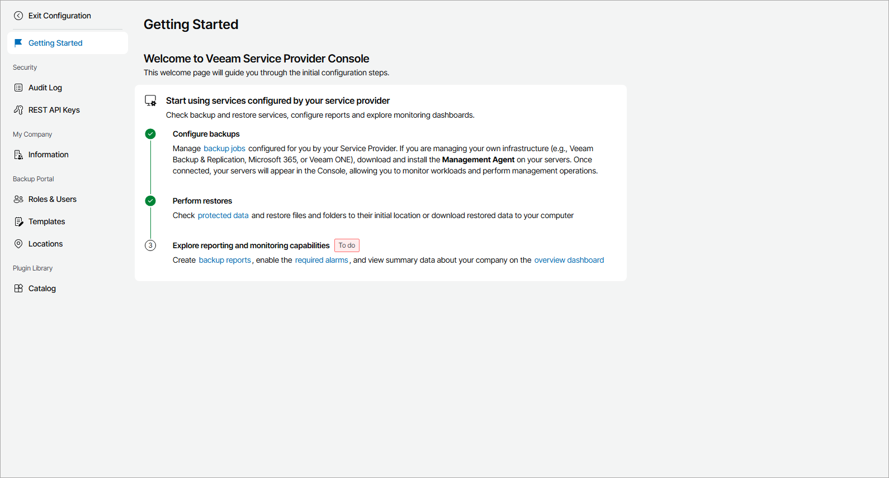

# Getting Started

The Getting Started page provides a sequence of steps you can follow to quickly set up and customize your Veeam Service Provider Console portal. On this page, completed steps are marked with a check mark, and incomplete steps are marked as To do. You can click a link in each step description to navigate to the relevant page of Veeam Service Provider Console.

To access the page:

1. Log in to Veeam Service Provider Console.

For details, see [Accessing Veeam Service Provider Console](access_vac.md).

1. At the top right corner of the Veeam Service Provider Console window, click Configuration.
2. In the configuration menu on the left, click Getting Started.

|  |
| --- |
| Note: |
| To perform configuration tasks, the user must have Company Owner or Company Administrator privileges. For details on users and privileges, see [Managing Portal Users](manage_users.md). |

Getting Started

To set up your Veeam Service Provider Console portal:

1. [Fill company profile](fill_tenant_profile.md).

Add information, such as contact details, about your company.

1. [Create locations](create_locations.md).

You can create multiple locations to differentiate backup services and cloud resources consumed by different offices or business units within your company.

1. [Create portal users](create_portal_users.md).

Create users that can access the Veeam Service Provider Console portal, and to which you can assign reporting and monitoring tasks.

1. Add systems to manage:

1. [Deploy Veeam backup agents and configure backup jobs](manage_backup_agents.md).

Deploy Veeam backup agents on computers in your infrastructure and configure backup job settings.

1. [Connect Veeam Backup & Replication servers](manage_vbr.md).

Connect Veeam Backup & Replication servers that you plan to manage in Veeam Service Provider Console.

1. Configure backup jobs or policies:

1. [Configure Veeam Backup & Replication jobs](manage_backup_jobs.md).
2. [Configure Veeam Backup for Microsoft 365 backup and backup copy jobs](manage_vbo_servers.md).
3. [Configure Veeam Backup for Public Clouds policies](vb_cloud_jobs.md).

1. [Configure backup reports](configure_backup_reports.md).

Configure and run backup reports to check the efficiency of data protection, and make sure that you meet established RPO requirements.

1. [Configure alarm settings](configure_alarms.md).

Check alarm settings, alarm response actions, and configure alarm assignment.

