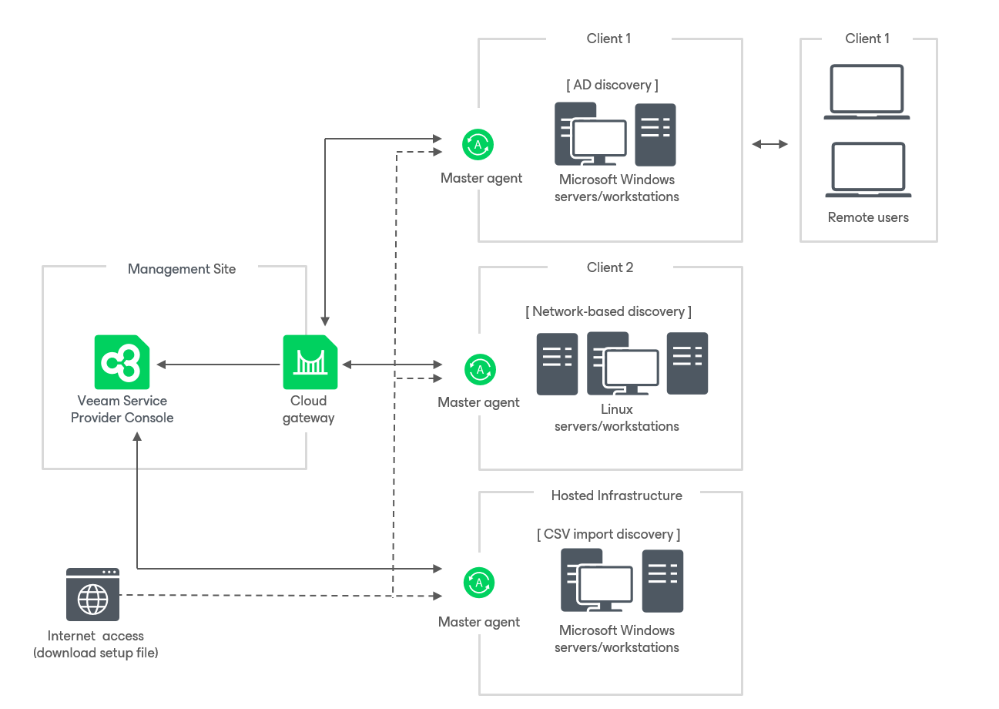

# Deploying Management Agents with Discovery Rules

You can deploy Veeam Service Provider Console management agents on managed computers using discovery rules. This method allows you to run discovery and initiate the installation procedure in the Veeam Service Provider Console portal. Thus, you can minimize manual operations with the managed computers, or usage of any 3rd party tools during the installation process.

How Installation with Discovery Rules is Performed

For installation with discovery rules, Veeam Service Provider Console requires a master agent. A master agent is a Veeam Service Provider Console management agent that runs on a Windows or Linux machine in the managed infrastructure. This agent is responsible for performing various types of tasks during the discovery and installation procedures, such as collecting information about discovered computers, installing Veeam Service Provider Console management agents on managed computers, downloading the Veeam backup agent setup file, uploading it to managed computers, and so on.

Installation with discovery rules includes two processes that run one after another:

* Discovery of managed computers
* Installation of Veeam Service Provider Console management agents and Veeam backup agents on discovered computers

The following diagram provides a high-level pictorial overview of the discovery-based installation method.

Discovery of Managed Computers

Discovery of managed computers runs as follows:

1. A backup administrator sets up a master agent in a managed location, configures a discovery rule and initiates the discovery process.

The discovery rule describes settings required to perform discovery and (optionally) installation of Veeam backup agents on discovered computers. Discovery rule prescribes what master agent will be used for discovery, what managed computers must be scanned, what account will be used to connect to these computers, whether Veeam backup agents must be installed on discovered computers, and so on.

The discovery rule can use one of the following discovery methods: network-based discovery, Active Directory discovery or import-based discovery.

1. The master agent obtains from Veeam Service Provider Console discovery settings specified in the discovery rule. The agent connects to managed computers under the specified account, collects configuration information about each scanned computer through WMI (for Windows computers) or SSH (for Linux computers), and communicates information about discovery results to Veeam Service Provider Console.

Information collected from discovered computers includes details on the computer type, platform, host name, guest OS, IP address, MAC address, available applications and information about Veeam products (their presence on the machine, product version and license installed).

1. If the discovery rule is configured to install Veeam backup agents on discovered computers and set up a backup job, the master agent initiates these tasks after discovery:

1. The master agent downloads the Veeam backup agent setup file from the Veeam Installation Server (over the Internet), and uploads this file to discovered computers.
2. The master agent downloads the Veeam Service Provider Console management agent setup file from the Veeam Service Provider Console server, uploads this file to discovered computers, triggers management agent installation, and configures management agents to communicate with Veeam Service Provider Console.
3. Veeam Service Provider Console management agents on the discovered computers trigger installation of Veeam backup agents.
4. When installation completes, management agents activate Veeam backup agents.
5. If a backup job must be set up as part of the installation procedure, management agents apply a backup policy.

|  |
| --- |
| Note: |
| If the computer on which you install Veeam Service Provider Console management agent has Veeam backup agent running in Unmanaged mode (Free mode), Veeam Service Provider Console will automatically switch the Veeam backup agent to Managed mode, assign the required number of licensing to it and assign a backup policy. The number of used and total licensing units in the Veeam Service Provider Console license pool will be updated.  When running a Linux discovery rule, Veeam Service Provider Console will install management agents on all discovered computers regardless of the Linux distributives running on the discovered computers and the computer hosting the master agent. Note that management agent will operate under the new veeam-usr-vspc-agent user. |

Required Privileges

To perform this task, a user must have one of the following roles assigned: Company Owner, Company Administrator, Location Administrator.

In This Section

* [Configuring Windows Discovery Rules](discovery_windows.md)
* [Configuring Linux Discovery Rules](discovery_linux.md)
* [Running Discovery](run_discovery.md)
* [Resetting Discovered Computers](reset_discovered_computers.md)
* [Viewing and Exporting Discovery Results](view_discovery_results.md)

