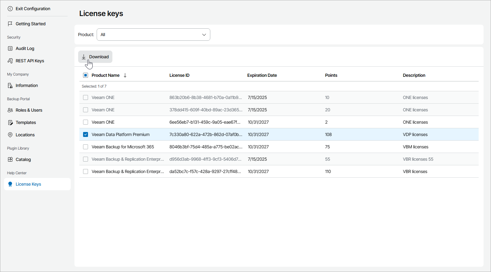

# Viewing and Downloading License Keys

You can view license keys assigned to your company by your service provider and download license files.

|  |
| --- |
| Note: |
| The License Keys tab is available only if your service provider has assigned any license key to your company. |

Required Privileges

To access license keys, a user must have one of the following roles assigned: Company Owner, Company Administrator.

Viewing and Downloading License Keys

To view and download license keys:

1. Log in to Veeam Service Provider Console.

For details, see [Accessing Veeam Service Provider Console](access_vac.md).

1. At the top right corner of the Veeam Service Provider Console window, click Configuration.
2. In the configuration menu on the left, click License Keys.

Veeam Service Provider Console will display all license keys assigned to your company.

To search the license keys by product name, you can apply the Product filter.

1. To download license key file, at the top of the list click Download.

The archive with the license key file will be saved to the default download location on your computer.

Each license key in the list is described with the following properties:

* Product Name — name and edition of Veeam product for which the license is assigned.
* License ID — ID of the license file.
* Expiration Date — date when the license will expire.
* Points — total number of points included in the license.
* Description — description of the license key.

