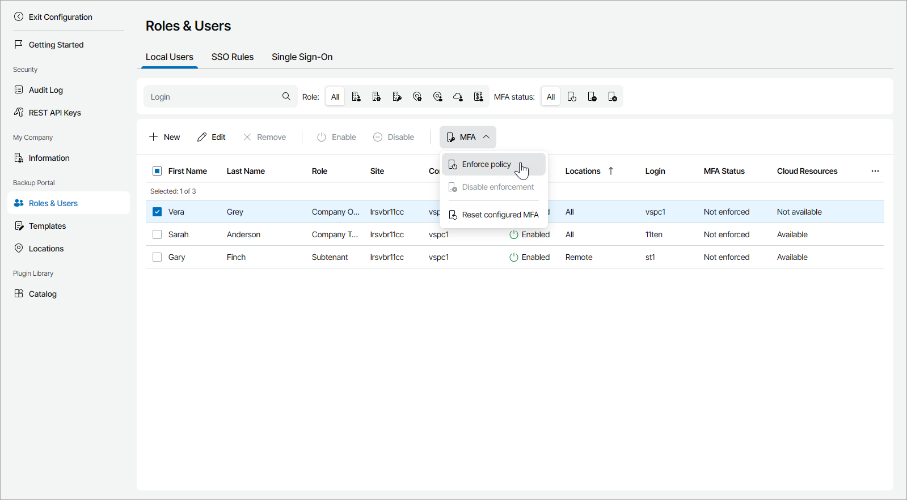

# Enabling, Disabling and Resetting MFA for Portal Users

You can configure MFA for other portal users.

|  |
| --- |
| Important! |
| If you configure MFA for an account that is used for integration with third party applications, that integration will stop working. To avoid that, first configure API key, as described in the [Configuring API Keys](api_keys.md) section. |

Required Privileges

To perform this task, a user must have the following role assigned: Company Owner, Company Administrator.

Enabling, Disabling and Resetting MFA

To enforce MFA for portal users:

1. Log in to Veeam Service Provider Console.

For details, see [Accessing Veeam Service Provider Console](access_vac.md).

1. At the top right corner of the Veeam Service Provider Console window, click Configuration.
2. In the configuration menu on the left, click Roles & Users.
3. Open the Local Users tab.
4. Select one or more users in the list.
5. At the top of the user list, click MFA.

Alternatively, you can right-click the necessary user, choose MFA.

1. From the drop-down list select Enforce policy to enable MFA, Disable enforcement to allow users to disable MFA or Reset configured MFA to reset MFA settings.

On the next authorization session, each user will be prompted to configure MFA on the Multi-Factor Authentication step of the Edit User wizard as described in the [Modifying User Profile](modify_user_profile.md#mfa_config) section.

