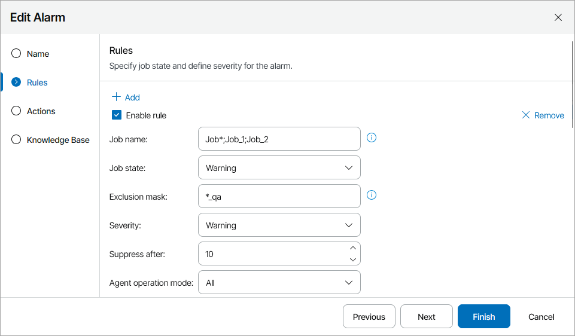
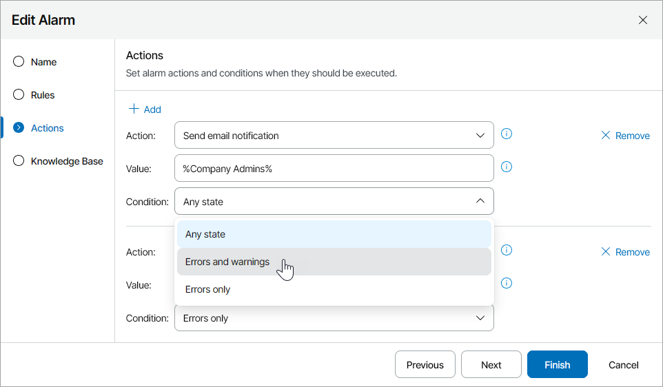
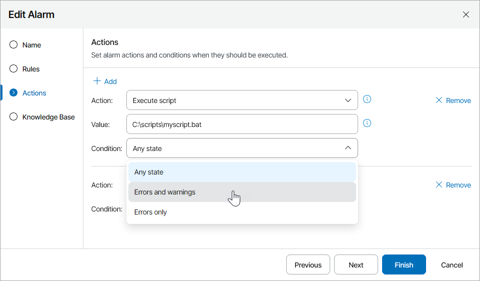

# Modifying Alarm Settings

You can modify alarm rules and response actions in accordance with your requirements.

Required Privileges

To perform this task, a user must have one of the following roles assigned: Company Owner, Company Administrator.

Modifying Alarm Settings

To modify alarm settings, perform the following steps.

Step 1. Launch the Edit Alarm Wizard

1. Log in to Veeam Service Provider Console.

For details, see [Accessing Veeam Service Provider Console](access_vac.md).

1. At the top right corner of the Veeam Service Provider Console window, click Configuration.
2. In the configuration menu on the left, click Templates.
3. Open the Predefined Alarms tab.
4. To narrow down the list of alarms, you can apply the following filters:

* Alarm — search alarms by name.
* Alarm type — limit the list of the alarms by type (Predefined, Custom).
* Category — limit the list of the alarms by alarm object category (Management agent, Veeam Agent, Company, User, Discovery rule, Veeam Backup & Replication (including public cloud backup), Veeam ONE, Veeam Backup for Microsoft 365).

1. Select an alarm you want to modify.
2. At the top of the list, click Edit.

Alternatively, you can right-click the necessary alarm and choose Edit.

Veeam Service Provider Console will launch the Edit Alarm wizard.

Step 2. Specify Alarm Rules

At the Rules step of the wizard, specify conditions according to which the alarm must be triggered.

To reset alarm rules to default settings, click Reset.

|  |
| --- |
| Note: |
| Options available for alarm rules vary for different alarms. Depending on the alarm type, you may need to modify alarm thresholds, alarm tolerance, alarm severity and so on. |

To include jobs in or exclude jobs from the alarm detection, you can configure filters:

* In the Job name field, specify job names and masks for jobs that you want to include in the alarm detection. Separate multiple job names with semicolons and without spaces.

To trigger alarms for specific jobs, specify the names of all jobs. For example, Job\_1;Job2;Job3. Veeam Service Provider Console will trigger alarms only for specified jobs.

To trigger alarms for jobs with similar names, specify the job name with ‘\*’ (asterisk) which stands for zero or more characters. For example, Job\*. Veeam Service Provider Console will trigger alarms for Job\_1, Job2, Job3.

To trigger alarms for jobs whose names differ by only 1 character, specify the job name with '?' which stands for one character. For example, Job?. Veeam Service Provider Console will trigger alarms for Job2 and Job3.

* In the Exclusion mask field, specify names and masks for workloads that you want to exclude from the alarm detection. Separate multiple names with semicolons and without spaces.

To disable alarms for specific workloads, specify the names of all items. For example, VM\_1;VM2;VM3. Veeam Service Provider Console will disable alarms for specified VMs.

To disable alarms for workloads with similar names, specify the name with ‘\*’ (asterisk) which stands for zero or more characters. For example, VM\*. Veeam Service Provider Console will disable alarms for VM\_1, VM2, VM3.

To disable alarms for workloads whose names differ by only 1 character, specify the name with '?' which stands for one character. For example, VM?. Veeam Service Provider Console will disable alarms for VM2 and VM3.

Note that the exclusion mask will apply only to only one workload type. The type of excluded workload depends on the alarm scope.

* In the Suppress after field, specify how many times alarm can be triggered. After the specified number of triggered alarms is exceeded, the alarm will not trigger until you manually resolve the already triggered alarms.

To disable the suppressing and receive information on all triggered alarms, set the value to 0.

* In the Trigger after field, specify the number of failed sessions after which the alarm will be triggered. Until the job session fails the specified number of times, the alarm will not trigger.

To trigger the alarm on the first failed session, set the value to 0.

|  |
| --- |
| Note: |
| Before reconfiguring filters for alarms that have already been triggered, you must manually resolve these alarms. Otherwise, new alarms will be triggered according to the old settings. |

Step 3. Specify Alarm Response Actions

At the Actions step of the wizard, specify actions that must be performed when a new alarm is triggered, or when the status of an existing alarm changes.

Veeam Service Provider Console supports two types of response actions:

* You can send an email notification to a specified email address
* You can run a custom script

You can modify the default alarm response action, or add new actions.

Sending Alarm Notifications by Email

You can add an alarm action that will send an email notification when a new alarm is triggered, or when the alarm status changes:

1. At the top left corner of the wizard, click Add.
2. In the Action field, choose Send email notification.
3. In the Value field, type an email address to which a notification must be sent.

You can specify multiple email addresses separated with commas (,) or semicolons (;).

|  |
| --- |
| Tip: |
| To send a notification to multiple users, you can use the following variables:   * %Company Owner% — to send a notification to company users with the Company Owner role. * %Company Admins% — to send a notification to company users with the Company Administrator role. * %Location Admins% — to send a notification to company users with the Location Administrator role. * %Subtenants% — to send a notification to company users with the Subtenant role.  * %Company Email% — to send a notification to the company email address.   To receive a notification, the user must configure an email address in the user profile. For details, see [Modifying User Profile](modify_user_profile.md). |

1. In the Condition field, choose an alarm state that must trigger the response action:

* Any state — select this option if a notification must be sent every time when the alarm status changes to Error, Warning or Info, or when a new alarm with one of these statuses is triggered.
* Errors and warnings — select this option if a notification must be sent every time when the alarm status changes to Error or Warning, or when a new alarm with one of these statuses is triggered.
* Errors only — select this option if a notification must be sent every time when the alarm status changes to Error, or when a new alarm with this status is triggered.

Running Custom Script

You can add an alarm action that will run a custom script when a new alarm is triggered, or when the alarm status changes. This can be a .BAT, .CMD, .EXE or .PS1 script.

By running a script, you can automate routine tasks that are normally performed when specific alarms fire. For example, if a critical system is affected, you may need to immediately open a ticket with the in-house support or perform actions that will eliminate the problem.

1. At the top left corner of the wizard, click Add.
2. In the Action field, choose Execute script.
3. In the Value field, type a path to the script file.

The script must reside on the machine that runs Veeam Service Provider Console management agent:

* If an alarm targets the Company object, the script file can reside on managed Veeam backup agents or Veeam backup servers. When the alarm is triggered or when the alarm status changes, the script will run on all managed Veeam backup agents and Veeam backup servers of the company, provided that the script file is present on these machines. Note that the path to the script on all managed machines must be the same.
* If an alarm targets the Location object, the script file can reside on managed Veeam backup agents or Veeam backup servers. When the alarm is triggered for a specific location or when the alarm status changes, the script will run on all managed Veeam backup agents and Veeam backup servers that belong to the affected location, provided that the script file is present on these machines. Note that the path to the script on all managed machines must be the same.
* If an alarm targets a specific backup infrastructure component (Veeam backup agent, backup proxy, backup repository, WAN accelerator and so on), the script file must reside on the Veeam backup server that manages this component.

You can also provide the following variables separated by spaces: %AlarmName%, %NewState%, %Time%, %ObjectName%.

1. In the Condition field, choose an alarm state that must trigger the response action:

* Any state — select this option if the script must run every time when the alarm status changes to Error, Warning or Info, or when a new alarm with one of these statuses is triggered.
* Errors and warnings — select this option if the script must run every time when the alarm status changes to Error or Warning, or when a new alarm with one of these statuses is triggered.
* Errors only — select this option if the script must run every time when the alarm status changes to Error, or when a new alarm with this status is triggered.

Step 4. Save Alarm Settings

At the Knowledge Base step of the wizard, click Finish to save alarm settings.

In This Section

[Modifying Multiple Alarms](modify_multiple_alarms.md)

