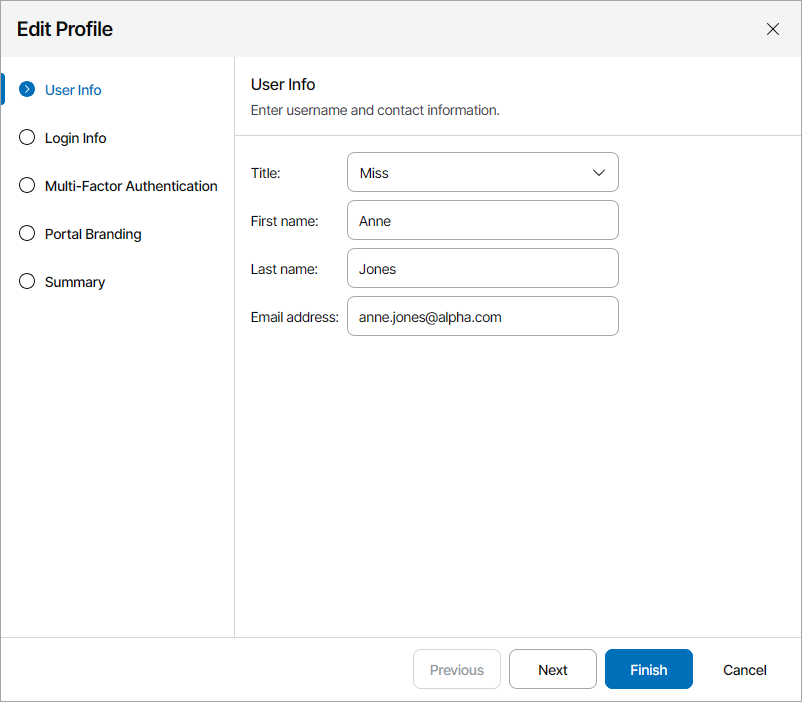
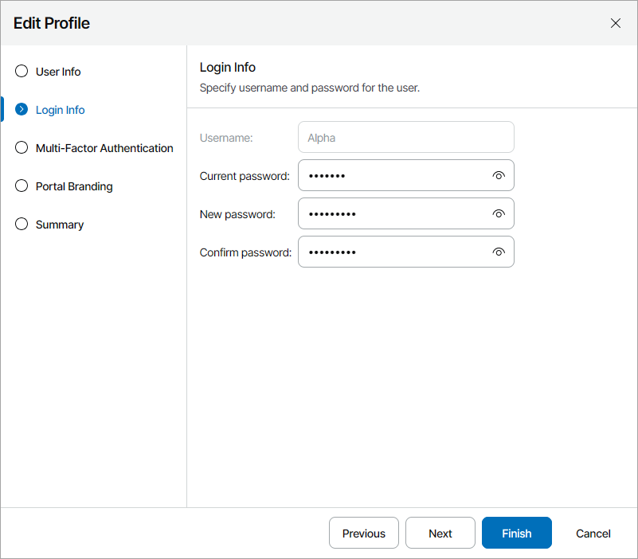
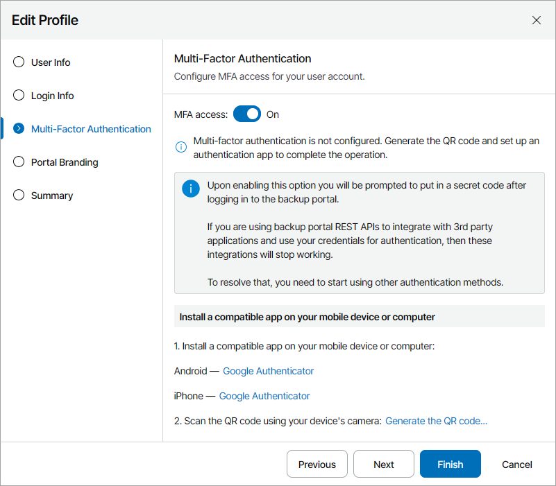
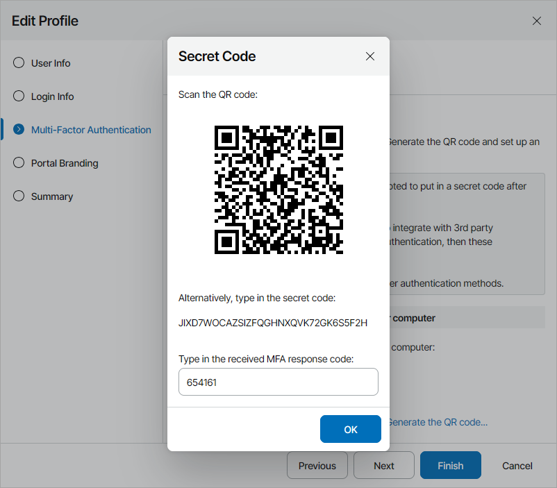
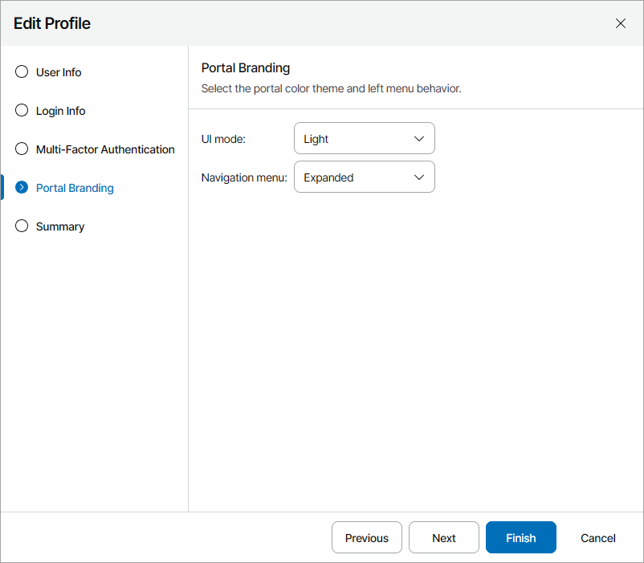
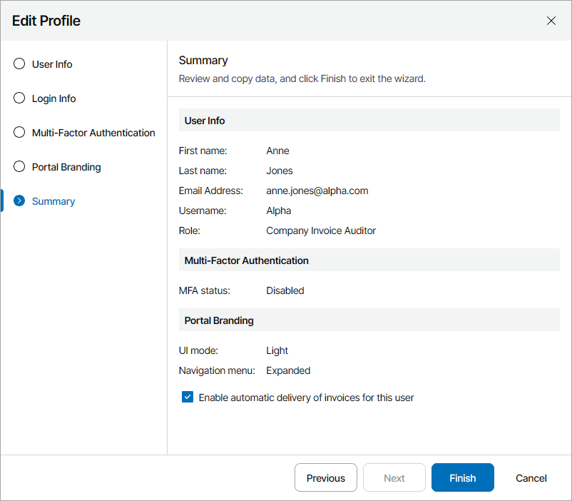

# Modifying User Profile

All portal users working with the Veeam Service Provider Console Client Portal can modify their user profile to update their contact information and password:

1. Log in to Veeam Service Provider Console.

For details, see [Accessing Veeam Service Provider Console](access_vac.md).

1. At the top right corner, click your user name and choose Edit Profile.

Veeam Service Provider Console will open the Edit Profile wizard.

1. At the User Info step of the wizard, you can modify your title, first name, last name and email address.

Veeam Service Provider Console will use this address to send you email notifications, such as billing notifications, backup report notifications, password reset notifications and so on.

1. At the Login Info step of the wizard, you can change your password details:

1. In the Current Password field, type your current password.
2. In the New Password and Confirm Password fields, type a new password.

It is recommended to use a password that contains characters from at least 3 of the following categories: uppercase characters, lowercase characters, base 10 digits (0 through 9), non-alphanumeric characters. The recommended password length is 6 or more characters.

1. To enable multi-factor authentication for your user account, at the Multi-Factor Authentication step of the wizard:

1. Set the MFA access toggle to On and click the Generate the QR code link.

The Secret Code window will open.

1. In an authenticator application, scan the QR code or enter the secret code to create a new account.
2. In the Secret Code window, type in the response code generated by the authenticator application and click OK.

For details on multi-factor authentication, see [Configuring Multi-Factor Authentication](mfa.md).

If you want to disable multi-factor authentication for your user account, set the Enable the MFA access toggle to Off.

1. At the Portal Branding step of the wizard:

1. From the UI mode drop-down list, select the portal color theme (Light, Dark, System).
2. From the Navigation menu drop-down list, select the behavior of the navigation menu on the left (Expanded, Collapsed).

1. At the Summary step of the wizard, review the profile settings.

[For Company Owner, Company Invoice Auditor] Select the Enable automatic delivery of invoices for this user check box if you want to receive a billing notification by email each time when a new invoice for the company is generated and sent. For details, see [Receiving Billing Notifications](receive_billing_notifications.md).

1. Click Finish.

