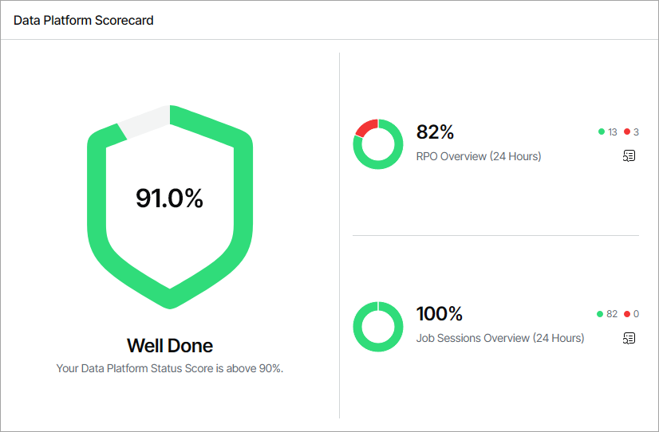
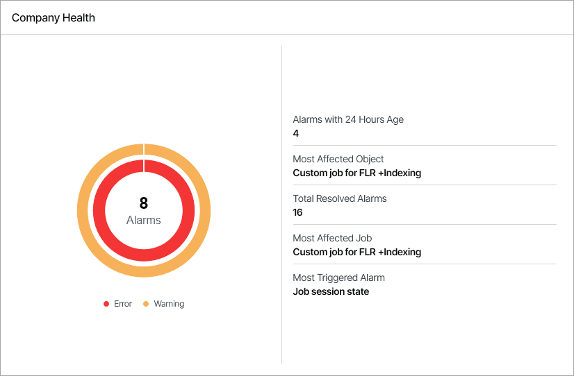
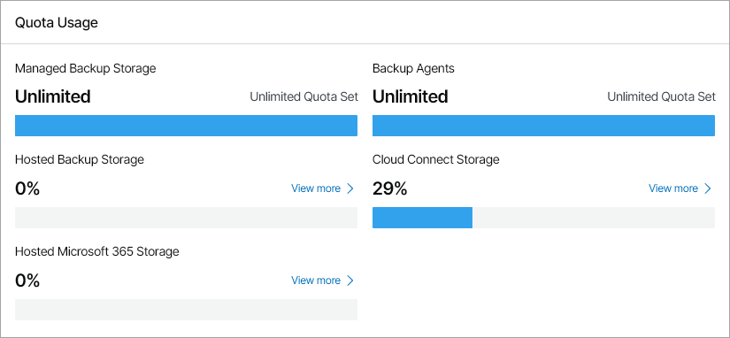

# Overview

The Overview dashboard consolidates information on the health state of connected Veeam products, active alarms, and Veeam Service Provider Console usage statistics. This dashboard presents the big picture and serves as the starting point from which you can drill down to dashboards and views that provide further details.

Required Privileges

To perform this task, a user must have the following role assigned: Company Owner.

Accessing Overview Dashboard

To access the dashboard:

1. Log in to Veeam Service Provider Console.

For details, see [Accessing Veeam Service Provider Console](access_vac.md).

1. In the menu on the left, click Overview.
2. To show data for a specific location, use the filters at the top left corner of the Veeam Service Provider Console window.

Widgets Included

Data Platform Scorecard

This widget calculates the data platform status score based on the status of protected workloads and finished jobs in the last 24 hours.

The widget includes the following sections:

* RPO Overview section shows the number and ratio of protected local and cloud workloads within RPO.

Click the relevant report icon to open the RPO & SLA dashboard. For details on this dashboard, see [RPO & SLA](protected_data_summary.md).

Note that the RPO Overview section does not include data from the Veeam Cloud Connect widget on the RPO & SLA dashboard.

* Job Sessions Overview section shows the number and ratio of successful jobs and jobs that finished with errors.

Click the relevant report icon to open the Session States dashboard. For details on this dashboard, see [Session States](job_overview.md).

Protected Data Overview

This widget shows the number and ratio of workloads protected by the managed Veeam products. To drill down to the list of protected workloads, click the links in the Name column.

Company Health

This widget shows an overview of triggered alarms in your company infrastructure. The chart shows the total number of triggered warning and error alarms. The widget sections provide information about the job and object with the highest number of triggered alarms, the most triggered alarm, as well as the number of resolved alarms and triggered alarms that have been active for more than 24 hours. For details on working with alarms, see [Working with Triggered Alarms](view_triggered_alarms.md).

Quota Usage

This widget shows the amount and ratio of consumed and available resources allocated to your company. The sections in the widget show the quota used by managed backup agents, the amount and ratio of used and available storage quota allocated for remote and hosted Veeam Backup & Replication servers, hosted Microsoft 365 servers, and Veeam Cloud Connect resources.

To drill down to the page with details on a specific resource, click View more.

