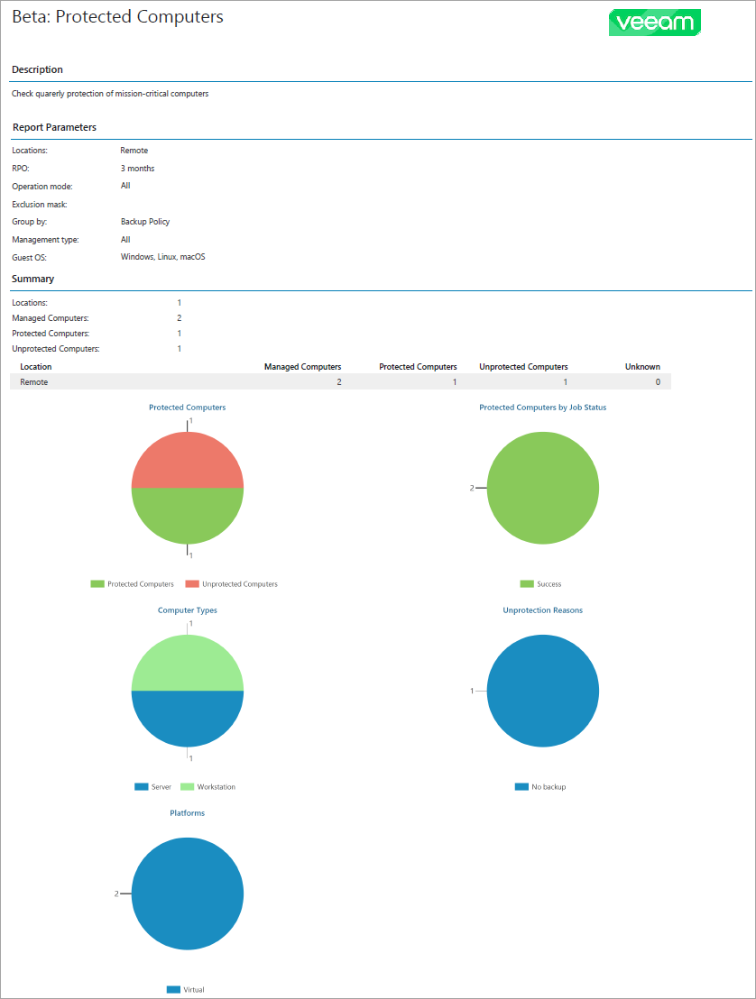

# Protected Computers Backup Report

The Protected Computers report analyzes the efficiency of computer data protection with Veeam backup agents.

If a job is assigned to a company by the service provider, some details on protected and unprotected workloads may be excluded from the report.

* The Report Parameters section provides information about company locations, RPO and operation mode of Veeam backup agents that run on computers in the report scope, mask for the computers excluded from the report scope, the way Veeam backup agent data is grouped in the report, Veeam backup agent management type and guest OS.

* The Summary section includes information about the number of company locations in the report scope and the number of discovered, protected and unprotected computers in each location.
* The report charts display information about protected and unprotected computers, type and platform of computers protected with Veeam backup agents, the latest backup status of each job on protected computers, and reasons for a failure to meet RPO requirements.

* The Details section provides information about all protected and unprotected computers including host name, management type, backup policy name, backup source and target, number of available restore points, guest OS, and date and time of the latest backup.

* The Unprotected Agents subsection displays a list of managed computers that do not have valid restore points within the configured RPO period. Information on unprotected computers in each company location is grouped by the age of the latest backup files.
* The Protected Agents subsection displays a list of managed computers that have at least one restore point that meets RPO requirements specified in the report configuration. Information on protected computers in each company location is grouped by Veeam backup agent or backup policy, as configured in the report parameters.

