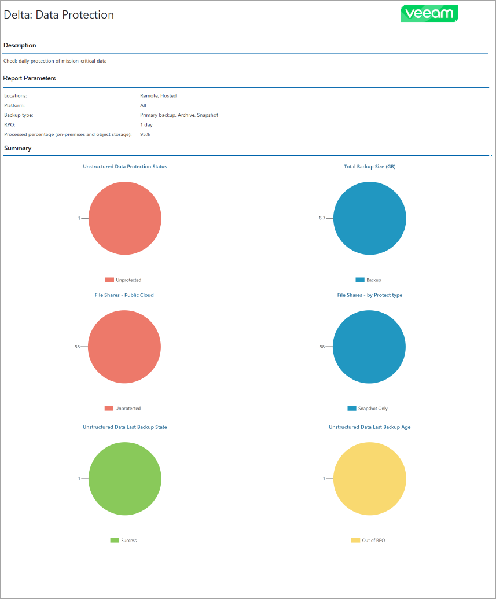

# Protected Data Backup Report

The Protected Data Backup report analyzes the efficiency of file share and object storage data protection with Veeam Backup & Replication and Veeam Backup for Public Clouds.

If a job is assigned to a company by the service provider, some details on protected and unprotected workloads may be excluded from the report.

* The Report Parameters section provides information about company locations, RPO, platform type and backup type of data storage in the report scope.

* The report charts display information about the number of file shares and object storage protected with Veeam Backup & Replication and Veeam Backup for Public Clouds, the breakdown of the total backup size by retention type and the breakdown of backup jobs by last backup state and last backup age.

* The Overview section provides information about the number of protected and unprotected file shares and object storage for each company in the report scope.

* The Details section provides information about all protected and unprotected file shares and object storage including server or instance name, backup job name and destination, retention type, backup source items, file mask, total backup size and date and time of the latest backup.

* The Unprotected Data Backup subsection displays a list of public cloud file shares that have outdated or missing restore points. For on-premises file shares, a file share is displayed in this section if the last job session processing this file share finished with error. For object storage, a storage is displayed in this section if the processed data percentage is lower than the percentage specified in the report parameters or if the last restore point is outdated. Information on unprotected file shares in each company location is grouped by backup job.
* The Protected Data Backup subsection displays a list of public cloud file shares that have at least one restore point that meets RPO requirements specified in the report configuration. For on-premises file shares, a file share is displayed in this section if the last job session processing this file share finished with successfully or with warning. For object storage, a storage is displayed in this section if the processed data percentage is equal to or higher than the percentage specified in the report parameters and the last restore point meets configured RPO requirements. Information on protected file shares in each company location is grouped by backup job.

