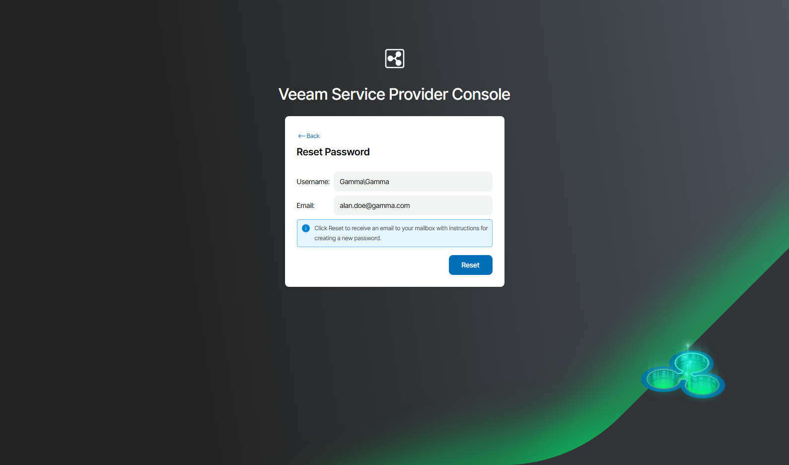
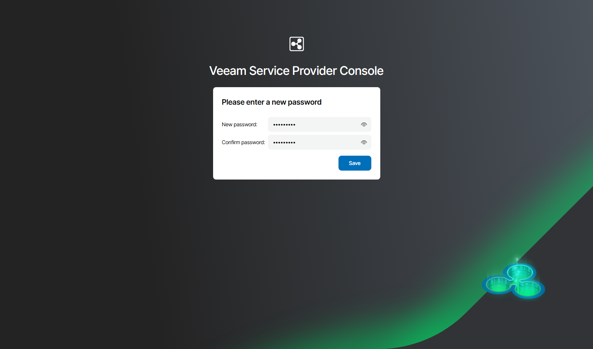

# Resetting Password

If you forget your password, you can reset it.

|  |
| --- |
| Note: |
| To be able to reset the password, make sure that:   * Your service provider has configured SMTP server settings. * You have an email address specified in your user profile. Veeam Service Provider Console will use this information to reset the password. For details on working with user profile details, see [Modifying User Profile](modify_user_profile.md). |

To reset the password:

1. Navigate to the Veeam Service Provider Console Login page.

For details, see [Accessing Veeam Service Provider Console](access_vac.md).

1. Click the Forgot password link.

Veeam Service Provider Console will open the Reset Password window.

1. In the Reset Password window, type your user name and an email address specified in your user profile, and click Reset.

The user name must be provided in the Company Name\User format. Alternatively, you can specify a short name for login to Veeam Service Provider Console. For details on configuring the login alias, see [Filling Company Profile](fill_tenant_profile.md).

1. Check your inbox for an email message with instructions for resetting the password.
2. Click the Reset Password link in the email message.

Veeam Service Provider Console will open the password reset window.

1. In the New password and Confirm password fields, type a new password and click Save.

1. After you change the password, log in to Veeam Service Provider Console using your new password.

Other Ways to Reset Password

If you cannot obtain an email for some reason (for example, you did not specify your email address in your user profile settings), contact the Administrator of the Client Portal. The Company Administrator can reset the password for you.

