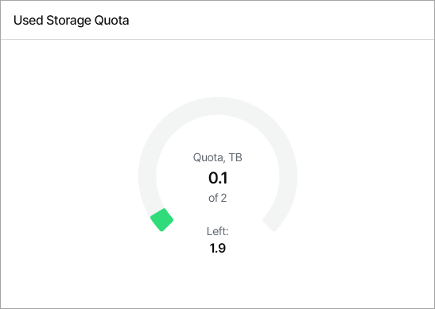
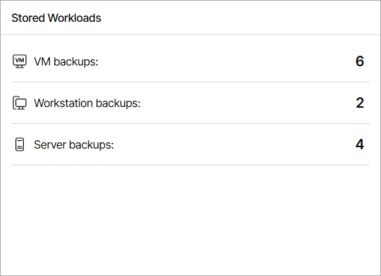
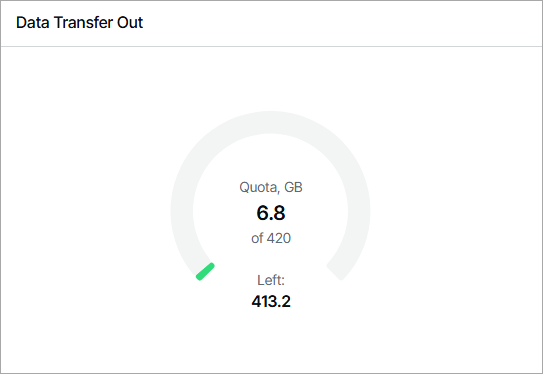
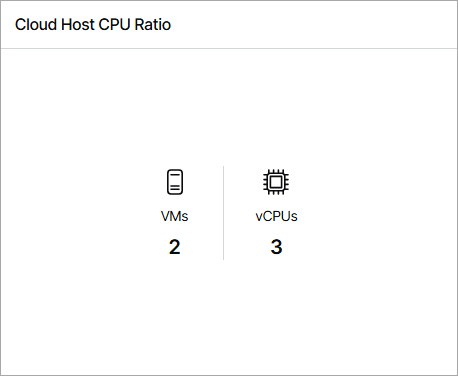
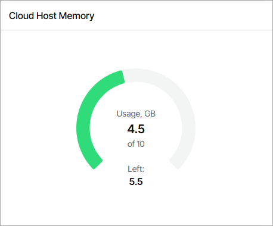
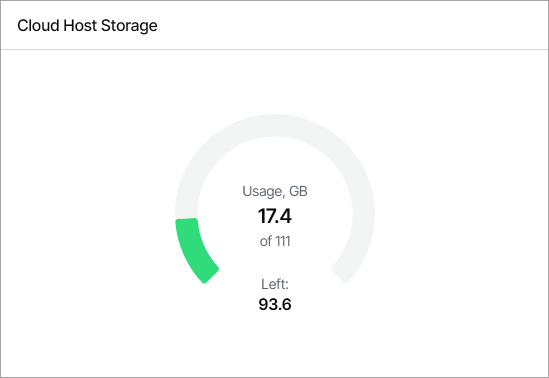

# Resources

You can view summary information about utilized cloud resources in the Resources dashboard.

Required Privileges

To perform this task, a user must have one of the following roles assigned: Company Owner, Company Administrator, Company Tenant, Location Administrator, Location User, Subtenant.

Subtenant User can access only the Used Storage Quota widget of the [Backup](#backup) view.

Accessing Resources Dashboard

To access the dashboard:

1. Log in to Veeam Service Provider Console.

For details, see [Accessing Veeam Service Provider Console](access_vac.md).

1. In the menu on the left, click Resources.

The dashboard includes two views — Backup and Replication.

Cloud Connect Backup Resources

This dashboard view shows summary information about Veeam Cloud Connect backup resources allocated for the company, used and remaining resources.

The dashboard view includes the following widgets:

* Used Storage Quota widget shows the total amount of space allocated to the company on all cloud repositories, the amount of space consumed by backup files, and the amount of remaining space. The widget does not count the amount of space used by scale-out backup repository policies and reduced by storage deduplication.

* [For Company Owner, Company Administrator, Location Administrator] Stored Workloads widget shows the number of workload restore points stored on cloud repositories.

* Data Transfer Out widget shows the data transfer out quota set for the company, the amount of data already downloaded from cloud repositories during the current billing period (length of time between two successive invoices), and the remaining data transfer out quota.

The widgets of this view allow you to reveal potential problems with overprovisioning of cloud resources: if the amount of allocated resources is greater than 100%, the chart will display an error.

Cloud Connect Replication Resources

This dashboard view shows summary information about Veeam Cloud Connect replication resources allocated for the company, used and remaining cloud resources.

The dashboard view includes the following widgets:

* Cloud Host CPU Ratio widget shows the number of cloud VM replicas on the selected hardware plan and the number of vCPUs used by these replicas.

By default, the widget shows information for all hardware plans by which the company is subscribed. To choose a specific hardware plan, use the list at the top of the widget.

* Cloud Host Memory widget shows the amount of memory resources allocated for cloud VM replicas, the amount of already used memory, and the remaining memory.

* Cloud Host Storage widget shows the amount of cloud storage space allocated for the company cloud VM replicas, the amount of used and remaining space.

The widgets of this view allow you to reveal potential problems with overprovisioning of cloud resources: if the amount of allocated resources is greater than 100%, the chart will display an error.

