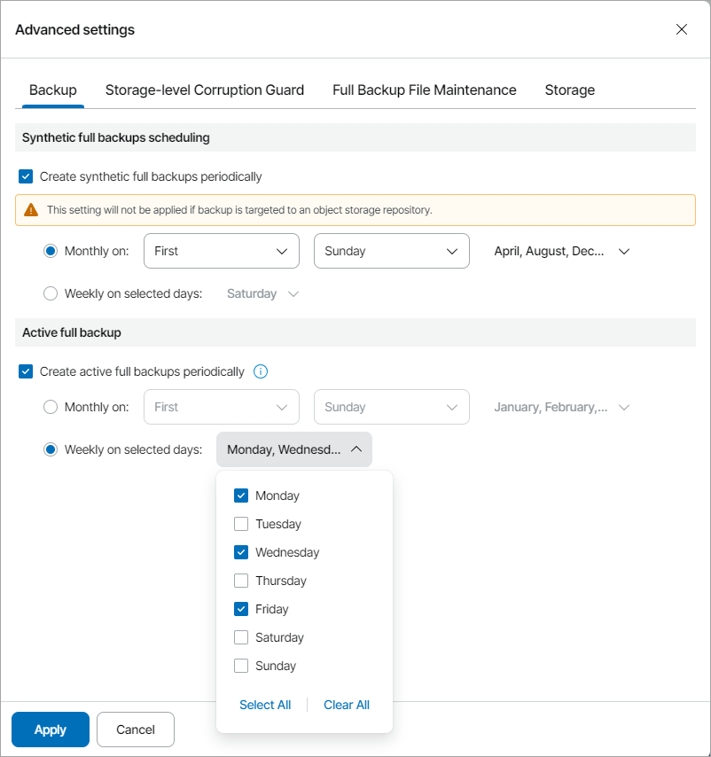
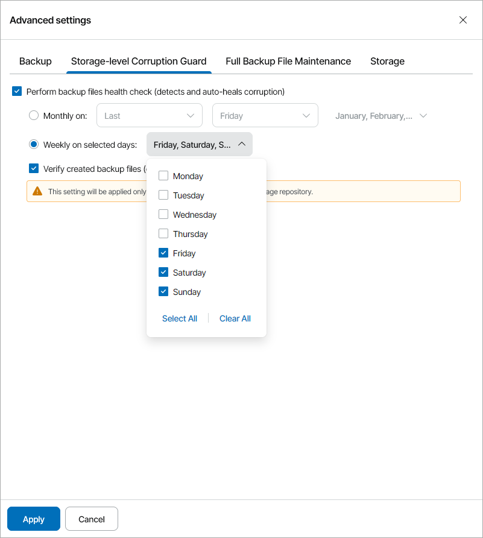
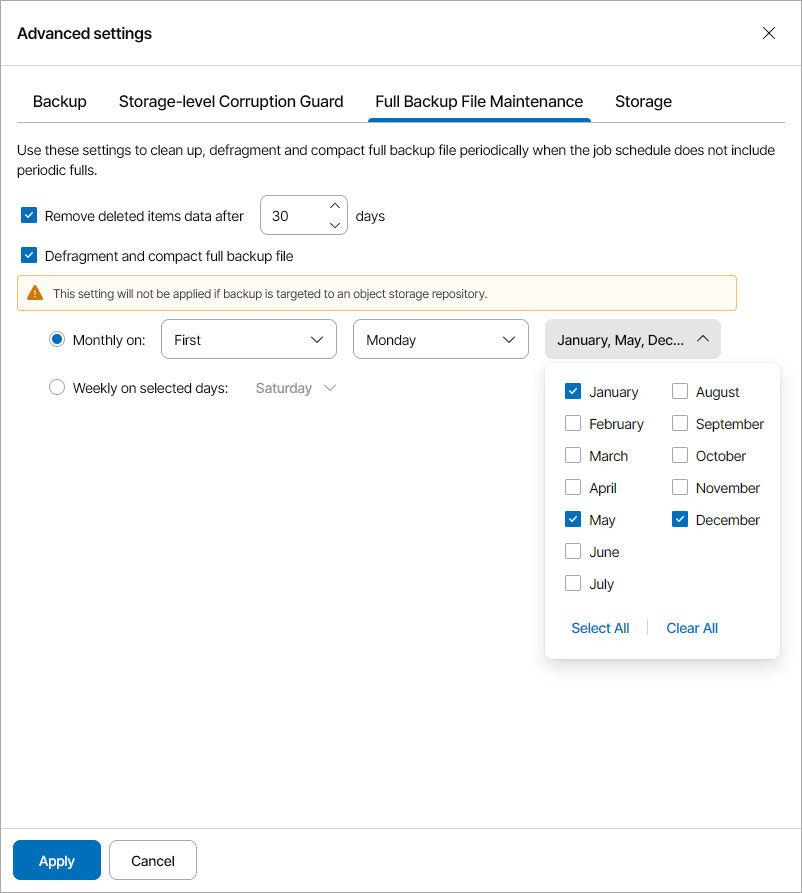
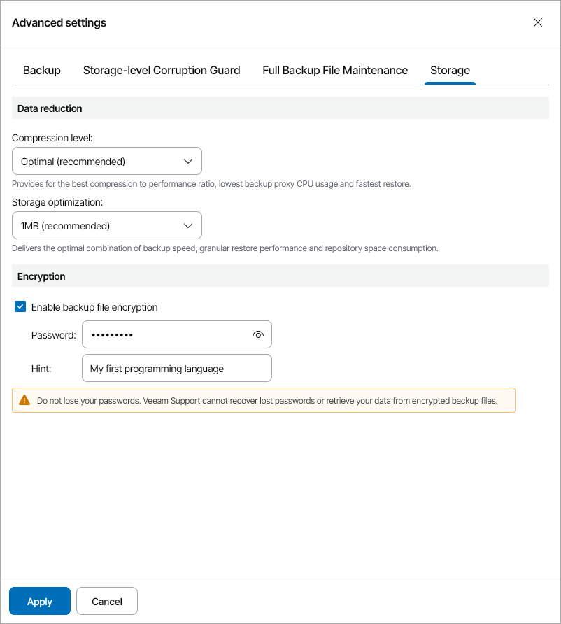

# Step 14. Specify Advanced Job Settings

In the Advanced Settings window, specify advanced settings for the backup job.

You can access the Advanced Settings window from the following steps of the wizard:

* [Local Storage](specify_storage_settings.md) — if you have chosen to store backups in the local storage.
* [Shared Folder](specify_folder_settings.md) — if you have chosen to store backups in a shared folder.
* [Backup Repository](specify_backup_repository_settings.md) — if you have chosen to store backups on a Veeam Backup & Replication repository.
* [Cloud Repository](specify_cloud_backup_settings.md) — if you have chosen to store backups on the Veeam Cloud Connect repository or on an object storage repository.

Policy settings include both settings for Veeam Cloud Connect repositories and object storage repositories. When you assign the policy to a managed computer, settings enabled for an unsupported repository type will be disabled automatically.

Backup Settings

On the Backup tab of the Advanced Settings window, specify settings for a backup chain created with the backup job:

1. If you want to periodically create synthetic full backups, select the Create synthetic full backups periodically check box. Use the Monthly on or Weekly on selected days options to define scheduling settings.

Note that this setting will not apply to object storage repository.

For details on synthetic full backup, see section [Synthetic Full Backup](https://helpcenter.veeam.com/docs/agentforwindows/userguide/synthetic_full_backup.html) of the Veeam Agent for Microsoft Windows User Guide.

1. If you want to periodically create active full backups, select the Create active full backups periodically check box. Use the Monthly on or Weekly on selected days options to define scheduling settings.

For details on active full backup, see section [Active Full Backup](https://helpcenter.veeam.com/docs/agentforwindows/userguide/active_full_backup.html) of the Veeam Agent for Microsoft Windows User Guide.

|  |
| --- |
| Note: |
| * Before scheduling periodic full backups, you must make sure that you have enough free space on the target location. As an alternative, you can create active full backups manually when needed. * If you schedule the active full backup and synthetic full backup on the same day, Veeam backup agent will perform only active full backup. Synthetic full backup will be skipped. |

Storage-Level Corruption Guard Settings

On the Storage-Level Corruption Guard tab of the Advanced Settings window, specify maintenance settings for the backup chain created with the backup job:

1. To periodically perform a health check for the latest restore point in the backup chain, select the Perform backup files health check check box and specify the schedule for the health check.

Use the Monthly on or Weekly on selected days options to define scheduling settings.

1. [For cloud repository targets] To enable full health checks for object storage repository, select the Verify created backup files check box.

For details on health check for backup files, see section [Health Check for Backup Files](https://helpcenter.veeam.com/docs/agentforwindows/userguide/backup_health_check.html) of the Veeam Agent for Microsoft Windows User Guide.

Full Backup File Maintenance Settings

On the Full Backup File Maintenance tab of the Advanced Settings window, specify maintenance settings for the backup chain created with the backup job:

1. [For Veeam backup repository and cloud repository targets] Select the Remove deleted items data after check box and specify the number of days for which you want to keep the backup created with the backup job in the target location.
2. To periodically compact a full backup, select the Defragment and compact full backup file check box.

Use the Monthly on or Weekly on selected days options to define scheduling settings.

Note that this setting will not apply to object storage repository.

For details on a health check for backup files, see section [Health Check for Backup Files](https://helpcenter.veeam.com/docs/agentforwindows/userguide/backup_health_check.html) of the Veeam Agent for Microsoft Windows User Guide.

Storage Settings

On the Storage tab of the Advanced Settings window, specify storage settings for the backup job:

1. In the Compression level list, select a compression level for the backup: None, Dedupe-friendly, Optimal, High or Extreme.
2. In the Storage optimization section, select what type of backup target you plan to use: 4 MB, 1 MB, 512 KB, or 256 KB.

Depending on the chosen storage type, Veeam backup agent will use data blocks of different size to optimize the size of backup files and job performance.

1. If you want to encrypt the content of backup files, in the Encryption section, specify encryption settings for the backup job:

1. Select the Enable backup file encryption check box.
2. In the Password field, type a password that you want to use for encryption.
3. In the Hint field, type a hint for the password.

In case you lose the password, the specified hint will help you to remember the lost password.

For details on encryption, see section [Data Encryption](https://helpcenter.veeam.com/docs/agentforwindows/userguide/data_encryption.html) of the Veeam Agent for Microsoft Windows User Guide.

|  |
| --- |
| Note: |
| * You cannot specify encryption options for the backup job if you have chosen to save backup files on a Veeam backup repository. Encryption options for Veeam backup agent jobs targeted at a Veeam Backup & Replication repository are managed by a backup administrator working with Veeam Backup & Replication. For details, see section [Storage Settings](https://helpcenter.veeam.com/docs/vbr/userguide/agent_job_advanced_storage.html?ver=13) of the Veeam Agent Management Guide. * If you lose a password that was specified for encryption, you can change the password in the encryption settings. After the backup job creates a new restore point encrypted with the new password, you will be able to use this password to restore data form all restore points in the backup chain, including those restore points that were encrypted with an old password. * If you enable encryption for the existing backup job that has already created one or more restore points, during the next job session, Veeam backup agent will create active full backup. The created full backup file and subsequent incremental backup files in the backup chain will be encrypted with the specified password. * Encryption is not retroactive. If you enable encryption for the existing backup job, Veeam backup agent does not encrypt the previous backup chain created with this job. |

