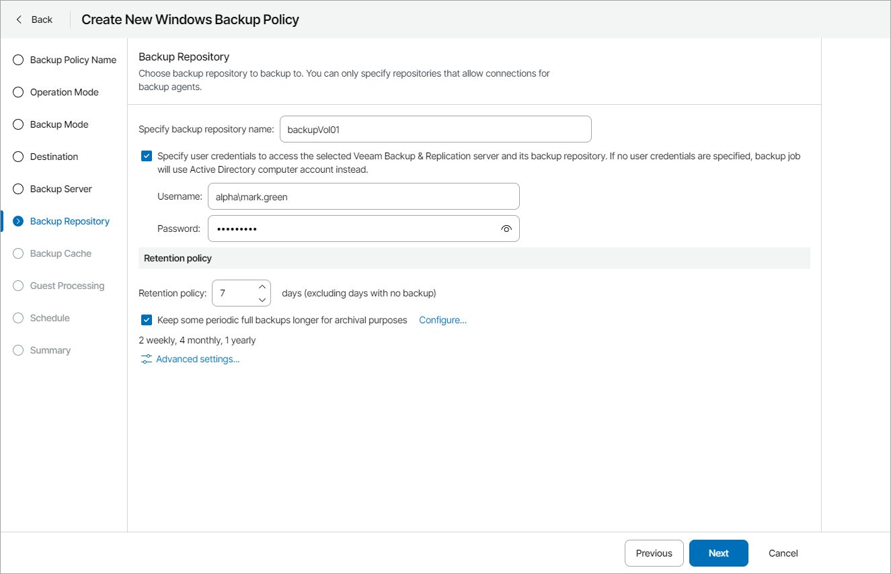

# Step 11. Specify Backup Repository Settings

The Backup Repository step of the wizard is available if at the [Destination](choose_backup_destination.md) step you have chosen to save backup files on a Veeam backup repository.

Specify settings for the target backup repository:

1. In the Specify backup repository name field, type the name of a backup repository where you want to store created backups.

To store backups, you can use a simple backup repository or a scale-out backup repository.

1. Select the Specify user credentials to access the selected Veeam Backup & Replication server and its backup repository check box. In the Username and Password fields, specify a user name and password of the account that has access to this backup repository.

Permissions on the backup repository managed by the target Veeam backup server must be granted beforehand. For details, see section [Setting Up User Permissions on Backup Repositories](https://helpcenter.veeam.com/docs/agentforwindows/userguide/integrate_permissions.html) of the Veeam Agent for Microsoft Windows User Guide.

If you do not select the Specify user credentials to access the selected Veeam Backup & Replication server and its backup repository check box, Veeam Agent for Microsoft Windows will connect to the backup repository using the NT AUTHORITY\SYSTEM account of the computer where the product is installed. You can use this scenario if the computer is joined to the Active Directory domain. In this case, you can add the computer account (DOMAIN\COMPUTERNAME$) to an Active Directory group and grant access rights on the backup repository to this group.

Setting access permissions on the backup repository to Everyone is equal to granting access rights to the Everyone Microsoft Windows group (Anonymous users are excluded). If you have set such permissions on the backup repository, you can omit specifying credentials. However, this scenario is recommended for demo environments only.

1. Specify backup retention policy settings:

* In the Retention policy field, specify the number of days for which you want to store backup files in the target location. By default, Veeam backup agent keeps backup files for 7 days. After this period is over, Veeam backup agent will remove the earliest restore points from the backup chain.

For details, see section [Short-Term Retention Policy](https://helpcenter.veeam.com/docs/agentforwindows/userguide/retention.html) of the Veeam Agent for Microsoft Windows User Guide.

* To enable long-term retention policy, select the Keep some periodic full backups longer for archival purposes check box and click Configure.

In the Configure GFS window, specify how long you want to keep weekly, monthly and yearly full backups.

For details on GFS retention mechanism, see section [Long-Term Retention Policy (GFS)](https://helpcenter.veeam.com/docs/vbr/userguide/gfs_retention_policy.html?ver=13) of the Veeam Backup & Replication User Guide.

|  |
| --- |
| Note: |
| * To enable GFS retention policy, you must configure creation of synthetic or active full backups in the [Advanced Settings](specify_advanced_job_settings.md). * GFS retention settings are available for Veeam Agent for Microsoft Windows version 5 or later. |

1. Click Advanced Settings to specify advanced settings for the backup job.

For details, see [Specify Advanced Job Settings](specify_advanced_job_settings.md).

