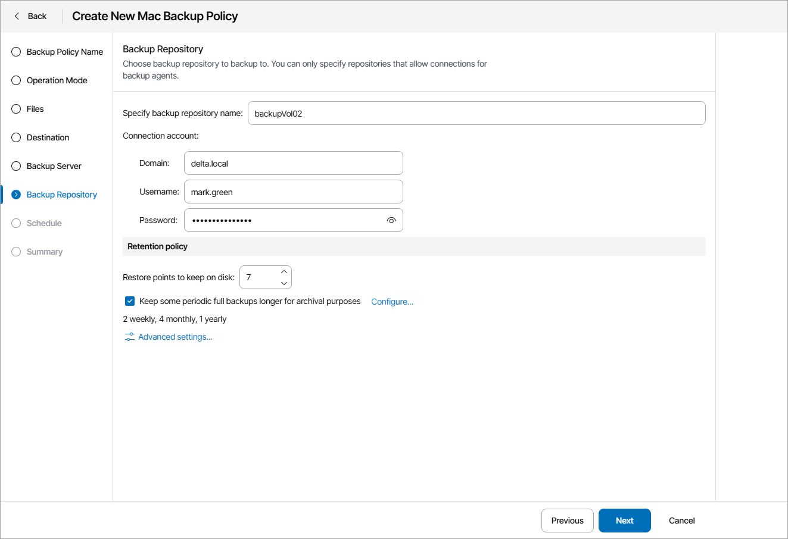

# Step 9. Specify Backup Repository Settings

The Backup Repository step of the wizard is available if at the [Destination](choose_backup_destination_mac.md) step you have chosen to save backup files on a Veeam backup repository.

Specify settings for the target backup repository:

1. In the Specify backup repository name field, type the name of a backup repository where you want to store created backups.

To store backups, you can use a simple backup repository or a scale-out backup repository.

1. In the Connection account fields, specify domain name and user name and password of the account that has access permissions on this backup repository.

Permissions on the backup repository managed by the target Veeam backup server must be granted beforehand. For details, see section [Setting Up User Permissions on Backup Repositories](https://helpcenter.veeam.com/docs/agentformac/userguide/integrate_permissions.html) of the Veeam Agent for Mac User Guide.

To view the specified password, click and hold the eye icon on the right of the Password field.

1. Specify backup retention policy settings:

* For Veeam Agent for Mac version 13 or later: In the Retention policy (for Veeam Agent for Mac v13) field, specify the number of days for which you want to keep backups in the target location. By default, Veeam backup agent keeps backup files for 7 days. After this period is over, Veeam backup agent will remove the earliest restore points from the backup chain.

For details, see section [Short-Term Retention Policy](https://helpcenter.veeam.com/docs/agentformac/userguide/retention.html) of the Veeam Agent for Mac User Guide.

* For earlier Veeam Agent for Mac versions: In the Retention policy (for Veeam Agent for Mac before v13) field, specify the number of restore points that you want to keep in the target location. By default, Veeam backup agent keeps the 7 latest backup files. When the number of restore points is exceeded, Veeam backup agent will remove the earliest restore points from the backup chain.

* To enable long-term retention policy, select the Keep some periodic full backups longer for archival purposes check box and click Configure.

In the Configure GFS window, specify how long you want to keep weekly, monthly and yearly full backups. For details on GFS retention mechanism, see section [Long-Term Retention Policy (GFS)](https://helpcenter.veeam.com/docs/vbr/userguide/gfs_retention_policy.html?ver=13) of the Veeam Backup & Replication User Guide.

|  |
| --- |
| Note: |
| * To enable GFS retention policy, you must configure creation of synthetic or active full backups in the [Advanced Settings](specify_advanced_job_settings_mac.md). * GFS retention settings are available for Veeam Agent for Mac version 2.1 or later. |

1. Click Advanced Settings to specify advanced settings for the backup job.

For details, see [Specify Advanced Job Settings](specify_advanced_job_settings_mac.md).

