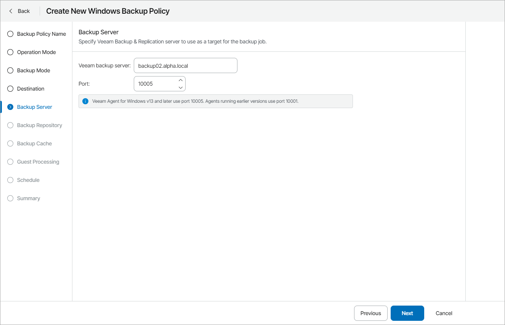

# Step 10. Specify Backup Server Settings

The Backup Server step of the wizard is available if at the [Destination](choose_backup_destination.md) step you have chosen to store backup files on a Veeam backup repository.

Specify settings for the Veeam backup server that manages the target backup repository:

1. In the Veeam backup server field, specify a DNS name or IP address of the Veeam backup server.

If the target backup repository is managed by a High Availability cluster, specify DNS name or IP address of the cluster. Alternatively, you can specify DNS name or IP address of the primary cluster node. If you specify DNS name or IP address of the secondary node, the policy will fail to apply.

1. In the Port field, specify a number of the port over which Veeam backup agent must communicate with the backup repository.

By default, Veeam Agent for Microsoft Windows version 13 or later uses port 10005. Earlier Veeam Agent for Microsoft Windows versions use port 10001.

|  |
| --- |
| Important! |
| If you specify a DNS name of the Veeam backup server, make sure that the Veeam backup server name is resolved into IPv4 address on the machine where Veeam backup agent is installed.  If you specify a DNS name or IP address of the primary cluster node, after switchover or failover of the cluster the policy sessions will finish with error. In this case, you must manually change the server address to the address of the new primary node of the address of the cluster. |

