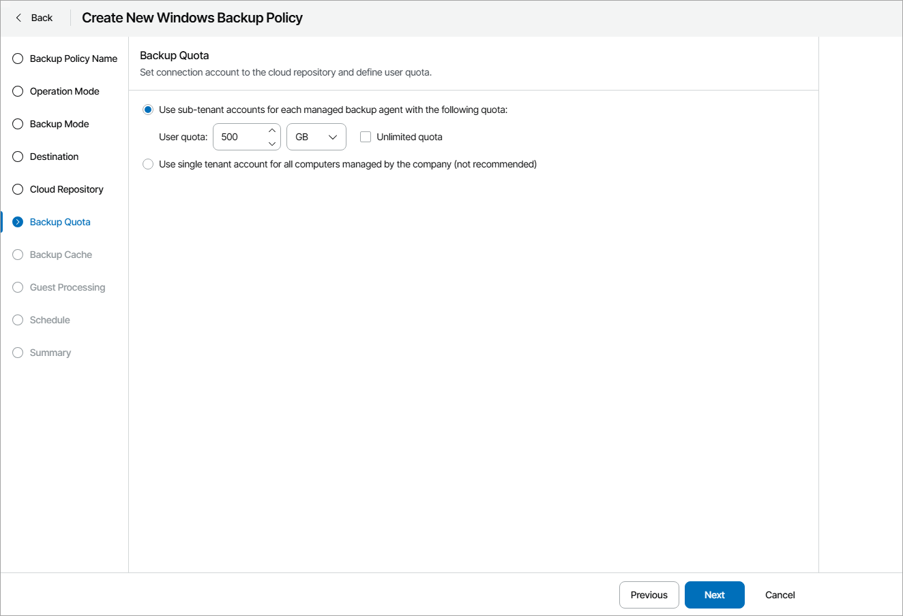

# Step 13. Specify Cloud Repository Quota

The Backup Quota step of the wizard is available if at the [Destination](choose_backup_destination.md) step you have chosen to save backup files on a Veeam Cloud Connect repository.

You can select one of the following options:

* Use sub-tenant accounts for each managed backup agent with the following quota.

If you select this option, Veeam Service Provider Console will create a subtenant account for each protected computer managed by the company. Veeam backup agent will use this account to write data to the cloud repository. The name of the subtenant account is formed according to the following pattern: <company\_name>\_<computer\_name>.

The subtenant quota will be set to the amount specified in the User quota field. If you do not want to limit the amount of space allocated to a subtenant, select the Unlimited quota check box.

For details on subtenant accounts, see section [Subtenants](https://helpcenter.veeam.com/docs/backup/cloud/cloud_connect_subtenants.html) of the Veeam Cloud Connect Guide.

|  |
| --- |
| Note: |
| * You can create subtenant accounts only for companies based on native Veeam Cloud Connect tenants. Creating subtenant accounts for companies based on VMware Cloud Director tenant accounts is not supported.  * When editing the backup job configuration, make sure you specify credentials of the Veeam Cloud Connect tenant account. |

* Use single tenant account for all computers managed by the company (not recommended).

If you select this option, Veeam Service Provider Console will store backups on a cloud repository using an account of a company to which protected computers belong.

