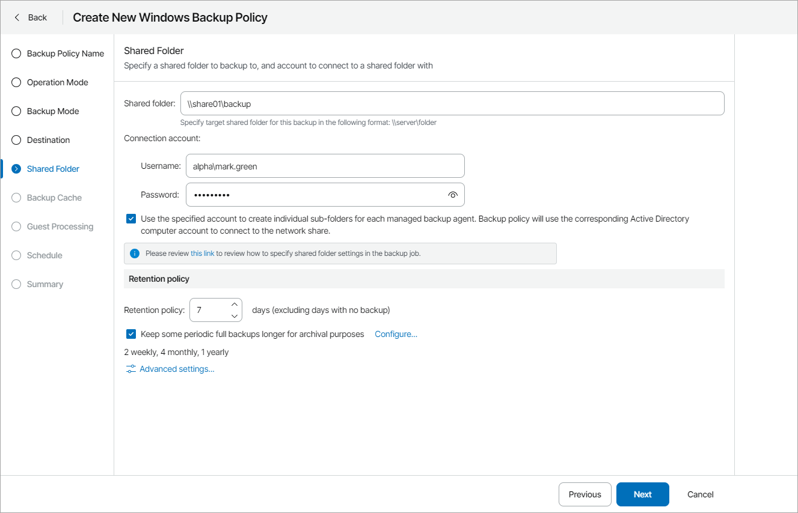

# Step 9. Specify Shared Folder Settings

The Shared Folder step of the wizard is available if at the [Destination](choose_backup_destination.md) step you have chosen to save the backup in a network shared folder.

Specify shared folder settings:

1. In the Shared folder field, type a UNC name of the network shared folder in which you want to store backup files.

The UNC name must start with two back slashes (\\).

1. In the Connection account fields, specify a user name and password of the account that has access permissions on this shared folder.

The user name must be specified in the DOMAIN\USERNAME format.

To view the specified password, click and hold the eye icon on the right of the Password field.

1. Select the Use the specified account to create individual sub-folders for each managed backup agent check box if backup of each managed computer must be stored in its own subfolder of the shared folder.

If this check box selected, each managed Veeam backup agent that writes data to the network share will create a separate subfolder and store backups  to this subfolder. The machine account of the managed computer will be set as the subfolder owner. As a result, the machine account of each managed computer will have access to the subfolder where its backups are stored, and will not be able to access content of other subfolders on the network share.

If the check box is selected, make sure that the following prerequisites are completed:

* Managed computers protected with Veeam backup agents are members of an Active Directory domain.
* The shared folder is included in the same Active Directory domain as the managed computers.
* Everyone has Read and Write permissions on the shared folder.
* Child objects (subfolders) do not inherit permissions from the shared folder.

If the check box is not selected, backups for all managed computers will be stored in the shared folder.

1. Specify backup retention policy settings:

* In the Retention policy field, specify the number of days for which you want to store backup files in the target location. By default, Veeam backup agent keeps backup files for 7 days. After this period is over, Veeam backup agent will remove the earliest restore points from the backup chain.

For details, see section [Short-Term Retention Policy](https://helpcenter.veeam.com/docs/agentforwindows/userguide/retention.html) of the Veeam Agent for Microsoft Windows User Guide.

* To enable long-term retention policy, select the Keep some periodic full backups longer for archival purposes check box and click Configure.

In the Configure GFS window, specify how long you want to keep weekly, monthly and yearly full backups.

For details on GFS retention mechanism, see section [Long-Term Retention Policy (GFS)](https://helpcenter.veeam.com/docs/vbr/userguide/gfs_retention_policy.html?ver=13) of the Veeam Backup & Replication User Guide.

|  |
| --- |
| Note: |
| * To enable GFS retention policy, you must configure creation of synthetic or active full backups in the [Advanced Settings](specify_advanced_job_settings.md). * GFS retention settings are available for Veeam Agent for Microsoft Windows version 5 or later. |

1. Click Advanced Settings to specify advanced settings for the backup job.

For details, see [Specify Advanced Job Settings](specify_advanced_job_settings.md).

