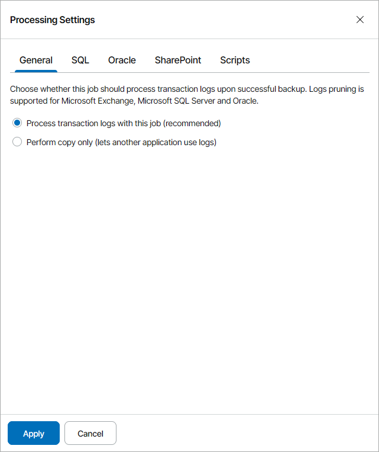
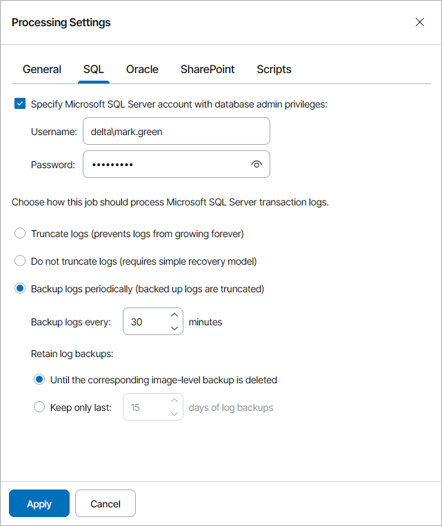
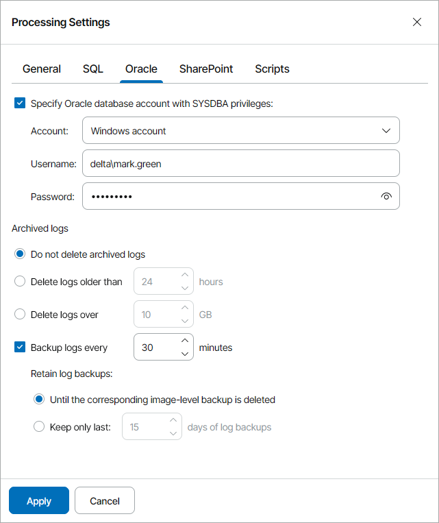
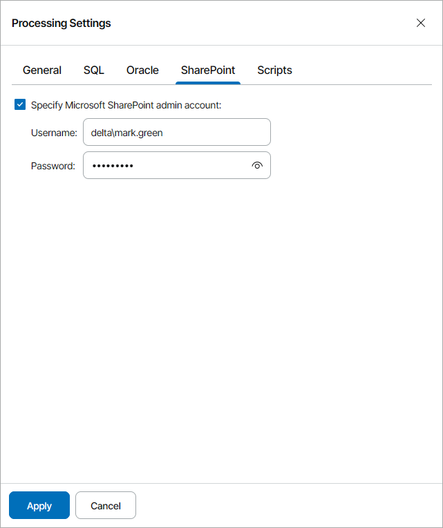
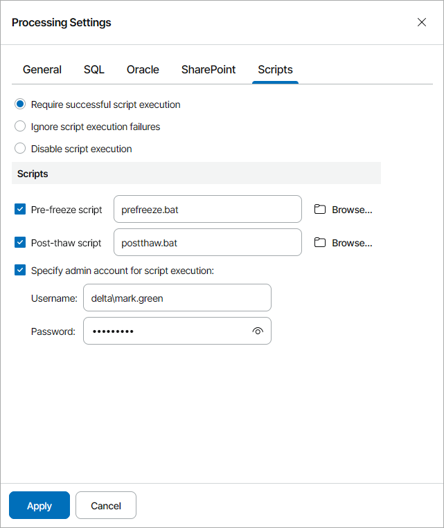
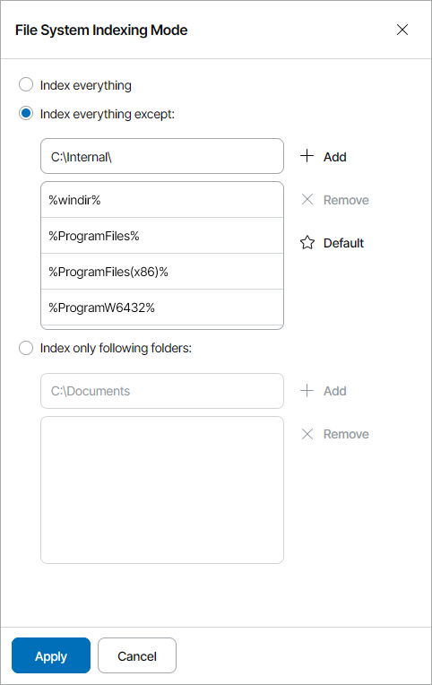

# Step 16. Specify Guest OS Processing Options

The Guest Processing step of the wizard is available if at the [Backup Mode](choose_operation_mode.md) step you have chosen the Server operation mode.

At this step, you can enable the following settings for guest OS processing:

* [Application-aware processing](specify_processing_options.md#appaware)
* [Transaction log handling for Microsoft SQL Server](specify_processing_options.md#sql)
* [Archived log handling for Oracle databases](specify_processing_options.md#oracle)
* [Microsoft SharePoint account settings](specify_processing_options.md#sharepoint)
* [Use of pre-freeze and post-thaw scripts](specify_processing_options.md#scripts)
* [File indexing](specify_processing_options.md#indexing)

Application-Aware Processing

If the computer runs VSS-aware applications, you can enable application-aware processing to create a transactionally consistent backup. The transactionally consistent backup guarantees proper recovery of applications without data loss.

To enable application-aware processing:

1. At the Guest Processing step of the wizard, select the Enable application-aware processing check box.
2. Click the Customize application handling options for individual applications link.
3. In the Processing Settings window, on the General tab, specify if Veeam backup agent must process transaction logs or copy-only backups must be created.

1. Select Process transaction logs with this job if Veeam backup agent must process transaction logs.

[For Microsoft Exchange] With this option selected, Veeam backup agent will wait for backup to complete successfully and then trigger truncation of transaction logs. If the backup job fails, logs will remain unaltered until the next backup job session.

[For Microsoft SQL Server and Oracle] You will need to specify additional settings for transaction log handling on the SQL and Oracle tabs of the Processing Settings window. For details, see [Transaction Log Handling for Microsoft SQL Server](#sql) and [Transaction Log Handling for Oracle Databases](#oracle).

1. Select the Perform copy only option if you use another tool to maintain consistency of the database state. Veeam backup agent will create a copy-only backup. The copy-only backup preserves the chain of full/differential backup files and transaction logs. For details, see [Microsoft Documentation](http://msdn.microsoft.com/en-us/library/ms191495.aspx).

|  |
| --- |
| Important! |
| If both Microsoft SQL Server and Oracle Server are installed on the same server, and log backup is enabled for both applications, Veeam backup agent will back up only Oracle transaction logs. Microsoft SQL Server transaction logs will not be processed. |

For details on transaction log truncation, see section [Transaction Log Truncation](https://helpcenter.veeam.com/docs/agentforwindows/userguide/transaction_truncation.html) of the Veeam Agent for Microsoft Windows User Guide.

Transaction Log Handling for Microsoft SQL Server

If you back up Microsoft SQL Server, you can specify how Veeam backup agent must process database transaction logs:

1. At the Guest Processing step of the wizard, select the Enable application-aware processing check box.
2. Click the Customize application handing options for individual applications link.
3. In the Processing Settings window, on the General tab, select Process transaction logs with this job.
4. In the Processing Settings window, open the SQL tab.
5. To specify a user account that Veeam backup agent must use to connect to the Microsoft SQL Server, select the Specify Microsoft SQL Server account with database admin privileges check box and specify a user name and password for the user account.

To connect to the Microsoft SQL Server, you must use a Microsoft Windows user account that has sysadmin privileges on the Microsoft SQL Server. You cannot use Microsoft SQL Server accounts (for example, the SA account) to connect to the database.

1. Specify how transaction logs must be processed. You can select one of the following options:

* Select Truncate logs to truncate transaction logs after successful backup. Veeam backup agent will wait for backup to complete successfully and then truncate transaction logs. If the backup job fails, the logs will remain unaltered until the next backup job session.
* Select Do not truncate logs to preserve transaction logs. When the backup job completes, Veeam backup agent will not truncate transaction logs.

It is recommended that you enable this option for databases that use the Simple recovery model. If you enable this option for databases that use the Full or Bulk-logged recovery model, transaction logs may grow large and consume all disk space. In this case, the database administrator must take care of transaction logs.

* Select Backup logs periodically to back up transaction logs with Veeam backup agent. Veeam backup agent will periodically copy transaction logs to the backup location and store them together with the image-level backup. During the backup job session, transaction logs will be truncated.

For details on log handling, see section [Microsoft SQL Server and Oracle Logs Backup](https://helpcenter.veeam.com/docs/agentforwindows/userguide/sql_backup.html) of the Veeam Agent for Microsoft Windows User Guide.

If you have chosen to back up transaction logs with Veeam backup agent, you must specify settings for transaction log backup:

1. In the Backup logs every <N> minutes field, specify the frequency for transaction log backup.

By default, transaction logs are backed up every 15 minutes. The maximum log backup interval is 480 minutes.

1. In the Retain log backups section, specify retention policy for transaction logs stored in the backup location.

* Select Until the corresponding image-level backup is deleted to apply the same retention policy for image-level backups and transaction log backups.
* Select Keep only last <N> days of log backups to keep transaction logs for a specific number of days. By default, transaction logs are kept for 15 days. If you select this option, you must make sure that retention for transaction logs is not greater than retention for the image-level backup. For details, see section [Retention for Database Log Backups](https://helpcenter.veeam.com/docs/agentforwindows/userguide/sql_backup_retention.html) of the Veeam Agent for Microsoft Windows User Guide.

|  |
| --- |
| Important! |
| Veeam backup agent automatically excludes its configuration database from application-aware processing during backup. Transaction logs for the configuration database are not backed up.  Veeam backup agent does not support transaction logs backup to a cloud repository. If you want to back up transaction logs, you must select local storage, shared folder or Veeam Backup & Replication repository as backup target. |

Archived Log Handling for Oracle Databases

If you back up a server that hosts an Oracle database, you can specify how Veeam backup agent must process archived logs:

1. At the Guest Processing step of the wizard, select the Enable application-aware processing check box.
2. Click the Customize application handing options for individual applications link.
3. In the Processing Settings window, on the General tab, select Process transaction logs with this job.
4. In the Processing Settings window, open the Oracle tab.
5. Specify a user account that Veeam backup agent must use to connect to the Oracle database:

1. Select the Specify Oracle account with SYSDBA privileges check box.
2. In the Account field, select what type of user account you plan to use: Oracle account or Windows account.
3. In the Username and Password fields, type a user name and password for the account.

The specified account must have SYSDBA permissions on the Oracle database.

1. In the Archived logs section, specify if Veeam backup agent must delete archived logs on the Oracle database:

* Select Do not delete archived logs if you want Veeam backup agent to preserve archived logs. When the backup job completes, Veeam backup agent will not delete archived logs.

It is recommended that you select this option for databases for which the ARCHIVELOG mode is turned off. If the ARCHIVELOG mode is turned on, archived logs may grow large and consume all disk space. In this case, the database administrator must take care of archived logs.

* Select Delete logs older than <N> hours or Delete logs over <N> GB if you want Veeam backup agent to delete archived logs that are older than <N> hours or larger than <N> GB. Veeam backup agent will wait for the backup to complete successfully and then trigger archived logs deletion using Oracle Call Interface (OCI). If the backup job fails, the logs will remain unaltered until the next backup job session.

1. To back up Oracle archived logs with Veeam backup agent, select the Backup log every <N> minutes check box and specify the frequency for archived log backup.

By default, archived logs are backed up every 15 minutes. The maximum log backup interval is 480 minutes.

1. In the Retain log backups section, specify retention policy for archived logs stored in the backup location:

* Select Until the corresponding image-level backup is deleted to apply the same retention policy for image-level backups and archived log backups.
* Select Keep only last <N> days of log backups to keep archived logs for a specific number of days.

By default, archived logs are kept for 15 days. If you select this option, you must make sure that retention for archived logs is not greater than retention for the image-level backups. For details, see section [Retention for Database Log Backups](https://helpcenter.veeam.com/docs/agentforwindows/userguide/sql_backup_retention.html) of the Veeam Agent for Microsoft Windows User Guide.

|  |
| --- |
| Important! |
| Veeam backup agent does not support archived logs backup to a cloud repository. If you want to back up archived logs, you must select local storage, shared folder or Veeam Backup & Replication repository as backup target. |

Microsoft SharePoint Account Settings

If you back up a server that hosts Microsoft SharePoint, you must specify a user account that has enough permissions on the application:

1. At the Guest Processing step of the wizard, select the Enable application-aware processing check box.
2. Click the Customize application handing options for individual applications link.
3. In the Processing Settings window, open the SharePoint tab.
4. Select the Specify Microsoft SharePoint admin account check box.
5. In the Username and Password fields, type credentials of the account.

Use of Pre-Freeze and Post-Thaw Scripts

If you plan to back up data of applications that do not support VSS, you can specify what scripts Veeam backup agent must use to help quiesce the OS and applications on the protected computer. The pre-freeze script quiesces the file system and application data to bring the OS to a consistent state before Veeam backup agent creates a VSS snapshot. After the VSS snapshot is created, the post-thaw script brings the file system and applications to their initial state.

To specify pre-freeze and post-thaw scripts for the job:

1. At the Guest Processing step of the wizard, select the Enable application-aware processing check box.
2. Click the Customize application handing options for individual applications link.
3. In the Processing Settings window, open the Scripts tab.
4. In the Script processing mode section, specify the scenario for scripts execution:

* Select Require successful script execution if Veeam backup agent must stop the backup process if the script fails.
* Select Ignore script execution failures if the backup process must continue even if script errors occur.
* Select Disable script execution if you do not want to run scripts.

1. In the Scripts section, specify paths to pre-freeze and post-thaw scripts.

Veeam backup agent supports scripts in the EXE, BAT, CMD, WSF, JS, VBS and PS1 formats.

1. By default, Veeam backup agent performs guest processing activities under the Local System account. To specify a user account that Veeam backup agent must use to run pre-freeze and post-thaw scripts, select the Specify admin account for script execution check box and enter a user name and password for the user account.

For details on scripts, see section [Pre-Freeze and Post-Thaw Scripts](https://helpcenter.veeam.com/docs/agentforwindows/userguide/pre_post_scripts.html) of the Veeam Agent for Microsoft Windows User Guide.

File Indexing

To specify guest OS indexing options:

1. At the Guest Processing step of the wizard, select the Enable file system indexing check box.
2. Click the Customize advanced file system indexing options link.
3. In the Indexing Settings window, specify the indexing scope:

* Select Index everything to index all files within the backup scope. Veeam backup agent will index all files that reside on your computer OS (for entire computer backup), on the volumes that you have selected for backup (for volume-level backup), in the directories that you have selected for backup (for file-level backup).
* Select Index everything except to index all files on your computer OS except those defined in the list.

By default, system folders are excluded from indexing. You can add or delete folders using the Add and Remove buttons on the right. You can use system environment variables to form the list, for example: %windir%, %ProgramFiles% and %Temp%.

* Select Index only following folders to define folders that you want to index. You can add or delete folders to index using the Add and Remove buttons on the right. You can use system environment variables to form the list, for example: %windir%, %ProgramFiles% and %Temp%.

For details on file system indexing, see section [File System Indexing](https://helpcenter.veeam.com/docs/agentforwindows/userguide/indexing.html) of the Veeam Agent for Microsoft Windows User Guide.

