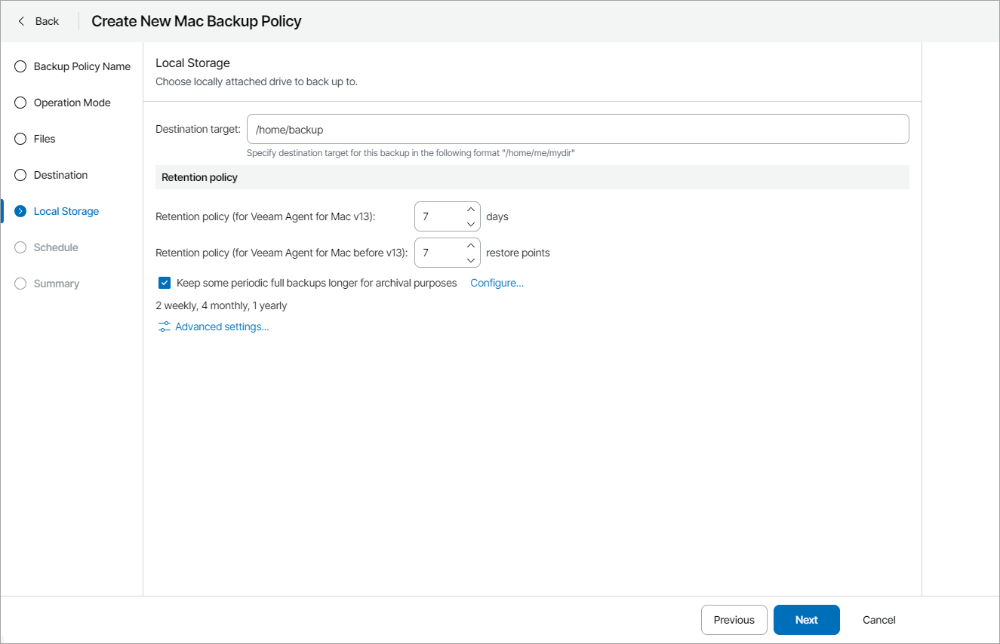

# Step 6. Specify Local Storage Settings

The Local Storage step of the wizard is available if at the [Destination](choose_backup_destination_mac.md) step you have chosen to save the backup on a local drive of the computer.

Specify local storage settings:

1. In the Destination target field, specify a path to the folder where backup files must be stored.

If the folder does not exist, Veeam backup agent will create it during backup.

1. Specify backup retention policy settings:

* For Veeam Agent for Mac version 13 or later: In the Retention policy (for Veeam Agent for Mac v13) field, specify the number of days for which you want to keep backups in the target location. By default, Veeam backup agent keeps backup files for 7 days. After this period is over, Veeam backup agent will remove the earliest restore points from the backup chain.

For details, see section [Short-Term Retention Policy](https://helpcenter.veeam.com/docs/agentformac/userguide/retention.html) of the Veeam Agent for Mac User Guide.

* For earlier Veeam Agent for Mac versions: In the Retention policy (for Veeam Agent for Mac before v13) field, specify the number of restore points that you want to keep in the target location. By default, Veeam backup agent keeps the 7 latest backup files. When the number of restore points is exceeded, Veeam backup agent will remove the earliest restore points from the backup chain.

* To enable long-term retention policy, select the Keep some periodic full backups longer for archival purposes check box and click Configure.

In the Configure GFS window, specify how long you want to keep weekly, monthly and yearly full backups. For details on GFS retention mechanism, see section [Long-Term Retention Policy (GFS)](https://helpcenter.veeam.com/docs/vbr/userguide/gfs_retention_policy.html?ver=13) of the Veeam Backup & Replication User Guide.

|  |
| --- |
| Note: |
| * To enable GFS retention policy, you must configure creation of synthetic or active full backups in the [Advanced Settings](specify_advanced_job_settings_mac.md). * GFS retention settings are available for Veeam Agent for Mac version 2.1 or later. |

1. Click Advanced Settings to specify advanced settings for the backup job.

For details, see [Specify Advanced Job Settings](specify_advanced_job_settings_mac.md).

|  |
| --- |
| Important! |
| * If you choose to store the backup on a local folder included in the backup scope, Veeam Agent for Mac will automatically exclude this folder from the backup. * USB storage devices formatted as FAT32 do not allow storing files larger than 4 GB in size. For this reason, it is recommended that you do not use such USB storage devices as a backup target. |

