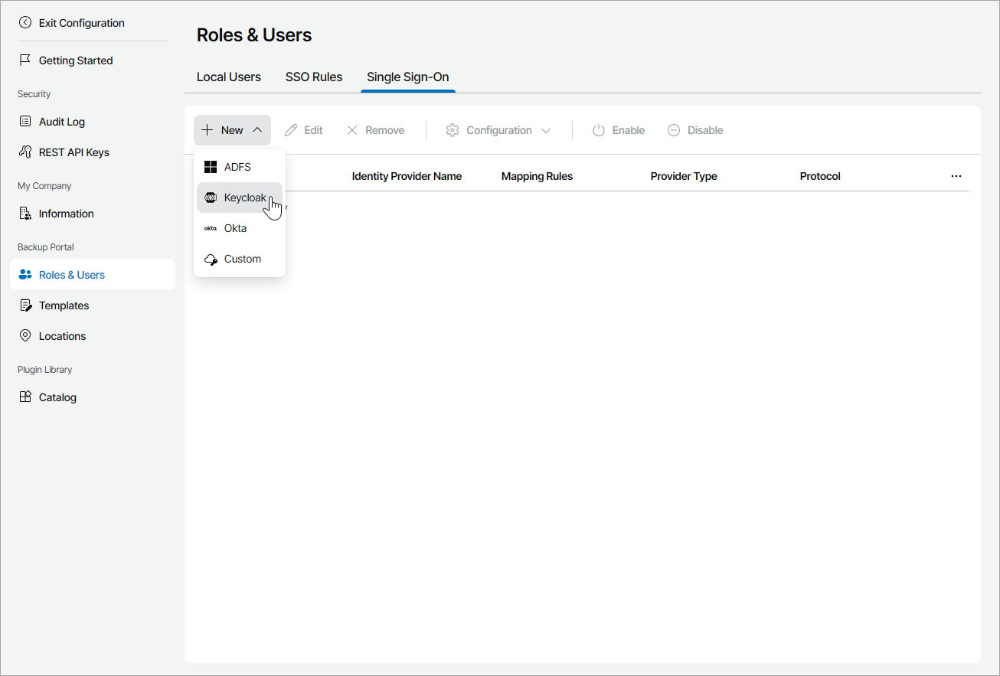
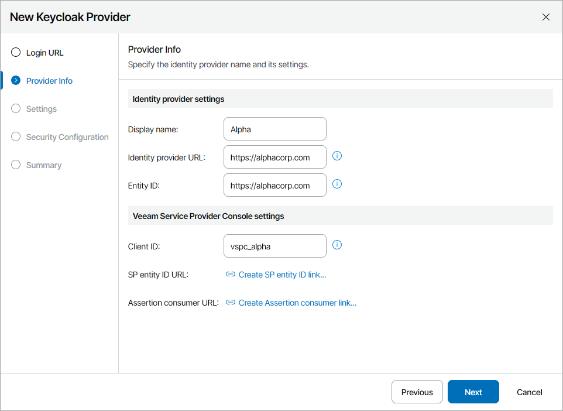
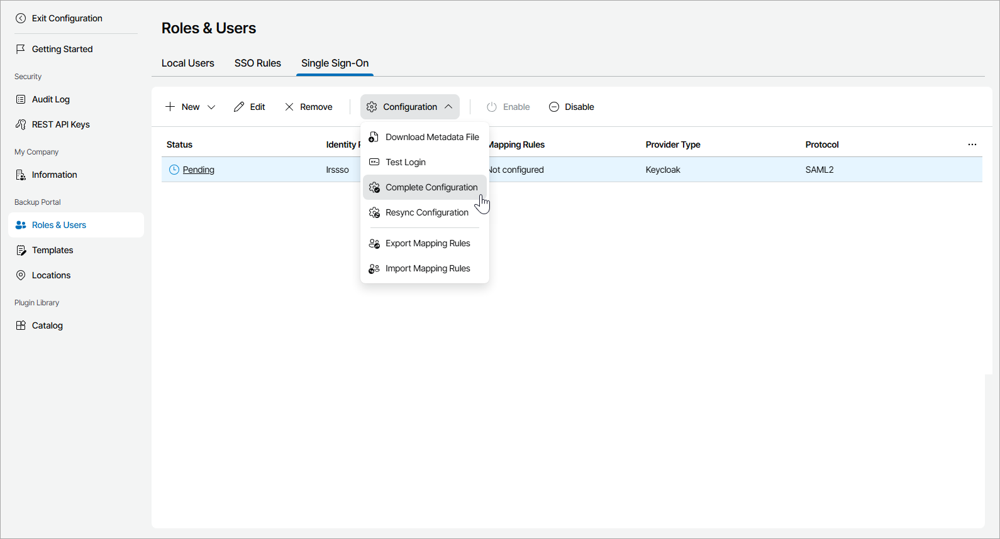
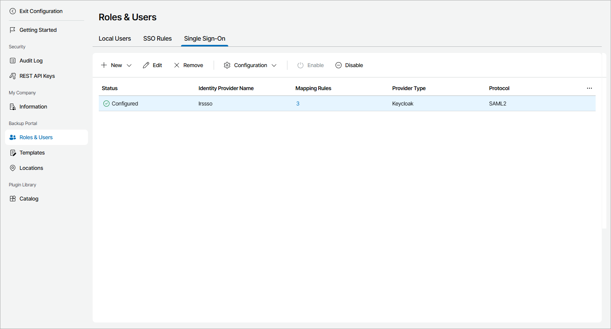

# Managing Identity Providers

Veeam Service Provider Console allows you to create and manage IdP configurations to set up SSO authentication.

Required Privileges

To perform the following tasks, a user must have one of the following roles assigned: Company Owner, Company Administrator.

Adding Identity Providers

SAML authentication requires SP to set up trust relationship with IdP. To do that in Veeam Service Provider Console, you must create an IdP configuration:

1. Log in to Veeam Service Provider Console.

For details, see [Accessing Veeam Service Provider Console](access_vac.md).

1. At the top right corner of the Veeam Service Provider Console window, click Configuration.
2. In the configuration menu on the left, click Roles & Users.
3. On the Single Sign-On tab, click New and select an identity provider service from the drop-down list.

The identity provider configuration wizard will open.

1. At the Login URL step of the wizard, you can review and copy your personal login portal URL.

It is recommended to use an address that includes your service provider domain name. To check if the login portal URL is valid, click Verify link. Veeam Service Provider Console will open the login portal in a new window. If the link is invalid, you must contact your service provider to include your login portal address in Veeam Service Provider Console security certificates.

Note that if you already have an identity provider, you will not be able to change the login portal URL. To change the URL, you will have to remove all created identity providers.

1. At the Provider Info step of the wizard, specify general information on the IdP:

* In the Display name field, specify the IdP name that will be displayed in the IdP list on the Single Sign-On tab.
* In the Identity provider URL field, specify URL of the page containing metadata that is required by IdP.
* [For Keycloak, Okta and Custom identity providers] In the Entity ID field, specify the unique identifier that an IdP will use to identify SP.
* In the Client ID field, specify the name of the client created for Veeam Service Provider Console on the IdP side.

Note that the name must be at least 5 and not more than 32 characters long and must not contain special characters.

* [For Keycloak, Okta and Custom identity providers] Click SP entity ID link to generate entity ID URL based on the portal web address and the Client ID value.

If you apply changes to Client ID value after link generation, click New link.

* [For Keycloak, Okta and Custom identity providers] Click Create Assertion consumer link to generate assertion consumer service URL based on the portal web address and the Client ID value.

If you apply changes to Client ID value after link generation, click New link.

1. At the Settings step of the wizard, you can change SP and IdP settings. To do that, clear the Use default configuration check box and specify the following settings:

* From the Outbound signing algorithm drop-down list, select a certificate signature algorithm for requests sent by Veeam Service Provider Console.
* From the Minimum accepted incoming signing algorithm drop-down list, select a certificate signature algorithm required from requests received by Veeam Service Provider Console.

Requests with signing algorithm weaker than the selected algorithm will be rejected.

* From the Comparison method drop-down list, select a comparison method for authentication context.
* From the Context class drop-down list, select an authentication method used by the IdP.

1. At the Security Configuration step of the wizard, select one of the following options for a security certificate that will be used by Veeam Service Provider Console to connect to the IdP:

* Generate a self-signed certificate

With this option selected, a new self-signed certificate will be generated automatically.

* Use the selected security certificate

With this option selected, you can upload a certificate in the PKCS#12 format from your local disk or file share and provide the certificate password.

1. At the Summary step of the wizard, review the IdP settings and click Finish.

The XML file containing metadata will be automatically downloaded to your computer.

At this point you can configure trust relationship with Veeam Service Provider Console on the IdP side. For details on how it can be performed, see [Single Sign-On Access Configuration Examples](appendix_sso_examples.md).

1. Select the new identity provider in the list.
2. From the Configuration drop-down list, select Complete Configuration.

If you have mapping rules configured, you can also select Test Login. It allows you to perform a trial authorization. If it is successful, the identity provider configuration is completed automatically.

Editing Identity Provider Display Name

To edit an identity provider:

1. Log in to Veeam Service Provider Console.

For details, see [Accessing Veeam Service Provider Console](access_vac.md).

1. At the top right corner of the Veeam Service Provider Console window, click Configuration.
2. In the configuration menu on the left, click Roles & Users.
3. Open the Single Sign-On tab.
4. Select the identity provider in the list.
5. At the top of the list, click Edit.

Alternatively, you can right-click the necessary identity provider and choose Edit.

The Edit Identity Provider wizard will open.

1. At the Provider Info step of the wizard, specify a new IdP display name.
2. Click Finish.

Disabling Identity Providers

Although you can add multiple identity providers, only one of them can be enabled at the same time. If you add a second identity provider, you cannot complete its configuration until another identity provider is enabled. To disable an identity provider:

1. Log in to Veeam Service Provider Console.

For details, see [Accessing Veeam Service Provider Console](access_vac.md).

1. At the top right corner of the Veeam Service Provider Console window, click Configuration.
2. In the configuration menu on the left, click Roles & Users.
3. Open the Single Sign-On tab.
4. Select the identity provider in the list.
5. At the top of the list, click Disable.

Alternatively, you can right-click the necessary identity provider and choose Disable.

Updating Identity Provider Configuration

You can update IdP configuration saved in Veeam Service Provider Console. This can be useful if changes were applied to a profile on IdP server and IdP configuration in Veeam Service Provider Console must be synchronized with these changes.

To update IdP configuration:

1. Log in to Veeam Service Provider Console.

For details, see [Accessing Veeam Service Provider Console](access_vac.md).

1. At the top right corner of the Veeam Service Provider Console window, click Configuration.
2. In the configuration menu on the left, click Roles & Users.
3. Open the Single Sign-On tab.
4. Select the identity provider in the list.
5. From the Configuration drop-down list, select Resync Configuration.

Alternatively, you can right-click the necessary identity provider, choose Configuration and select Resync Configuration.

Deleting Identity Providers

To delete an identity provider:

1. Log in to Veeam Service Provider Console.

For details, see [Accessing Veeam Service Provider Console](access_vac.md).

1. At the top right corner of the Veeam Service Provider Console window, click Configuration.
2. In the configuration menu on the left, click Roles & Users.
3. Open the Single Sign-On tab.
4. Select the identity provider in the list.
5. At the top of the list, click Remove.

Alternatively, you can right-click the necessary identity provider and choose Remove.

After you delete an identity provider, all user identities associated with it will also be deleted.

Viewing Identity Provider Details

To view details on configured identity providers:

1. Log in to Veeam Service Provider Console.

For details, see [Accessing Veeam Service Provider Console](access_vac.md).

1. At the top right corner of the Veeam Service Provider Console window, click Configuration.
2. In the configuration menu on the left, click Roles & Users.
3. Open the Single Sign-On tab.

Each identity provider in the list is described with the following set of properties:

* Status — status of the IdP.
* Identity Provider Name — display name of the IdP.
* Mapping Rules — mapping rules configured for the IdP.
* Provider Type — name of the IdP service.
* Protocol — authentication protocol.

