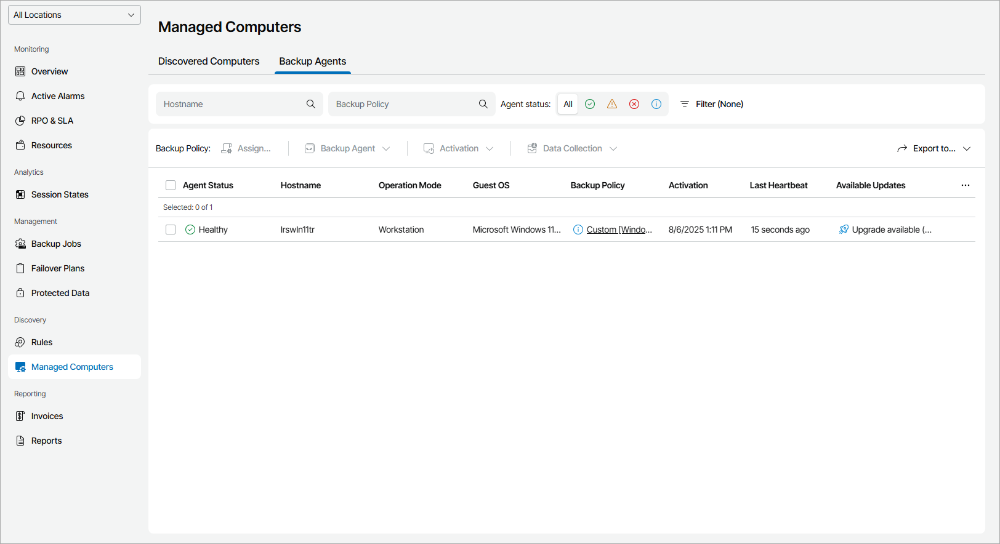

# Upgrading Veeam Backup Agents

In Veeam Service Provider Console, you can initiate upgrade of Veeam backup agents on protected computers.

For example, you may need to perform the upgrade procedure if computers in the managed infrastructure already have Veeam backup agents installed, but the software version is not supported by Veeam Service Provider Console. To be able to manage Veeam backup agents in Veeam Service Provider Console, you must upgrade the software to the supported version.

The upgrade procedure works as follows:

1. Veeam Service Provider Console periodically connects to the Veeam Installation Server (over the Internet), and checks whether a new version of the Veeam backup agent software is available.
2. If a new software version is available for managed Veeam backup agents, Veeam Service Provider Console displays warnings next to these Veeam backup agent saying that the backup agent version is outdated.

|  |
| --- |
| Note: |
| Upgrade to Veeam Agent for Microsoft Windows version 13 or later is available only for computers that run a 64-bit version of the Microsoft Windows OS and have Veeam Agent for Microsoft Windows version 6.1 installed. |

Required Privileges

To perform this task, a user must have one of the following roles assigned: Company Owner, Company Administrator, Company Tenant, Location Administrator.

Checking Whether New Veeam Backup Agent Version is Available

To check whether a newer software version is available for managed Veeam backup agents:

1. Log in to Veeam Service Provider Console.

For details, see [Accessing Veeam Service Provider Console](access_vac.md).

1. In the menu on the left, click Managed Computers.
2. Open the Backup Agents tab.
3. To display all Veeam backup agents that you can upgrade, click Filter, in the Available updates section select Update available, and click Apply.

Otherwise, you can sort Veeam backup agents in the list by values in the Available Updates column. For Veeam backup agents that can be upgraded, the column displays the Upgrade available value.

Veeam Service Provider Console offers the following methods for upgrading Veeam backup agents:

* [You can upgrade Veeam backup agents from the Veeam Installation Server](update_backup_agents_from_web.md)
* [You can upgrade Veeam backup agents in the offline mode](update_backup_agents_offline.md)

