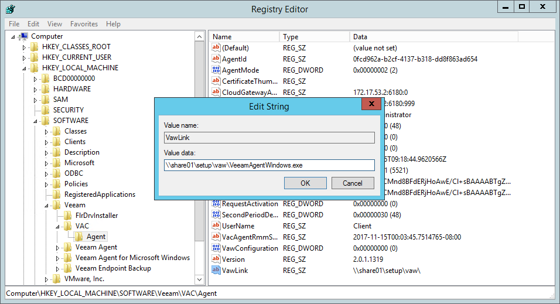
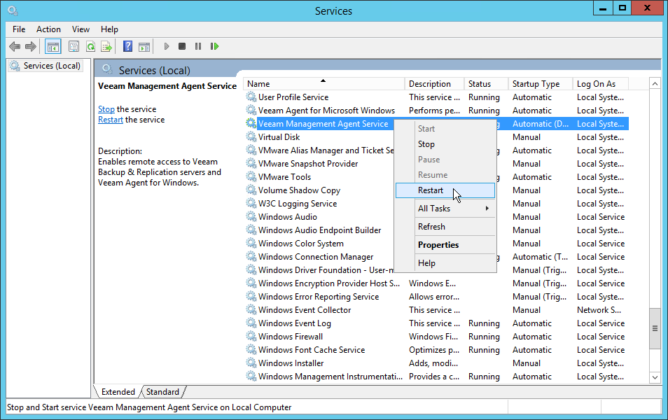

# Upgrading Veeam Backup Agents in Offline Mode

If none of the computers that host Veeam backup agents has connection to the Internet, or you do not want to fetch the Veeam backup agent setup file from the Veeam Installation Server, you can perform offline upgrade. In this upgrade scenario, the Veeam backup agent setup file is placed to a folder on a computer that hosts the master agent, to a network share, or to the computer that hosts the Veeam backup agent. During upgrade, the master agent or Veeam Service Provider Console management agent uploads this setup file to remote computers, and initiates the software upgrade.

The upgrade procedure depends on the method that you used to install Veeam backup agents:

* If you installed Veeam backup agents with a discovery rule, you must upgrade them as described in [Upgrading Veeam Backup Agents Installed with Discovery Rules](#discovery).
* If you installed Veeam backup agents with 3rd party tools, like GPO, or installed Veeam backup agents manually, you must upgrade them as described in [Upgrading Veeam Backup Agents Installed with 3rd Party Tools or Manually](#external).
* If you installed Veeam backup agents on machines running Linux or macOS operating systems, you must upgrade them as described in [Upgrading Veeam Agent for Linux and Veeam Agent for Mac](#linux).

Before You Begin

Before you start the upgrade procedure, make sure that:

* Computers on which you plan to upgrade Veeam backup agents are powered on.
* [For Microsoft Windows computers] Computers are configured to allow upload of a Veeam backup agent setup file: the File and Printer Sharing (SMB-In) firewall rule must allow inbound traffic.

* [For Linux and macOS computers] You have the root account or any user account with super user privileges on all computers.

Required Privileges

To perform this task, a user must have one of the following roles assigned: Company Owner, Company Administrator, Location Administrator.

Upgrading Veeam Backup Agents Installed with Discovery Rules

To upgrade Veeam backup agents installed with a discovery rule:

1. Download a new version of the Veeam backup agent setup file.
2. Place the Veeam backup agent setup file to a folder on a computer that hosts the master agent, or to a network share.

The master agent must have access to this folder. Make sure that the account under which the master agent service runs has Read/Write permissions on the folder.

1. Log on to a computer that hosts the master agent and specify the path to the Veeam backup agent setup file:

1. Open the Registry Editor.
2. In the Registry Editor, navigate to the HKEY\_LOCAL\_MACHINE\SOFTWARE\Veeam\VAC\Agent path.
3. Create a new registry key value with the following settings:

* Type: String value
* Value name: VawLink
* Value data: path to the Veeam backup agent setup file

1. Open the Services console, and restart Veeam Management Agent Service.

1. Log in to Veeam Service Provider Console.

For details, see [Accessing Veeam Service Provider Console](access_vac.md).

1. In the menu on the left, click Managed Computers.
2. Open the Backup Agents tab.
3. Select one or more Veeam backup agents in the list.
4. At the top of the list, click Backup Agent and choose Upgrade.

Alternatively, you can right-click the necessary Veeam backup agent, choose Backup Agent and select Upgrade.

After you initiate the upgrade procedure, the value in the Backup Agent Version column will change to Updating. You can click the Updating link to track the progress of the upgrade procedure.

1. Check the value in the Backup Agent Version column.

After the upgrade procedure completes, the value in this column will be set to Up-to-date.

In some cases, after upgrade you may need to perform additional operations. For example, if the setup detects a pending computer reboot, the Backup Agent Version column will display a warning notifying that reboot is required. To complete the upgrade procedure, you can initiate computer reboot in Veeam Service Provider Console. For details, see [Rebooting Remote Computers](reboot_remote_computers.md).

Upgrading Veeam Backup Agents Installed with 3rd Party Tools or Manually

To upgrade Veeam backup agents installed using 3rd party automation tools (like GPO) or manually:

1. Download a new version of the Veeam backup agent setup file.
2. Place the Veeam backup agent setup file to a folder on a computer where you want to upgrade the Veeam backup agent, or to a network share.

The Veeam Service Provider Console management agent deployed on the computer hosting the Veeam backup agent must have access to this folder. Make sure that the account under which the management agent service runs has at least Read/Write permissions on the folder.

1. Log on to a computer where you want to upgrade the Veeam backup agent and specify the path to the Veeam backup agent setup file:

1. Open the Registry Editor.
2. In the Registry Editor, navigate to the HKEY\_LOCAL\_MACHINE\SOFTWARE\Veeam\VAC\Agent path.
3. Create a new registry key value with the following settings:

* Type: String value
* Value name: VawLink
* Value data: path to the Veeam backup agent setup file

1. Open the Services console, and restart Veeam Management Agent Service.

1. Log in to Veeam Service Provider Console.

For details, see [Accessing Veeam Service Provider Console](access_vac.md).

1. In the menu on the left, click Managed Computers.
2. Open the Backup Agents tab.
3. Select one or more Veeam backup agents in the list.
4. At the top of the list, click Backup Agent and choose Upgrade.

Alternatively, you can right-click the necessary Veeam backup agent, choose Backup Agent and select Upgrade.

After you initiate the upgrade procedure, the value in the Backup Agent Version column will change to Updating. You can click the Updating link to track the progress of the upgrade procedure.

1. Check the value in the Backup Agent Version column.

After the upgrade procedure completes, the value in this column will be set to Up-to-date.

In some cases, after upgrade you may need to perform additional operations. For example, if the setup detects a pending computer reboot, the Backup Agent Version column will display a warning notifying that reboot is required. To complete the upgrade procedure, you can initiate computer reboot in Veeam Service Provider Console. For details, see [Rebooting Remote Computers](reboot_remote_computers.md).

Upgrading Veeam Agent for Linux and Veeam Agent for Mac

To upgrade Veeam backup agents installed on computers running Linux or macOS operating systems:

1. Download a new version of the Veeam backup agent setup files.
2. [For Veeam Agent for Linux] Obtain the ValPackageIndex.xml file from your service provider.
3. Place the Veeam backup agent setup files and the ValPackageIndex.xml file (for Veeam Agent for Linux) to a shared folder or a local folder on a computer that hosts Veeam backup agent.

Veeam Service Provider Console management agent must have access to this folder. Make sure that the account under which the management agent service runs has Read/Write permissions on the folder.

1. Run the following command:

|  |
| --- |
| sudo veeamconsoleconfig --update\_backup <...> |

where:

<...> — path to a folder where you have saved the setup files and the ValPackageIndex.xml file.

Wait for the agent to upgrade.

1. Log in to Veeam Service Provider Console.

For details, see [Accessing Veeam Service Provider Console](access_vac.md).

1. In the menu on the left, click Managed Computers.
2. Open the Backup Agents tab.
3. Select the necessary Veeam backup agent in the list.
4. Check the value in the Backup Agent Version column.

After the upgrade procedure completes, the value in this column will be set to Up-to-date.

In some cases, after upgrade you may need to perform additional operations. For example, if the setup detects a pending computer reboot, the Backup Agent Version column will display a warning notifying that reboot is required. To complete the upgrade procedure, you can initiate computer reboot in Veeam Service Provider Console. For details, see [Rebooting Remote Computers](reboot_remote_computers.md).

