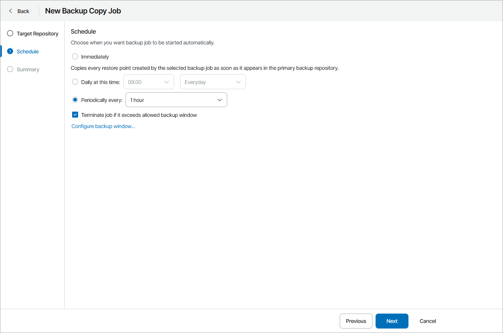

# Step 3. Configure Backup Copy Schedule

At the Schedule step of the wizard, specify backup copy schedule:

1. Define scheduling settings for the job:

* To run the job right after the latest restore point appears in a source backup repository, select Immediately.

* To run the job at specific time daily, on defined week days or with specific periodicity, select Daily at this time. Use the fields on the right to configure the necessary schedule.
* To run the job repeatedly throughout a day with a specific time interval, select Periodically every. In the field on the right, select the necessary time period.

Veeam Backup for Microsoft 365 always starts counting defined intervals from 12:00 AM. For example, if you configure to run a job with a 4-hour interval, the job will start at 12:00 AM, 4:00 AM, 8:00 AM, 12:00 PM, 4:00 PM and so on.

1. In the Terminate the job if it exceeds allowed backup window section, define the time interval within which the backup copy job must complete. The backup window prevents the job from overlapping with production hours and ensures that the job does not impact performance of your server.

To set up a backup window for the job:

1. Select the Terminate job if it exceeds allowed backup window check box and click Configure backup window.
2. In the Schedule window, define the allowed hours and prohibited hours for backup.

If the job exceeds the allowed window, it will be automatically terminated.

