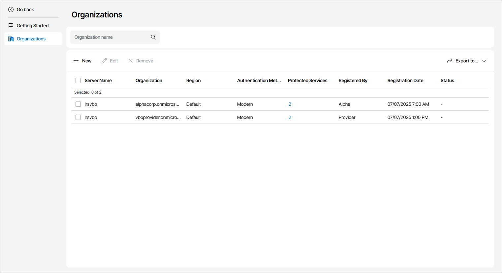

# Viewing and Exporting Organization Details

To view and export Microsoft 365 organization details:

1. Log in to Veeam Service Provider Console.

For details, see [Accessing Veeam Service Provider Console](access_vac.md).

1. At the top right corner of the Veeam Service Provider Console window, click Configuration.
2. In the configuration menu on the left, click Catalog.
3. Click the Veeam Backup for Microsoft 365 plugin tile.
4. In the menu on the left, click Organizations.

To narrow down the list of organizations, you can filter the list by organization name.

1. To export organization details, click Export to and choose a format of the exported data:

* CSV — choose this option to structure exported data as a CSV file.
* XML — choose this option to structure exported data as an XML file.

The file with exported data will be saved to the default download location on your computer.

Each organization in the list is described with the following properties:

* Server Name — name of the Veeam Backup for Microsoft 365 server on which the organization is registered.
* Organization — organization name.
* Region — Microsoft Azure region to which the organization belongs.
* Authentication Method — organization authentication method.
* Protected Services — number of services protected for the organization.

Click a link in this column to drill down to the list of Microsoft Online services protected for the selected organization.

* Registered By — name of the user who registered the organization.
* Registration Date — date and time when the organization was registered.
* Status — organization status.

