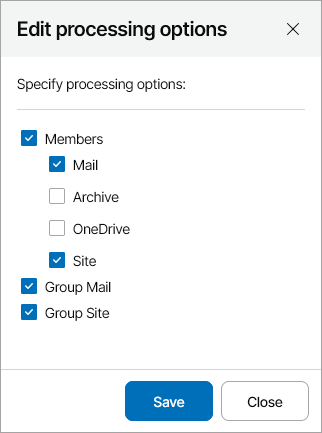
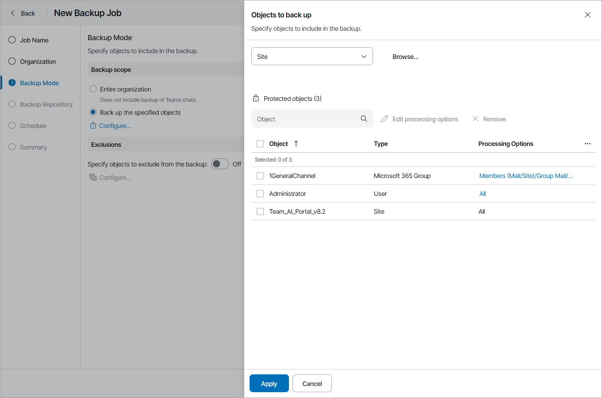

# Step 4. Choose Backup Mode

At the Backup Mode step of the wizard, select the mode in which you want to create a backup:

1. In the Backup scope section, specify objects to back up:

* Select the Entire organization option to back up the whole organization.

Note that in this backup mode, Veeam Service Provider Console will not back up Teams chats.

* Select the Back up the specified objects option to back up individual objects:

1. Click Configure.
2. In the Objects to back up window, select type of object to back up: User, Group, Site, Teams, Personal Sites or Current organization.

The list of available objects depends on which Microsoft Online services are selected in the organization settings.

1. [If you did not select a Current organization or Personal Sites object type] Click the Browse link and select objects to back up.
2. Click Add.
3. If you want to customize processing options, select an object in the list and click Edit Processing Options or click a link in the Processing Options column.
4. [For User, Teams, Group and Current organization object types] In the Edit processing options window, select the necessary processing options and click Save.

Note that processing options for Current organization object will be applied to all users, groups, sites and teams in the organization.

[For Teams and Current organization object types] You can modify the Chats and Teams chats check boxes only if the Teams chats protected service is selected in the organization settings.

For details about available object types and their processing options, see section [Organization Object Types](https://helpcenter.veeam.com/docs/vbo365/guide/vbo_object_types.html) of the Veeam Backup for Microsoft 365 User Guide.

1. Repeat steps ii–vi for all object types you want to back up.
2. Click Apply.

1. To exclude specific objects, in the Exclusions section set the toggle to On and specify objects to exclude:

1. Click Configure.
2. In the Exclusions window, select type of the object to back up: User, Group, Site, Teams or Personal Sites.

The list of available objects depends on which Microsoft Online services you selected to protect during organization registration.

1. [If you did not select a Personal Sites object type] Click the Browse link and select objects to exclude.
2. Click Add.
3. If you want to customize processing options, select an object in the list and click Edit processing options or click a link in the Processing Options column.

For details about available object types and their processing options, see section [Organization Object Types](https://helpcenter.veeam.com/docs/vbo365/guide/vbo_object_types.html) of the Veeam Backup for Microsoft 365 User Guide.

1. [For User and Group object types] In the Edit processing options window, select the necessary processing options and click Save.
2. Repeat steps b–f for all object types you want to exclude.
3. Click Apply.

