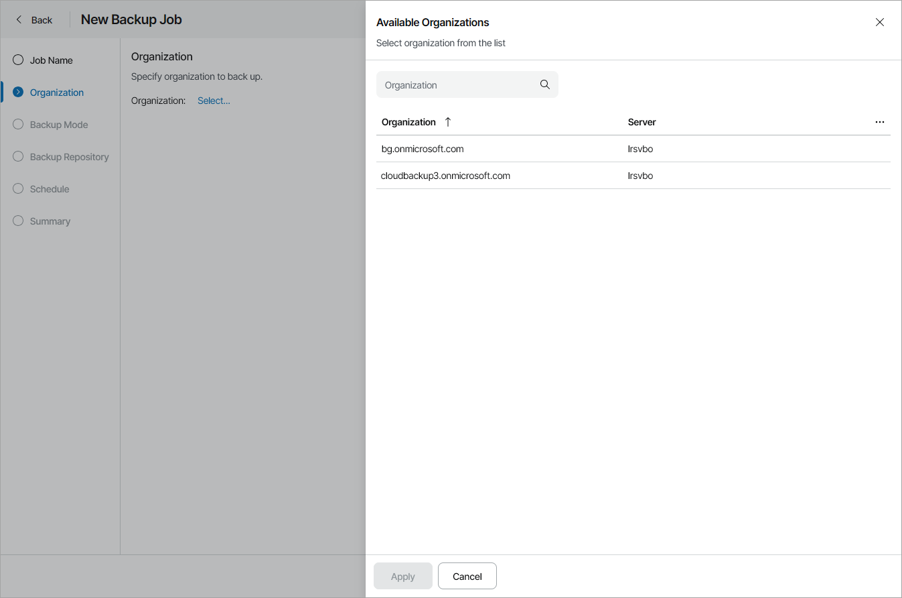

# Step 3. Choose Organization to Back Up

At the Organization step of the wizard, choose organization to back up:

1. Click Select.
2. In the Available Organizations window, select an organization to back up.
3. Click Apply.

