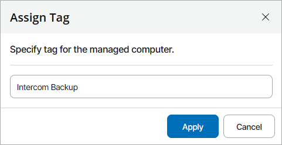

# Assigning Custom Tags to Veeam Backup & Replication Servers

In Veeam Service Provider Console, you can assign custom tags for managed Veeam Backup & Replication servers. Assigning custom tags can help you differentiate managed servers that have same or similar names.

Required Privileges

To perform this task, a user must have one of the following roles assigned: Company Owner, Company Administrator, Company Tenant, Location Administrator.

Assigning Custom Tags

To assign custom tags to managed Veeam Backup & Replication servers:

1. Log in to Veeam Service Provider Console.

For details, see [Accessing Veeam Service Provider Console](access_vac.md).

1. In the menu on the left, click Managed Computers.
2. Open the Backup Servers tab.
3. Select a Veeam Backup & Replication server in the list.
4. Click a link in the Tag column.

If the column is hidden, click the ellipsis on the right of the list header and select Tag in the list of properties that must be displayed.

1. In the Assign Tag window, specify a tag that must be assigned to a backup server and click Apply.

