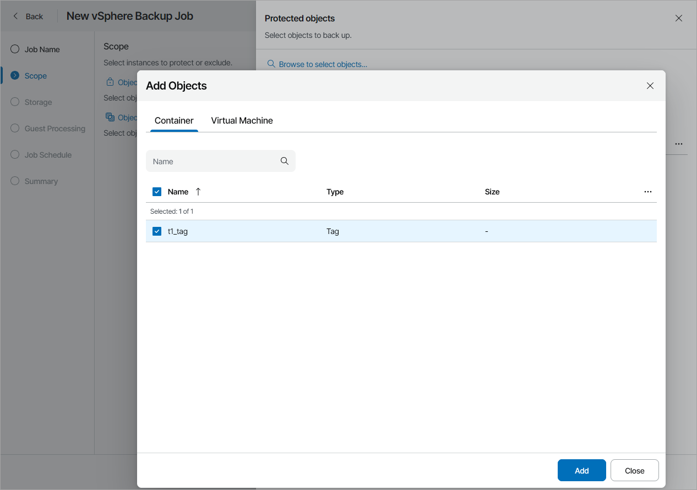

# Step 3. Select Objects to Back Up

At the Scope step of the wizard, specify virtual infrastructure objects that you want to include in the backup:

1. Click the Objects to include link.
2. In the Protected objects window, click the Browse to select objects link.
3. In the Add Objects window, specify objects that you want to include in the backup scope:

* To back up a VM container, on the Container tab select the available container.

If you select a VM container and add new VMs to this container in future, Veeam Backup & Replication will update backup job settings automatically to include these VMs.

* To back up separate VMs, on the VM tab select the necessary VMs.

|  |
| --- |
| Note: |
| Veeam Service Provider Console collects data from the connected Veeam Backup & Replication servers every hour. If you have added a VM to a container, it may take up to an hour for this VM to get included in the backup scope. To back up the new VM, make sure to collect data from Veeam Backup & Replication servers manually before configuring or running the backup job. For details, see [Collecting Data](collect_agent_data.md#backup). |

1. Click Add.
2. Click Apply.
3. To exclude specific objects, click the Objects to exclude link.
4. In the Exclusions window, click the Browse to select objects link.
5. In the Add Objects window, select VMs that you want to exclude from the backup and click Add.
6. Click Apply.

