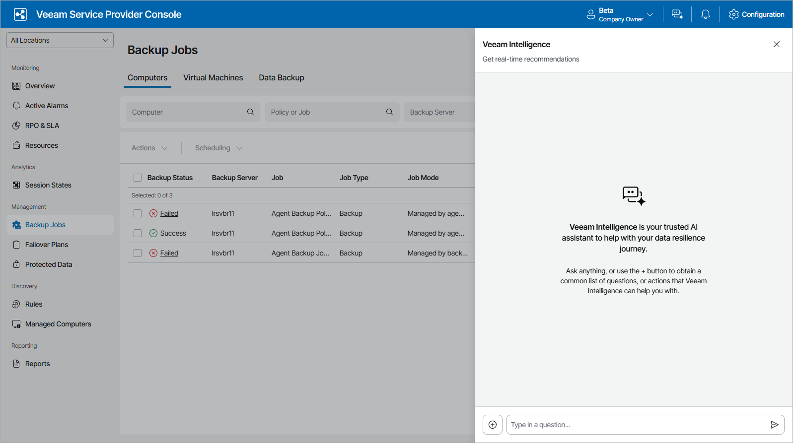

# Veeam Intelligence

Veeam Intelligence is an advanced Artificial Intelligence solution designed to assist customers with Veeam products. It searches for up-to-date information in the technical documentation and analyzes product data to provide recommendations using natural language. You can interact with Veeam Intelligence in any language, whether for simple queries or complex inquiries.

|  |
| --- |
| Important! |
| Consider the following   * Veeam Intelligence sends your queries outside of your organization. Be aware of this when writing queries related to private or confidential information. * Veeam takes no responsibility for the accuracy of the information that Veeam Intelligence provides. * The Veeam Intelligence bot considers the context of all previous messages and may affect its consequent responses. If you need to clear the context of your conversation, refresh the page. * Veeam Intelligence is under constant development. For details on Veeam Intelligence updates, see [this Veeam KB article](https://www.veeam.com/kb4539). |

Veeam Intelligence Advanced Mode

Advanced mode allows additional searches of Veeam Service Provider Console API GET queries to provide additional answers specific to your environment. In the Advanced mode, Veeam Intelligence has access to the following information to generate the answers you receive for your infrastructure:

* Predefined and triggered alarms, including alarms for managed workloads
* VMs, computers, storage and applications protected with Veeam products
* Cloud VMs, file share, database and network policies
* Protected cloud VMs, file shares, databases and networks
* Managed servers and best practices
* All monitored Veeam Backup & Replication, Veeam Backup for Microsoft 365, Veeam backup agent and Veeam Backup for Public Clouds jobs
* Open support cases

Using Veeam Intelligence

To start a new conversation:

1. Click Veeam Intelligence button located in the upper right corner of the Veeam Service Provider Console window.
2. In the chat window, type the question. Alternatively, click prompt to provide a short list of suggested questions. Consider the following examples:

* How to view protected workloads?
* How to view invoices?
* How can I use Veeam Service Provider Console to monitor backup jobs health state?

1. Click the Send button or press Enter to send your question.
2. When you do not need Veeam Intelligence, click the Close button to close the Veeam Intelligence window. The context and entire history is still saved when closed. If you refresh the page your conversation history is cleared.

Responses from Veeam Intelligence are generated in real time, token-by-token, allowing users to begin reading as the AI continues writing the answer. Relevant links to Veeam documentation and knowledge base articles are integrated within the text. Note that screenshots and images are not supported in the current version.

Note that Veeam Intelligence provides answers depending on the user role under which you log in to Veeam Service Provider Console.

If you find the answer to be insufficient, you can add more details. The bot retains the conversation context and previous questions within a current session, so you do not have to repeat anything. If you refresh the page or open the chat in a new Veeam Service Provider Console tab, Veeam Intelligence restarts and loses the context of your previous conversation.

